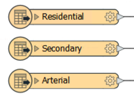
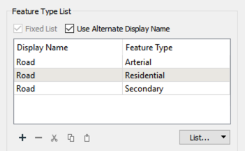

# Layer Selection and Handling

Spatial data is often organized in layers (tables, groups, classes, categories, feature types) and a common way that users will wish to choose data in a self-serve system is on a layer-basis.

In FME, feature type (layer) flexibility can be achieved through the *Feature Types to Read* parameter.

## Selecting Layers ##

Each reader in FME has a parameter called Feature Types to Read. This parameter is used to tell FME which of the feature types in the workspace should be used in the translation.

Here a Reader contains eight feature types. The Feature Types to Read parameter has been set up to read just three of these (Libraries, Parks, TransitStations).

The parameter can be set by the workspace author, but in most cases, it is published so that the end user can select a list of layers to read.

---

## Publishing Feature Types to Read ##

Choosing to publish the Feature Types to Read parameter results in a dialog that is significantly different to any other parameter definition:

This dialog is a predefined configuration for the parameter. This is possible because FME already knows what feature types exist in the workspace, whereas for a coordinate system parameter, it has no idea what coordinate systems the author wishes to allow.

If the author wishes to define the parameter with an alias, the checkbox for Use Alternate Display Name allows them to do so.

---

<!--Tip Section-->

<table style="border-spacing: 0px">
<tr>
<td style="vertical-align:middle;background-color:darkorange;border: 2px solid darkorange">
<i class="fa fa-info-circle fa-lg fa-pull-left fa-fw" style="color:white;padding-right: 12px;vertical-align:text-top"></i>
TIP
</td>
</tr>

<tr>
<td style="border: 1px solid darkorange">

By default the Feature Types to Read list is originally set by the feature types in the workspace, but will automatically update if this is changed. For example, if the Libraries feature type was removed from the workspace then it would also be removed from this parameter.
  So the list is fixed to what appears in the workspace.
  However, if any of the Reader feature types have a merge filter set, then the list is no longer fixed. It will show all feature types in the source dataset, whether or not they exist as feature types in the workspace!

</td>
</tr>
</table>

---

## Grouped Layers ##

On occasion, it's better to provide a single choice to the user that represents multiple feature types. For example, in this workspace:

...the author might consider it sufficient to provide an option called "Roads" - that encompasses all three reader feature types - rather than "Residential," "Arterial," and "Secondary" as separate entities. If the user chooses to read "Roads", then all three feature types are read.

The way to do this is by using the Alternate Display Name option and entering the same value for the Display Name for each layer you want to group together:

That way the user is presented with groups instead of individual layers:

---

<!--Person X Says Section-->

<table style="border-spacing: 0px">
<tr>
<td style="vertical-align:middle;background-color:darkorange;border: 2px solid darkorange">
<i class="fa fa-quote-left fa-lg fa-pull-left fa-fw" style="color:white;padding-right: 12px;vertical-align:text-top"></i>
FME Lizard says...
</td>
</tr>

<tr>
<td style="border: 1px solid darkorange">

This functionality is useful because of a difference in viewpoint between author and user. The author is asking which layers should be read. But the user is responding to a different question: they are telling us which layers they want to write.
  The above example illustrates the case. The user thinks they are choosing to write a layer called Roads, when in reality they are choosing to read three feature types called Residential, Arterial, and Secondary.

</td>
</tr>
</table>
