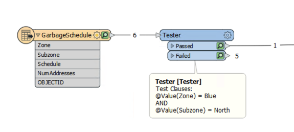
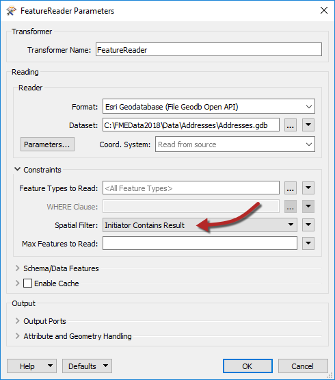
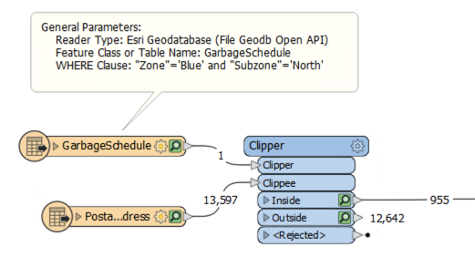

## Existing Boundaries ##

By **existing boundary** we mean the perimeter of a non-rectangular geographic area; for example a regional boundary, census area, or similar. In FME these are represented by existing polygon features.

Any polygon feature can be read into a workspace, but its perimeter cannot be used to clip features being read into the workspace via a *reader*. However, it can be used to clip features being read into the workspace via a *transformer*.

So, instead of using a reader and its parameters, an existing boundary is used to clip data either with a FeatureReader transformer or with a Clipper transformer.

---

### Selecting the Existing Area ###

If the existing area feature is a single feature in a dataset, then it can be read into the workspace and used immediately.

If, however, it is part of a larger dataset, then it needs to be filtered from the rest of the data. If the reader has a where clause (and the feature can be identified in that way) then it is the most efficient way of filtering the data:

Here the data from a Geodatabase is filtered down to the required feature using a WHERE clause. The feature count on the connection shows only a single feature passed.

If the Reader has no WHERE clause parameter, then the full dataset can be read and the required feature filtered out using transformers such as the Tester or TestFilter:

However, this technique is not as efficient, because - in the above example - all six features needed to be read instead of just one.

---

### FeatureReader ###

To use a FeatureReader to filter data by an existing area, the polygon feature is routed into the FeatureReader Initiator port.

Here a single garbage schedule area (Blue zone, north) is passed to the FeatureReader for use as a filter. The idea is to return only addresses that fall inside that garbage collection zone. The parameters are set up like this:

Notice that the FeatureReader is set to read from an address geodatabase. The Spatial Filter parameter tells the transformer to only read features (addresses) inside the incoming polygon feature (garbage collection zone).

These features are output through a port dynamically added to the FeatureReader:

The feature counts here show that there are 955 addresses inside that garbage collection zone. In case you noticed that the GarbageSchedule already has a NumAddresses attribute, yes, it is the same value!

---

### Clipper ###

The Clipper transformer is a means to spatially filter data that is already read into a workspace (other similar transformers are the PointOnAreaOverlayer, or the SpatialFilter).

Here the address database is read into a workspace, and the Clipper used to filter out those addresses that fall inside the chosen garbage collection zone:

