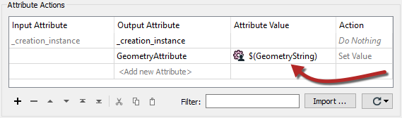
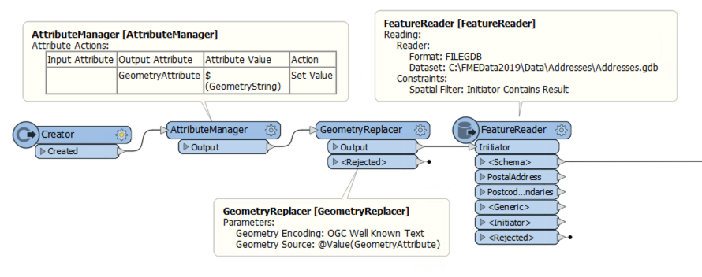

## Ad Hoc Boundaries ##

By **ad-hoc boundary** we mean that the geographic area for data download is not a previously known shape. Sometimes it is simply defined by the user on a web map as it is needed.

In this scenario, a different technique is needed for your FME workspaces, one that involves a published parameter.

### Passing Ad Hoc Boundaries to FME ###

The way to pass an area boundary to FME is with the geometry defined as a string. The geometry could be, for example, either WKT (Well-Known Text) or XML. The string is passed to FME using a published parameter.

One simple method would be to use an AttributeManager transformer and publish the Value part:

This information could be used in a sequence like this; the translation is triggered with a Creator, the geometry string retrieved with the AttributeManager, the attribute contents converted into true geometry with a GeometryReplacer, and then the real data read with a FeatureReader:

With these methods, a web mapping interface that allows the user to define their own custom area of interest can pass it to the FME workspace to be used as the area of interest in a Clipper or FeatureReader.
