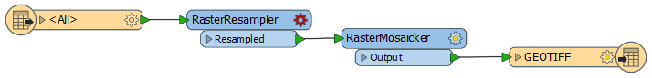
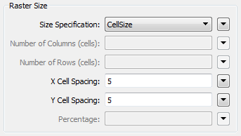

<!--Instructor Notes-->

<!--Exercise Section-->
<!--NB: In GitBook world we don't give a number to exercises-->

<table style="border-spacing: 0px;border-collapse: collapse;font-family:serif">
<tr>
<td width=25% style="vertical-align:middle;background-color:darkorange;border: 2px solid darkorange">
<i class="fa fa-cogs fa-lg fa-pull-left fa-fw" style="color:white;padding-right: 12px;vertical-align:text-top"></i>
Exercise 1
</td>
<td style="border: 2px solid darkorange;background-color:darkorange;color:white">

</td>
</tr>

<tr>
<td style="border: 1px solid darkorange; font-weight: bold">Data</td>
<td style="border: 1px solid darkorange">Orthophoto images (GeoTIFF)</td>
</tr>

<tr>
<td style="border: 1px solid darkorange; font-weight: bold">Overall Goal</td>
<td style="border: 1px solid darkorange">Create an FME Server Data Download system for orthophotos</td>
</tr>

<tr>
<td style="border: 1px solid darkorange; font-weight: bold">Demonstrates</td>
<td style="border: 1px solid darkorange">Creating a workspace and running it with Data Download</td>
</tr>

<tr>
<td style="border: 1px solid darkorange; font-weight: bold">Start Workspace</td>
<td style="border: 1px solid darkorange">None</td>
</tr>

<tr>
<td style="border: 1px solid darkorange; font-weight: bold">End Workspace</td>
<td style="border: 1px solid darkorange">C:\FMEData2016\Workspaces\ServerAuthoring\SelfServe-Ex1-Complete.fmw</td>
</tr>

</table>

---

As a technical analyst in the GIS department of your local city you have plenty of experience using FME Desktop, and are just getting started with FME Server.

Other departments frequently ask the GIS team for orthophoto imagery of the city. Their format of choice is usually JPEG. Currently you use FME Desktop to translate the data, adding to your workspace any special requests they have such as a particular resolution, a specific area of interest, or even sets of vector data stamped onto the raster. 

However good you are with FME Workbench, it does take time to set up each of these individual requests. It would be far better if the other departments could help themselves to the raster data, with options for all of their special requests built in.

Of course, you very soon realize that a Data Download system implemented on FME Server would be an ideal solution. 

---

<!--Person X Says Section-->

<table style="border-spacing: 0px">
<tr>
<td style="vertical-align:middle;background-color:darkorange;border: 2px solid darkorange">
<i class="fa fa-quote-left fa-lg fa-pull-left fa-fw" style="color:white;padding-right: 12px;vertical-align:text-top"></i>
Miss Vector says...
</td>
</tr>

<tr>
<td style="border: 1px solid darkorange">

If you have lots of experience with FME Workbench - <strong>and if your instructor agrees</strong> - simply open the workspace listed in the header above and skip to step 6. But make sure you inspect the transformers and their parameters, so you know what you are working with.

</td>
</tr>
</table>

---

 **1) Create Workspace**
 Let's start off by creating a basic FME workspace to translate and transform the source raster data. Start FME Workbench and select Readers &gt; Add Reader. When prompted enter these parameters:

<table style="border: 0px">

<tr>
<td style="font-weight: bold">Reader Format</td>
<td style="">GeoTIFF (Geo-referenced Tagged Image File Format)</td>
</tr>

<tr>
<td style="font-weight: bold">Reader Dataset</td>
<td style="">C:\FMEData2016\Data\Orthophotos\06-07-LM.tif</td>
</tr>

<tr>
<td style="font-weight: bold">Workflow Options</td>
<td style="">Single Merged Feature Type</td>
</tr>

</table>

It's important to use the Single Merged Feature Type option because there are many source tiles of data, and we may want to read any of them without having to add them as individual feature types.

 **2) Add Writer**
 Now we need a Writer. Select Writers &gt; Add Writer from the menubar. When prompted enter these parameters:

<table style="border: 0px">

<tr>
<td style="font-weight: bold">Writer Format</td>
<td style="">JPEG (Joint Photographic Experts Group)</td>
</tr>

<tr>
<td style="font-weight: bold">Writer Dataset</td>
<td style="">C:\FMEData2016\Output</td>
</tr>

<tr>
<td style="font-weight: bold">Add Feature Types</td>
<td style="">Copy From Reader</td>
</tr>

</table>

Your workspace will now look like this:

 **3) Add Transformers**
 We'll start out with two transformers in our workspace; a RasterResampler and a RasterMosaicker. So place one of each of these and connect up everything in the workspace:

 **4) Set Transformer Parameters**
 Open the RasterResampler parameters dialog and set:

<table>
<tr><td style="font-weight: bold">Size Specification</td><td>Cell Size</td></tr>
<tr><td style="font-weight: bold">X Cell Spacing</td><td>5</td></tr>
<tr><td style="font-weight: bold">Y Cell Spacing</td><td>5</td></tr>
</table>

Now open the RasterMosaicker parameters dialog. You can check the parameters but there really aren't any that need changing at the moment, so simply click OK to close the dialog again.

 **5) Save and Run Workspace**
 Save the workspace and - just to ensure that all is well - run it in FME Workbench. The result should be a JPEG file (GEOTIFF.jpg) along with a world file (GEOTIFF.wld).

 **6) Publish Workspace**
 Now let's publish the workspace to FME Server.

