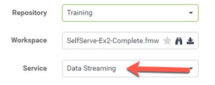

<!--Instructor Notes-->

<!--Exercise Section-->

<table style="border-spacing: 0px;border-collapse: collapse;font-family:serif">
<tr>
<td width=25% style="vertical-align:middle;background-color:darkorange;border: 2px solid darkorange">
<i class="fa fa-cogs fa-lg fa-pull-left fa-fw" style="color:white;padding-right: 12px;vertical-align:text-top"></i>
Exercise 3.2
</td>
<td style="border: 2px solid darkorange;background-color:darkorange;color:white">
Data Streaming System
</td>
</tr>

<tr>
<td style="border: 1px solid darkorange; font-weight: bold">Data</td>
<td style="border: 1px solid darkorange">Orthophoto images (GeoTIFF)</td>
</tr>

<tr>
<td style="border: 1px solid darkorange; font-weight: bold">Overall Goal</td>
<td style="border: 1px solid darkorange">Create an FME Server Data Streaming system for orthophotos</td>
</tr>

<tr>
<td style="border: 1px solid darkorange; font-weight: bold">Demonstrates</td>
<td style="border: 1px solid darkorange">Data streaming</td>
</tr>

<tr>
<td style="border: 1px solid darkorange; font-weight: bold">Start Workspace</td>
<td style="border: 1px solid darkorange">C:\FMEData2020\Workspaces\ServerAuthoring\SelfServe-Ex2-Begin.fmw</td>
</tr>

<tr>
<td style="border: 1px solid darkorange; font-weight: bold">Start Server Project</td>
<td style="border: 1px solid darkorange">C:\FMEData2020\Projects\ServerAuthoring\SelfServe-Ex2-Begin.fsproject</td>
</tr>

<tr>
<td style="border: 1px solid darkorange; font-weight: bold">End Workspace</td>
<td style="border: 1px solid darkorange">C:\FMEData2020\Workspaces\ServerAuthoring\SelfServe-Ex2-Complete.fmw</td>
</tr>

<tr>
<td style="border: 1px solid darkorange; font-weight: bold">End Server Project</td>
<td style="border: 1px solid darkorange">C:\FMEData2020\Projects\ServerAuthoring\SelfServe-Ex2-Complete.fsproject</td>
</tr>

</table>

---

As a technical analyst in the GIS department of a city you have just created a system to allow other departments to download orthophoto data, rather than having to ask you to create it for them.

Sometimes the end-users download data as JPEG just to open it in a browser or image viewer to inspect it. You realize that, in cases like this, they may be able to use a data streaming service, instead of a data download.

 **1) Open Workspace**
 Open the workspace from exercise 1, or the begin workspace listed above.

 **2) Publish to FME Server**
  Re-publish the workspace to FME Server.

In the final dialog of the publishing wizard, check the boxes to register the workspace with both Data Download and Data Streaming (but don't click Finish yet):

Click the Edit button for the Data Streaming service. Ensure that service is using the output of the JPEG Writer (for now we're limiting the streaming of data to JPEG format):

 **3) Run Workspace**
 In the FME Server web interface locate the newly published workspace and run it. In the parameters for the workspace, be sure to set the web service to Data Streaming instead of Data Download

 **5) Check Results**
 You should find that the results of the translation are returned as a streamed JPEG file. Most likely it will open directly in your web browser:

---

<!--Exercise Congratulations Section-->

<table style="border-spacing: 0px">
<tr>
<td style="vertical-align:middle;background-color:darkorange;border: 2px solid darkorange">
<i class="fa fa-thumbs-o-up fa-lg fa-pull-left fa-fw" style="color:white;padding-right: 12px;vertical-align:text-top"></i>
CONGRATULATIONS
</td>
</tr>

<tr>
<td style="border: 1px solid darkorange">

By completing this exercise you have learned how to:
 
<ul><li>Set up a workspace for use in a Data Streaming service</li>
<li>Publish a workspace to the Data Streaming service</li></ul>

</td>
</tr>
</table>
