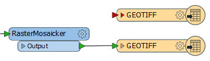
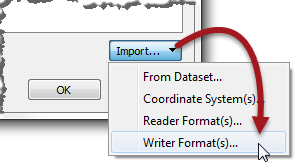
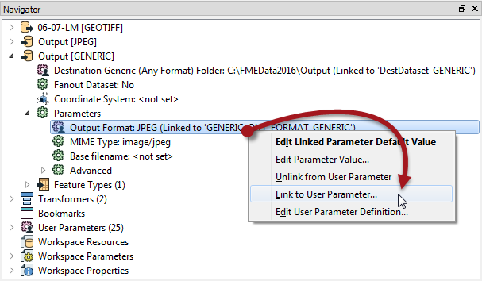

<!--Instructor Notes-->

<!--Exercise Section-->
<!--NB: In GitBook world we don't give a number to exercises-->

<table style="border-spacing: 0px;border-collapse: collapse;font-family:serif">
<tr>
<td width=25% style="vertical-align:middle;background-color:darkorange;border: 2px solid darkorange">
<i class="fa fa-cogs fa-lg fa-pull-left fa-fw" style="color:white;padding-right: 12px;vertical-align:text-top"></i>
Exercise 3
</td>
<td style="border: 2px solid darkorange;background-color:darkorange;color:white">

</td>
</tr>

<tr>
<td style="border: 1px solid darkorange; font-weight: bold">Data</td>
<td style="border: 1px solid darkorange">Orthophoto images (GeoTIFF)</td>
</tr>

<tr>
<td style="border: 1px solid darkorange; font-weight: bold">Overall Goal</td>
<td style="border: 1px solid darkorange">Create an FME Server Data Download system for orthophotos</td>
</tr>

<tr>
<td style="border: 1px solid darkorange; font-weight: bold">Demonstrates</td>
<td style="border: 1px solid darkorange">Creating published parameters for user control in Data Download</td>
</tr>

<tr>
<td style="border: 1px solid darkorange; font-weight: bold">Start Workspace</td>
<td style="border: 1px solid darkorange">C:\FMEData2016\Workspaces\ServerAuthoring\SelfServe-Ex3-Begin.fmw</td>
</tr>

<tr>
<td style="border: 1px solid darkorange; font-weight: bold">End Workspace</td>
<td style="border: 1px solid darkorange">C:\FMEData2016\Workspaces\ServerAuthoring\SelfServe-Ex3-Complete.fmw</td>
</tr>

</table>

---

As a technical analyst in the GIS department of a city you have just commenced a project to allow other departments to download orthophoto data, rather than having to ask you to create it for them. Not only will their requests be processed quicker, you will also spend less time on that task.

So far you have created a simple workspace to translate orthophotos to jpeg format, added published parameters for transformation, and published it to a Data Download service on FME Server.

Now you need to give the end-users control over the output format and output coordinate system.

 **1) Open Workspace**
 Open the workspace from exercise 2, or the begin workspace listed above. You can see that it consists of a Reader, a Writer, and two transformers, plus some published parameters.

In this step we'll give the end-user control over format and coordinate system.

 **2) Add Writer**
 To give control over format needs a Generic format writer. Select Writers &gt; Add Writer from the menubar. When prompted enter these parameters:

<table style="border: 0px">

<tr>
<td style="font-weight: bold">Writer Format</td>
<td style="">Generic (Any Format)</td>
</tr>

<tr>
<td style="font-weight: bold">Writer Dataset</td>
<td style="">C:\FMEData2016\Output</td>
</tr>

<tr>
<td style="font-weight: bold">Writer Parameters</td>
<td style="">Output Format: JPEG (Joint Photographic Experts Group) MIME Type: img/jpeg</td>
</tr>

<tr>
<td style="font-weight: bold">Add Feature Types</td>
<td style="">Copy From Reader</td>
</tr>

</table>

Your workspace will now look like this:

The upper (unconnected) feature type belongs to the Generic Writer.

 **3) Switch Feature Types**
 We want to write to the Generic Writer, not the JPEG Writer, so switch the connection from the JPEG feature type to the Generic feature type. They are both labelled "GEOTIFF" so be sure to open the properties dialog to check if you need to.

Don't delete the JPEG Writer though, or its feature type. We'll need those for reasons to be explained shortly.

 **4) Create User Parameter**
 To give control over format requires a published parameter. So in the Navigator window of FME Workbench, locate the section marked User Parameters. Right-click on there and choose the option Add Parameter.

Set the parameter values as follows:

<table>
<tr><td style="font-weight: bold">Type</td><td>Choice with Alias</td></tr>
<tr><td style="font-weight: bold">Name</td><td>OutputFormat</td></tr>
<tr><td style="font-weight: bold">Published</td><td>Yes</td></tr>
<tr><td style="font-weight: bold">Optional</td><td>No</td></tr>
<tr><td style="font-weight: bold">Prompt</td><td>Select the Output Format</td></tr>
</table>

For the configuration field, click the [...] browse button. In the dialog that opens, click on Import &gt; Writer Format(s):

This will open a list of FME-supported formats. Choose a few simple raster formats such as JPEG, PNG, and GeoTIFF. Click OK to close the dialog and return to the previous one:

---

<!--Warning Section--> 

<table style="border-spacing: 0px">
<tr>
<td style="vertical-align:middle;background-color:darkorange;border: 2px solid darkorange">
<i class="fa fa-exclamation-triangle fa-lg fa-pull-left fa-fw" style="color:white;padding-right: 12px;vertical-align:text-top"></i>
WARNING
</td>
</tr>

<tr>
<td style="border: 1px solid darkorange">

Be sure to use the PNG format called PNGRASTER. Don't select the format called PNG Rasterizer (PNG) as that is for rasterizing vector data, not writing raster data.

</td>
</tr>
</table>

---

Click OK and OK again to close these dialogs and create the parameter.

 **5) Apply User Parameter**
 Now we've create a user parameter, we have to apply it.

Locate the Generic Writer in the Navigator window, expand its parameters and locate the parameter called Output Format. This is already linked to a published parameter that FME created automatically, but we want to ignore that and use our own.

So, right-click on Output Format and choose the option to Link to User Parameter:

When prompted select the OutputFormat parameter that we just created:

The parameter FME created (GENERIC_OUT_FORMAT_GENERIC) will be automatically deleted. FME realizes that we don't need it any more and, since it is used nowhere else, will remove it.

 
---

<!--Exercise Congratulations Section--> 

<table style="border-spacing: 0px">
<tr>
<td style="vertical-align:middle;background-color:darkorange;border: 2px solid darkorange">
<i class="fa fa-thumbs-o-up fa-lg fa-pull-left fa-fw" style="color:white;padding-right: 12px;vertical-align:text-top"></i>
CONGRATULATIONS
</td>
</tr>

<tr>
<td style="border: 1px solid darkorange">

By completing this exercise you have learned how to:
 
<ul><li>Create an integer user parameter and apply it to two transformer parameters</li>
<li>Create a choice user parameter and apply it to a Writer feature type parameter</li>
<li>Publish a workspace and use published parameters</li></ul>

</td>
</tr>
</table>   

