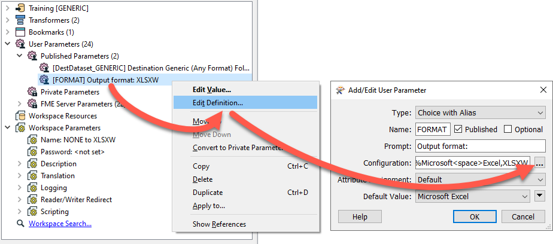
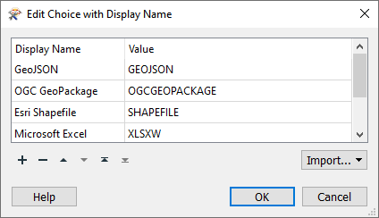
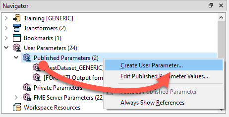
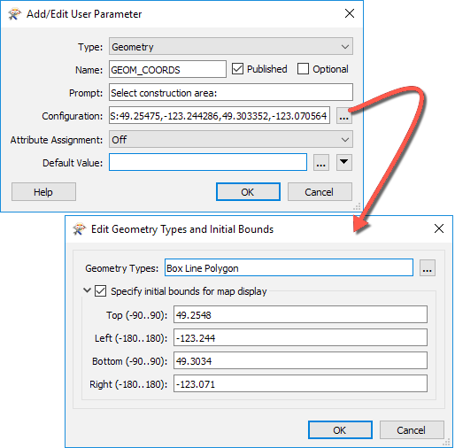
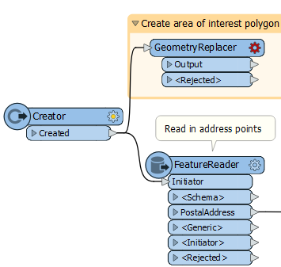
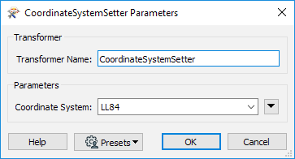
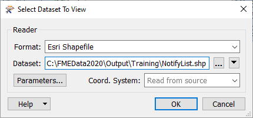
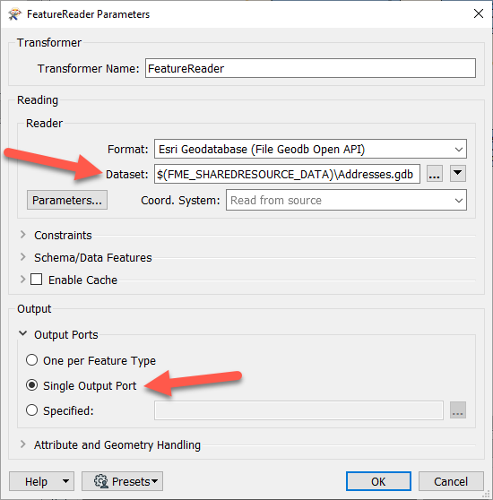
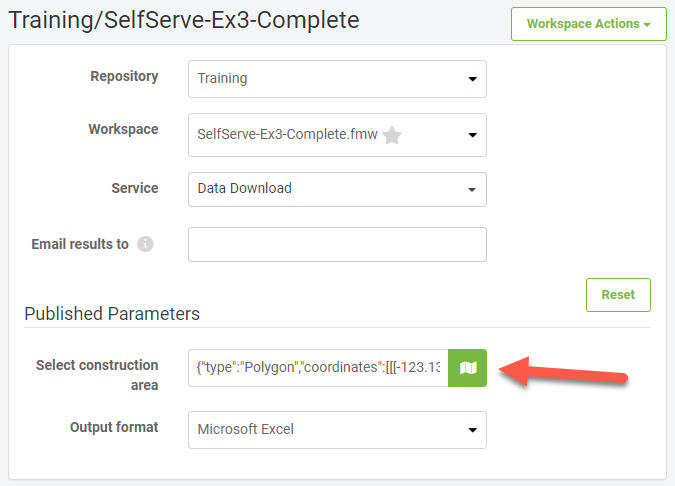
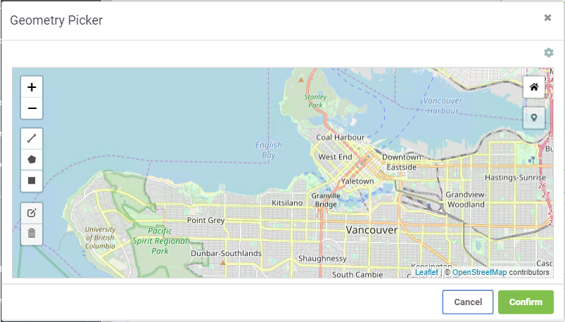

<!--Instructor Notes-->

<!--Exercise Section-->


<table style="border-spacing: 0px;border-collapse: collapse;font-family:serif">
<tr>
<td width=25% style="vertical-align:middle;background-color:darkorange;border: 2px solid darkorange">
<i class="fa fa-cogs fa-lg fa-pull-left fa-fw" style="color:white;padding-right: 12px;vertical-align:text-top"></i>
<span style="color:white;font-size:x-large;font-weight: bold">Exercise 3.3</span>
</td>
<td style="border: 2px solid darkorange;background-color:darkorange;color:white">
<span style="color:white;font-size:x-large;font-weight: bold">Data Download System: Published Parameters</span>
</td>
</tr>

<tr>
<td style="border: 1px solid darkorange; font-weight: bold">Data</td>
<td style="border: 1px solid darkorange">Community Mapping (Esri File Geodatabase)</td>
</tr>

<tr>
<td style="border: 1px solid darkorange; font-weight: bold">Overall Goal</td>
<td style="border: 1px solid darkorange">Create an FME Server Data Download system community mapping data, allowing the user to choose the format and area of interest</td>
</tr>

<tr>
<td style="border: 1px solid darkorange; font-weight: bold">Demonstrates</td>
<td style="border: 1px solid darkorange">Creating published parameters for user control in Data Download</td>
</tr>

<tr>
<td style="border: 1px solid darkorange; font-weight: bold">Start Workspace</td>
<td style="border: 1px solid darkorange">C:\FMEData2020\Workspaces\ServerAuthoring\SelfServe-Ex3-Begin.fmw</td>
</tr>

<tr>
<td style="border: 1px solid darkorange; font-weight: bold">End Workspace</td>
<td style="border: 1px solid darkorange">C:\FMEData2020\Workspaces\ServerAuthoring\SelfServe-Ex3-Complete.fmw</td>
</tr>

<tr>
<td style="border: 1px solid darkorange; font-weight: bold">End Server Project</td>
<td style="border: 1px solid darkorange">C:\FMEData2020\Workspaces\ServerAuthoring\SelfServe-Ex3-Complete.fsproject</td>
</tr>

</table>

---

As a technical analyst in the GIS department of a city, you have just commenced an initiative to allow other departments to download community mapping data, rather than having to ask you to create it for them. Not only will their requests be processed quicker, but you will also spend less time on that task.

So far you have created a workspace that allows users to choose the format for their data download.

Now you need to add a Geometry published parameter to let users interactively choose their area of interest.

<br>**1) Open Workspace**
<br>Open C:\FMEData2020\Workspaces\ServerAuthoring\SelfServe-Ex3-Begin.fmw.

<br>**2) Inspect Published Parameters**
<br>The starting workspace is in-progress. It already has a published parameter that lets users choose the output format. You can find them by looking at the Navigator > User Parameters > Published Parameters. Right-click FORMAT and choose Edit Definition to view its configuration:



This parameter lets the user choose the output format for the data they receive. The default is Microsoft Excel. Click the ellipsis button next to Configuration to view the options for this Choice with Alias parameter.



This parameter gives the user the option of four output formats (GeoJSON, OGC GeoPackage, Esri Shapefile, or Microsoft Excel). Using Choice with Alias like this lets you provide a set of formats or coordinate systems to the user, instead of letting them pick from the entire list. This option can be beneficial as it is less overwhelming to the user and can prevent incorrect outcomes. Click Cancel twice to close the parameter dialog.

---

<!--Tip Section-->

<table style="border-spacing: 0px">
<tr>
<td style="vertical-align:middle;background-color:darkorange;border: 2px solid darkorange">
<i class="fa fa-info-circle fa-lg fa-pull-left fa-fw" style="color:white;padding-right: 12px;vertical-align:text-top"></i>
<span style="color:white;font-size:x-large;font-weight: bold;font-family:serif">TIP</span>
</td>
</tr>

<tr>
<td style="border: 1px solid darkorange">
<span style="font-family:serif; font-style:italic; font-size:larger">
You can learn how to create user parameters like this in <a href="https://s3.amazonaws.com/gitbook/Desktop-Advanced-2019/DesktopAdvanced4Parameters/4.00.AdvancedParameterUse.html">this chapter</a> from our FME Desktop Advanced training.
</span>
</td>
</tr>
</table>

---

<br>**3) Create a Geometry Published Parameter**
<br>Now let's edit this workspace so the user can define the area where construction will be occurring. The first step is to add a Geometry published parameter. In the Navigator, right-click User Parameters and choose Create User Parameter:



In the Add/Edit User Parameter window enter the following:

<table>
<tr><td><strong>Type</strong></td><td>Geometry</td></tr>
<tr><td><strong>Name</strong></td><td>GEOM_COORDS</td></tr>
<tr><td><strong>Prompt</strong></td><td>Select construction area:</td></tr>
<tr><td><strong>Published</strong></td><td>Checked</td></tr>
<tr><td><strong>Optional</strong></td><td>Unchecked</td></tr>
<tr><td><strong>Attribute Assignment</strong></td><td>Off</td></tr>
</table>

For Configuration, click on the ellipsis and enter the following:

<table>
<tr><td><strong>Geometry Types</strong></td><td>Box, Polygon, Line</td></tr>
<tr><td><strong>Specify initial bounds for map display</strong></td><td>Checked</td></tr>
<tr><td><strong>Top (-90..90)</strong></td><td>49.2548</td></tr>
<tr><td><strong>Left (-180..180)</strong></td><td>-123.244</td></tr>
<tr><td><strong>Bottom (-90..90)</strong></td><td>49.3034</td></tr>
<tr><td><strong>Right (-180..180)</strong></td><td>-123.071</td></tr>
</table>

The initial bounds will be the area shown in FME Server. Larger bounds will have the map zoomed out, and smaller bounds will have the map zoomed in.



Click OK twice to close the parameter dialogs.

<br>**4) Create the Area of Interest Polygon**
<br>Now that we have set up the geometry published parameter, we need to use it within the workflow. Add a GeometryReplacer in a new stream after the Creator transformer.



Open the parameters for the GeometryReplacer. Set the Geometry Encoding to GeoJSON and then set the Geometry Source to the GEOM_COORDS published parameter.


Click OK.

<br>**5) Reproject the Area of Interest**
<br>We want to ensure that FME knows our data is in LL84, as this is what the Geometry published parameter accepts as values. Add a CoordinateSystemSetter transformer after the GeometryReplacer. In the parameters, set the Coordinate System to LL84.



Our source address data is in UTM83-10. It is more appropriate to buffer and intersect data in a projected coordinate system, so we will reproject both streams of data to UTM83-10. Add the first Reprojector after the CoordinateSystemSetter. Set the Destination Coordinate System to UTM83-10.


Add a second Reprojector between the FeatureReader and the NotifyList writer feature type. We have to make a slight change to the address data coordinate system. Set the Destination Coordinate System to UTM83-10 and click OK.

Your workspace should look like this:


<br>**6) Buffer the Area of Interest**
<br>We need to add a 100-meter buffer around the area of interest to find which neighboring residents might be affected by construction noise and must be notified. Add a Bufferer transformer connected to the first Reprojector. In the parameters, set the Buffer Distance to 100 and set the Buffer Distance Units to Meters.


<br>**7) Clip the Addresses to the Area of Interest**
<br>Now we need to apply the buffered area of interest to our data. To do this we will use a Clipper transformer. Add a Clipper transformer to the canvas and connect the Bufferer's Buffered port to the Clipper input port. Then connect the Reprojector_2 to the Clippee input port. In the Clipper parameters, enable Merge Attributes.


Click OK.

<br>**8) Clean up Attributes**
<br>One final step before we can write out our data is to clean up the attributes. Add an AttributeKeeper to the canvas and connect it to the Inside output port on the Clipper.

In the parameters, for Attributes to Keep, select:
- OWNERNM1
- PSTLADDRESS
- PSTLCITY
- PSTLPROV
- POSTALCODE

Click OK.

<br>**9) Test Writing Results to Shapefile**
<br>Let's test our workspace by writing the results to a Shapefile. Connect the AttributeKeeper to the NotifyList writer feature type and run your workspace. Select Esri Shapefile as the output format.

For the Geometry parameter, we have to supply GeoJSON to test on FME Desktop. On FME Server you can use a web map. Paste the following GeoJSON code in to test:

```javascript
{"type":"Polygon","coordinates":[[[-123.131762,49.282752],[-123.132148,49.282465],[-123.131579,49.282087],[-123.131139,49.282332],[-123.131762,49.282752]]]}
```

When the translation finishes, click the NotifyList writer feature type once to select it, and then click View Written Data. Specify Esri Shapefile for the Format and add NotifyList.shp to the end of the Dataset parameter:



Click OK. The addresses to notify, those within 100m of the area of interest, should appear in the Visual Preview window.


---

<!--Tip Section-->

<table style="border-spacing: 0px">
<tr>
<td style="vertical-align:middle;background-color:darkorange;border: 2px solid darkorange">
<i class="fa fa-info-circle fa-lg fa-pull-left fa-fw" style="color:white;padding-right: 12px;vertical-align:text-top"></i>
<span style="color:white;font-size:x-large;font-weight: bold;font-family:serif">TIP</span>
</td>
</tr>

<tr>
<td style="border: 1px solid darkorange">
<span style="font-family:serif; font-style:italic; font-size:larger">
We have provided GeoJSON code for testing the Geometry parameter. If you want to get your own GeoJSON to test, you can publish your unfinished workspace to FME Server, fill out the Geometry parameter, and copy the resulting GeoJSON code. Alternatively, you can use an online service to generate the GeoJSON for you, e.g. <a href="https://geojson.io/">https://geojson.io/</a>. Just remember the parameter expects a single feature.
</span>
</td>
</tr>
</table>

---

<br>**11) Change Data Source to Shared Resources Folder**
<br>To ensure everyone can run this workspace on FME Server, we should change the address GDB dataset parameter to look for the data on FME Server's Shared Resources Data folder instead of the C:\ drive. We will do this before publishing it to FME Server, and then we can upload the data there when we publish the workspace.

Double-click the FeatureReader to open its parameters. Change the Dataset parameter to `$(FME_SHAREDRESOURCE_DATA)\Addresses.gdb`. This path will look for the GDB in the FME Server Data folder. To ensure the FeatureReader still works when reading from FME Server, click Output > Output Ports > Single Output Port.



Note that this workspace won't work on FME Desktop now, but it will run properly on Server. Click OK. The Addresses output port disappears; connect the &lt;Generic&gt; port to the Reprojector_2.

<br>**11) Publish to FME Server**
<br>With the workspace complete, we can now publish to FME Server. Click on the Publish button on the toolbar. Select the Training FME Server connection and the Training repository. Click Select Files... > Select Location > Upload to a shared resource folder > Data > OK to upload the GDB to FME Server's Data folder. Select Data Download and Job Submitter as the Services.

<br>**12) Test on FME Server**
<br>Click the Direct Link to the workspace in the Translation Log (http://localhost/fmeserver/#/workspaces/run/Training/SelfServe-Ex3-Complete.fmw/) and login if necessary.

Select Training as the Repository and set the Service to Data Download.

For Published Parameters, you should see the Select construction area parameter. Click on the map icon to select the area.



When you click on the map icon, the Geometry Picker dialog will appear, which will have a map of the area set up in the published parameter, as well as options along the side to determine which geometry type you wish to use for your selection.



Zoom into the area of interest. For this example, we will zoom into downtown Vancouver and use the polygon tool to pick a small area of buildings.

Note: For this workspace to run correctly, buildings with addresses need to be selected. If an area is selected without an address the workspace won’t write out any data. To close off an area in a polygon, double-click on the starting point.


Once the area is selected, click Confirm. GeoJSON coordinates will now be available in the Select construction area text box.

Once the map area has been selected, click Run to run the workspace.

When the workspace has finished running, click on the download link to get the data. Extract and open the data in Microsoft Excel or FME Data Inspector. This list can then be used to send letters to the residents affected by the construction.


---

<!--Exercise Congratulations Section-->

<table style="border-spacing: 0px">
<tr>
<td style="vertical-align:middle;background-color:darkorange;border: 2px solid darkorange">
<i class="fa fa-thumbs-o-up fa-lg fa-pull-left fa-fw" style="color:white;padding-right: 12px;vertical-align:text-top"></i>
<span style="color:white;font-size:x-large;font-weight: bold;font-family:serif">CONGRATULATIONS</span>
</td>
</tr>

<tr>
<td style="border: 1px solid darkorange">
<span style="font-family:serif; font-style:italic; font-size:larger">
By completing this exercise you have learned how to:
<br>
<ul><li>View user parameters designed for FME Server workflows</li>
<li>Create a Geometry published parameter</li>
<li>Use a Geometry published parameter in a self-serve data download workflow</li>
<li>Publish a workspace and use published parameters</li></ul>
</span>
</td>
</tr>
</table>
