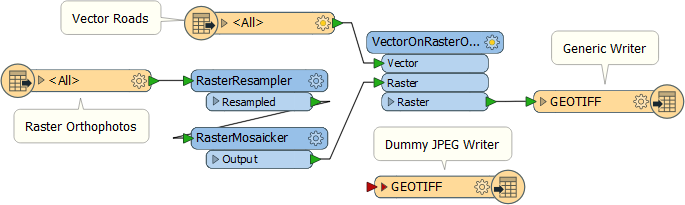
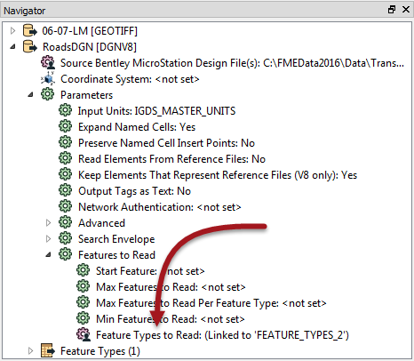
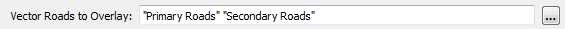
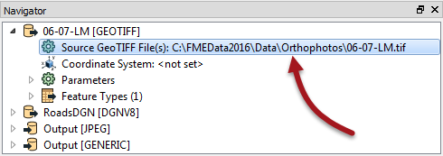

<!--Instructor Notes-->

<!--Exercise Section-->
<!--NB: In GitBook world we don't give a number to exercises-->

<table style="border-spacing: 0px;border-collapse: collapse;font-family:serif">
<tr>
<td width=25% style="vertical-align:middle;background-color:darkorange;border: 2px solid darkorange">
<i class="fa fa-cogs fa-lg fa-pull-left fa-fw" style="color:white;padding-right: 12px;vertical-align:text-top"></i>
Exercise 4
</td>
<td style="border: 2px solid darkorange;background-color:darkorange;color:white">

</td>
</tr>

<tr>
<td style="border: 1px solid darkorange; font-weight: bold">Data</td>
<td style="border: 1px solid darkorange">Orthophoto images (GeoTIFF)</td>
</tr>

<tr>
<td style="border: 1px solid darkorange; font-weight: bold">Overall Goal</td>
<td style="border: 1px solid darkorange">Create an FME Server Data Download system for orthophotos</td>
</tr>

<tr>
<td style="border: 1px solid darkorange; font-weight: bold">Demonstrates</td>
<td style="border: 1px solid darkorange">Adding vector data. Handling layer selection in Data Download</td>
</tr>

<tr>
<td style="border: 1px solid darkorange; font-weight: bold">Start Workspace</td>
<td style="border: 1px solid darkorange">C:\FMEData2016\Workspaces\ServerAuthoring\SelfServe-Ex4-Begin.fmw</td>
</tr>

<tr>
<td style="border: 1px solid darkorange; font-weight: bold">End Workspace</td>
<td style="border: 1px solid darkorange">C:\FMEData2016\Workspaces\ServerAuthoring\SelfServe-Ex4-Complete.fmw</td>
</tr>

</table>

---

As a technical analyst in the GIS department of a city you have just commenced a project to allow other departments to download orthophoto data, rather than having to ask you to create it for them. Not only will their requests be processed quicker, you will also spend less time on that task.

So far you have created a simple workspace to translate orthophotos to jpeg format. To this you have added published parameters for transformation, format, and coordinate system. The workspace was published it to a Data Download service on FME Server.

One of the frequent requests you get when you translate orthophoto data is to add vector data as an overlay on the raster. This is very simple in FME with the VectorOnRasterOverlayer transformer. However, to deploy this on FME Server means you need to give the end-users control over which vector layers are included.

 **1) Open Workspace**
 Open the workspace from exercise 3, or the begin workspace listed above. You can see that it consists of a Reader, a Writer, and two transformers, plus some published parameters.

In this step we'll give the end-user control over output layers.

 **2) Add Reader**
 To add - for example - road features to the raster output first requires a Reader for those road features. So select Readers &gt; Add Reader and use the following setup:

<table style="border: 0px">

<tr>
<td style="font-weight: bold">Reader Format</td>
<td style="">Bentley MicroStation Design (V8)</td>
</tr>

<tr>
<td style="font-weight: bold">Reader Dataset</td>
<td style="">C:\FMEData2016\Data\Transportation\RoadsDGN.dgn</td>
</tr>

<tr>
<td style="font-weight: bold">Reader Parameters</td>
<td style="">Group Elements By: Level Names</td>
</tr>

<tr>
<td style="font-weight: bold">Workflow Options</td>
<td style="">Single Merged Feature Type</td>
</tr>

</table>

We'll use the Single Merged Feature Type option here because there are multiple source layers and yet - because they are being overlaid onto the raster as a group - we don't really need to have them divided in any way.

 **3) Add VectorOnRasterOverlayer Transformer**
 Add a VectorOnRasterOverlayer transformer. Connect the DGN feature type to the Vector input port, and the output of the RasterMosaicker transformer to the Raster input port:

You can check the parameters for this transformer but, for now at least, we'll leave them as they are.

 **4) Create User Parameter**
 Now we have some source data we can create a parameter to control which layers in that data should be read.

In the Navigator window find the DGN Reader's parameters, expand the Features to Read section, and locate the parameter called Feature Types to Read. You will see that it is already published - a result of us using the Single Merged Feature Type:

Right-click on the parameter and choose Edit User Parameter Definition. This will bring up a dialog that looks like this:

---

<!--Person X Says Section-->

<table style="border-spacing: 0px">
<tr>
<td style="vertical-align:middle;background-color:darkorange;border: 2px solid darkorange">
<i class="fa fa-quote-left fa-lg fa-pull-left fa-fw" style="color:white;padding-right: 12px;vertical-align:text-top"></i>
Ms Analyst says...
</td>
</tr>

<tr>
<td style="border: 1px solid darkorange">

The Feature Types to Read parameter tells FME which layers to read from the source. When you use a Single Merged Feature Type (or manually set a merge filter) it is published automatically. It also is set to update automatically.
  This means when the end-user is prompted to select feature types, FME will automatically scan the source dataset for the list. This is particularly useful for databases, where the table list will often change. However, for this project we're going to assume a fixed list of feature types. 

</td>
</tr>
</table>

---

 **5) Edit User Parameter**
 In the Modify Feature Types List dialog, check the box that is labelled Fixed List, and also the box that is labelled Use Alternate Display Name.

Click List &gt; Add From Current Dataset and - when prompted - select all of the feature types in this dataset. Click OK and the dialog will now look like this:

What we could do is just create a display name for each road type and close the dialog. The end-user will then be able to select any of the individual layers. However, for this project I think we should give them a simpler choice, and we will do that by grouping the layers.

So, under the Display Name, enter values to match as follows:

<table>
<tr><th>Display Name</th><th>Feature Type</th></tr>
<tr><td>Primary Roads</td><td>Arterial</td></tr>
<tr><td>Primary Roads</td><td>Collector</td></tr>
<tr><td>Other Roads</td><td>NonCity</td></tr>
<tr><td>Other Roads</td><td>Private</td></tr>
<tr><td>Secondary Roads</td><td>Residential</td></tr>
<tr><td>Secondary Roads</td><td>Secondary</td></tr>
<tr><td>Other Roads</td><td>Other</td></tr>
</table>

The list will sort itself and look like this:

What this will do is give the user a choice of three options: Primary Roads, Secondary Roads, Other Roads. Whichever they choose will return all of the source layers for that choice.

One final task. In the lower part of the dialog, change the prompt to something like "Vector Roads to Overlay":

It's just a small thing but will help with the end user experience.

 **6) Save and Run Workspace**
 Save the workspace and then run it in FME Workbench to test it. You should be able to select any of the three types of roads, or even none of them:

 **7) Clean User Parameters**
 If your workspace is like mine, there are a number of extra published parameters we don't really need right now. Plus the order of parameters is not good. Let's take this opportunity to clean it up.

Locate and delete the following published parameters:

- SourceDataset_DGNV8
- SourceDataset_GEOTIFF
- DestDataset_JPEG
- DestDataset_GENERIC

With that we remove the ability to select source raster tiles. We'll add that back in and also add the ability to select which files to process.

So, locate the GeoTIFF Reader's source dataset parameter:

Double-click it to set it. Browse to the folder C:\FMEData2016\Data\Orthophotos and in there select all of the .tif files.

Now locate the GeoTIFF Reader's Feature Types to Read parameter. Open its definition dialog. It's 

 **8) Publish to FME Server**
 Save the workspace and publish it to FME Server. **However!** When you register it with the Data Download service be sure to click the Edit button to edit the service properties. In that dialog you MUST change the writer from "Output [JPEG]" to "Output [GENERIC]".

 

---

<!--Exercise Congratulations Section--> 

<table style="border-spacing: 0px">
<tr>
<td style="vertical-align:middle;background-color:darkorange;border: 2px solid darkorange">
<i class="fa fa-thumbs-o-up fa-lg fa-pull-left fa-fw" style="color:white;padding-right: 12px;vertical-align:text-top"></i>
CONGRATULATIONS
</td>
</tr>

<tr>
<td style="border: 1px solid darkorange">

By completing this exercise you have learned how to:
 
<ul><li>Add a Generic Writer and set up its format and MIME type parameters</li>
<li>Create an output format user parameter and apply it to a Generic Writer</li>
<li>Create an output coordinate system user parameter and apply it to a Generic Writer</li>
<li>Apply a parameter from a dummy Writer to the generic Writer</li></ul>

</td>
</tr>
</table>   
