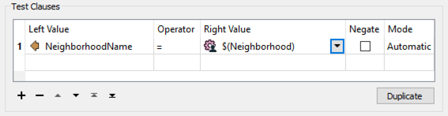
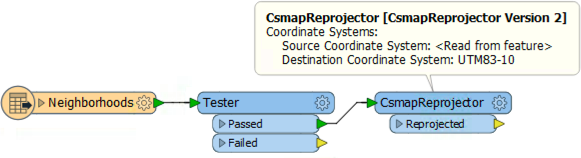
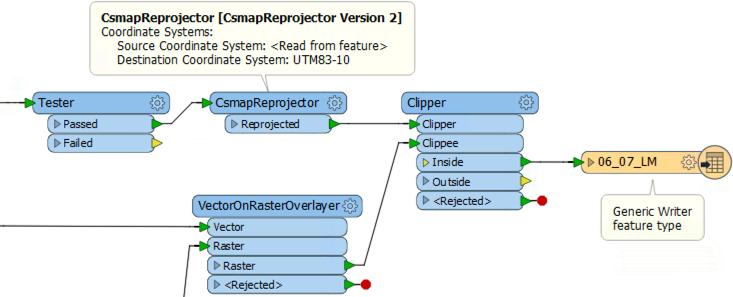

<!--Instructor Notes-->

<!--Exercise Section-->

<table style="border-spacing: 0px;border-collapse: collapse;font-family:serif">
<tr>
<td width=25% style="vertical-align:middle;background-color:darkorange;border: 2px solid darkorange">
<i class="fa fa-cogs fa-lg fa-pull-left fa-fw" style="color:white;padding-right: 12px;vertical-align:text-top"></i>
Exercise 1
</td>
<td style="border: 2px solid darkorange;background-color:darkorange;color:white">
Data Download System: Geographic Selection
</td>
</tr>

<tr>
<td style="border: 1px solid darkorange; font-weight: bold">Data</td>
<td style="border: 1px solid darkorange">Orthophoto images (GeoTIFF)</td>
</tr>

<tr>
<td style="border: 1px solid darkorange; font-weight: bold">Overall Goal</td>
<td style="border: 1px solid darkorange">Create an FME Server Data Download system for orthophotos</td>
</tr>

<tr>
<td style="border: 1px solid darkorange; font-weight: bold">Demonstrates</td>
<td style="border: 1px solid darkorange">Handling selection by geographic area</td>
</tr>

<tr>
<td style="border: 1px solid darkorange; font-weight: bold">Start Workspace</td>
<td style="border: 1px solid darkorange">C:\FMEData2017\Workspaces\ServerAuthoring\SelfServe2-Ex1-Begin.fmw</td>
</tr>

<tr>
<td style="border: 1px solid darkorange; font-weight: bold">End Workspace</td>
<td style="border: 1px solid darkorange">C:\FMEData2017\Workspaces\ServerAuthoring\SelfServe2-Ex1-Complete.fmw</td>
</tr>

</table>

---

As a technical analyst in the GIS department of a city you have just commenced a project to allow other departments to download orthophoto data, rather than having to ask you to create it for them. Not only will their requests be processed quicker, you will also spend less time on that task.

You've implemented a lot of different options for transformation, format, coordinate system, and layers to process. However, end-users also often ask for raster data for a particular neighborhood of the city, and that's easy to do using a Clipper transformer.

 **1) Open Workspace**
 Open the begin workspace listed above. You can see that it consists of a reader, two writers, three transformers, and various published parameters.

To clip data to a particular neighborhood first requires a reader for those neighborhood features, so that is the first step...

 **2) Add Reader**
 Select Readers &gt; Add Reader and use the following setup:

<table style="border: 0px">

<tr>
<td style="font-weight: bold">Reader Format</td>
<td style="">Google KML</td>
</tr>

<tr>
<td style="font-weight: bold">Reader Dataset</td>
<td style="">C:\FMEData2017\Data\Boundaries\VancouverNeighborhoods.kml</td>
</tr>

<tr>
<td style="font-weight: bold">Workflow</td>
<td style="">Individual Feature Types</td>
</tr>

</table>

Be sure to set the workflow option if you carried out the previous exercise, as it might default to a different value. Click OK and, when prompted, select only the feature type for Neighborhoods:

Once added, remove the published parameter for SourceDataset_OGCKML. We don't need to prompt to user to select this dataset. 

 **3) Add Published Parameter**
 Currently the KML Reader will read all of the neighborhoods. However, we need the user to select one of these to clip the data with. To select the neighborhood we'll use a published parameter.

So, add a new parameter. Set the parameter values as follows:

<table>
<tr><td style="font-weight: bold">Type</td><td>Choice</td></tr>
<tr><td style="font-weight: bold">Name</td><td>Neighborhood</td></tr>
<tr><td style="font-weight: bold">Published</td><td>Yes</td></tr>
<tr><td style="font-weight: bold">Optional</td><td>Yes</td></tr>
<tr><td style="font-weight: bold">Prompt</td><td>Select the Neighborhood</td></tr>
</table>

For the configuration field, click the [...] browse button. In the dialog that opens, enter the names of the neighborhoods of Vancouver. These are:

- Downtown
- Fairview
- Kitsilano
- Mount Pleasant
- Strathcona
- West End

Notice that this parameter is optional. The user should not have to select a value if they don't want to. Also, this is a choice field alone; an alias is not needed because the proper values are clear enough.

 **4) Add Tester**
 Now we need to filter the neighborhood data by the user's choice. So add a Tester transformer to the workspace, connected to the Neighborhood feature type:

Inspect its parameters and set them up to test where NeighborhoodName = the neighborhood published parameter:

Save the parameter changes.

 **5) Add CsmapReprojector**
 One interesting part of the neighborhood dataset is that it is in a Latitude/Longitude coordinate system, whereas all other data is in UTM83-10. To be able to clip one with the other requires both datasets to be in the same coordinate space.

So, place a CsmapReprojector transformer after the Tester, connected to the Tester:Passed port. Set it up to reproject to UTM83-10

---

<!--Person X Says Section-->

<table style="border-spacing: 0px">
<tr>
<td style="vertical-align:middle;background-color:darkorange;border: 2px solid darkorange">
<i class="fa fa-quote-left fa-lg fa-pull-left fa-fw" style="color:white;padding-right: 12px;vertical-align:text-top"></i>
Professor Spatial F.M.E., E.T.L. says...
</td>
</tr>

<tr>
<td style="border: 1px solid darkorange">

Why does the CsmapReprojector come after the Tester? Because it has less work to do. If the data was reprojected first then we would be reprojecting data that is subsequently filtered out. It might only be a small difference here, but this is the type of detail that really helps workspace performance in larger projects. 

</td>
</tr>
</table>

---

 **6) Add Clipper**
 Now to clip the raster data. Add a Clipper transformer to the workspace. Connect the CsmapReprojector to the the Clipper:Clipper port. Connect the output from the VectorOnRasterOverlayer to the Clipper:Clippee port:

Check the parameters. The only parameter to really check is one specifically related to raster data: Preserve Clippee Extents. Set this parameter to No if it is not already.

 **7) Publish to FME Server**
 Save the workspace and publish it to FME Server. Register it with the Data Download service, being sure to click the Edit button to edit the service properties. In that dialog set the writer to "Output [GENERIC]" (not "Output [JPEG]").

Run the workspace on FME Server. You should now be able to choose all source tiles and clip them to a chosen neighborhood, like so (here, the Downtown neighborhood):

---

<!--Exercise Congratulations Section--> 

<table style="border-spacing: 0px">
<tr>
<td style="vertical-align:middle;background-color:darkorange;border: 2px solid darkorange">
<i class="fa fa-thumbs-o-up fa-lg fa-pull-left fa-fw" style="color:white;padding-right: 12px;vertical-align:text-top"></i>
CONGRATULATIONS
</td>
</tr>

<tr>
<td style="border: 1px solid darkorange">

By completing this exercise you have learned how to:
 
<ul><li>Set up a workspace for a user to select a specific area feature</li>
<li>Clip data to a chosen area for use in a Data Download system</li></ul>

</td>
</tr>
</table>   
