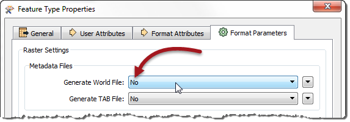

<!--Instructor Notes-->

<!--Exercise Section-->

<table style="border-spacing: 0px;border-collapse: collapse;font-family:serif">
<tr>
<td width=25% style="vertical-align:middle;background-color:darkorange;border: 2px solid darkorange">
<i class="fa fa-cogs fa-lg fa-pull-left fa-fw" style="color:white;padding-right: 12px;vertical-align:text-top"></i>
Exercise 6
</td>
<td style="border: 2px solid darkorange;background-color:darkorange;color:white">

</td>
</tr>

<tr>
<td style="border: 1px solid darkorange; font-weight: bold">Data</td>
<td style="border: 1px solid darkorange">Orthophoto images (GeoTIFF)</td>
</tr>

<tr>
<td style="border: 1px solid darkorange; font-weight: bold">Overall Goal</td>
<td style="border: 1px solid darkorange">Create an FME Server Data Streaming system for orthophotos</td>
</tr>

<tr>
<td style="border: 1px solid darkorange; font-weight: bold">Demonstrates</td>
<td style="border: 1px solid darkorange">Data streaming</td>
</tr>

<tr>
<td style="border: 1px solid darkorange; font-weight: bold">Start Workspace</td>
<td style="border: 1px solid darkorange">C:\FMEData2016\Workspaces\ServerAuthoring\SelfServe-Ex6-Begin.fmw</td>
</tr>

<tr>
<td style="border: 1px solid darkorange; font-weight: bold">End Workspace</td>
<td style="border: 1px solid darkorange">C:\FMEData2016\Workspaces\ServerAuthoring\SelfServe-Ex6-Complete.fmw</td>
</tr>

</table>

---

As a technical analyst in the GIS department of a city you have just created a system to allow other departments to download orthophoto data, rather than having to ask you to create it for them. 

<!--Hidden until I get step 3 to work as a URL!

Sometimes the end-users download data as JPEG for use in a particular software application. You realize that, assuming the software will accept a URL as a data source, they may be able to use a data streaming service, instead of a data download. That way the data is always the latest version, rather than a downloaded snapshot.-->

Sometimes the end-users download data as JPEG just to open it in a browser or image viewer to inspect it. You realize that, in cases like this, they may be able to use a data streaming service, instead of a data download. 

 **1) Open Workspace**
 Open the workspace from exercise 5, or the begin workspace listed above. You can see that it consists of various Readers, Writers, transformers, and other functionality. Most importantly there is an unconnected JPEG Writer that could be used to stream data.

Currently the JPEG Writer is disconnected, so connect it back into the workspace, this time to the Clipper:Inside output port:

 **2) Publish to FME Server**
 Now publish the workspace to FME Server.

In the final dialog of the publishing wizard, check the boxes to register the workspace with both Data Download and Data Streaming (but don't click Finish yet):

Now click the Edit button for the Data Download service. Ensure that service is using the output of the Generic Writer.

Next click the Edit button for the Data Streaming service. Ensure that service is using the output of the JPEG Writer (for now we're limiting the streaming of data to JPEG format). 

 **3) Run Workspace**
 In the FME Server web interface locate the newly published workspace and run it. In the parameters for the workspace be sure to set the web service to Data Streaming instead of Data Download:

The result of this translation is not a streamed jpeg file. Instead, the translation returns a zip file:

If you open the zip file you'll see that it includes both a jpeg file and a wld file. That's why FME returned a zip file. It will zip the results of a Data Streaming service whenever the result is multiple files.

 **4) Turn off wld File Creation**
 To really stream the data we should turn off the wld file creation in the workspace. Open the properties dialog for the JPEG Writer's feature type and click the Format Parameters tab. Set the Generate World File parameter to No:

Click OK to close the dialog.

 **5) Publish and Run Workspace**
 Re-publish the workspace and run it on FME Server. You should find that the results of the translation are returned as a streamed jpeg file. Most likely it will open directly in your web browser:

---

<!--Exercise Congratulations Section--> 

<table style="border-spacing: 0px">
<tr>
<td style="vertical-align:middle;background-color:darkorange;border: 2px solid darkorange">
<i class="fa fa-thumbs-o-up fa-lg fa-pull-left fa-fw" style="color:white;padding-right: 12px;vertical-align:text-top"></i>
CONGRATULATIONS
</td>
</tr>

<tr>
<td style="border: 1px solid darkorange">

By completing this exercise you have learned how to:
 
<ul><li>Set up a workspace for use in a Data Streaming service</li>
<li>Published a workspace to the Data Streaming service</li></ul>

</td>
</tr>
</table>   
