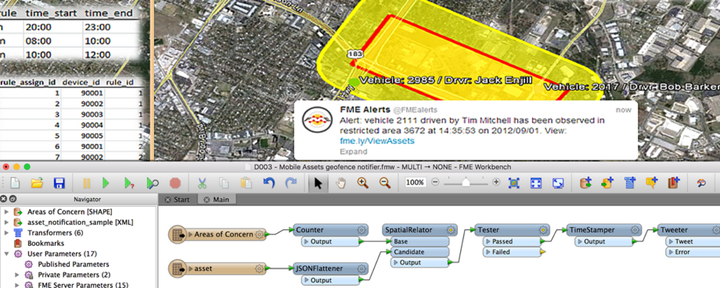

# Real-Time with FME Server

Real-time systems are those that act on events as they happen, and send information as it becomes available.

Real-time is often implemented to monitor sensor networks, run event-driven processing, and/or to send alerts to mobile devices such as cell phones. Therefore real-time is usually related to small amounts of information (rather than large datasets) that arrive either as individual events or as a continuous communication stream.

Real-world examples include processing simple location data from a vehicle tracking system, or handling a continuous stream of data from a temperature sensor or lightning detector. A simpler example would be sending email to a system administrator in response to database table updates.

Real-time data in FME Server is handled in two ways: Notifications and Message Streams.

## Notifications ##

Notifications are how FME Server handles individual messages and alerts.

FME Server has a specific Notification Service that can be set up to listen for an incoming message from outside of FME, and trigger a certain action in response; or that can be set up to send a single alert in response to an event that takes place on FME Server.

Protocols supported include email, websockets, and notifications for Apple and Android devices.

## Message Streaming ##

Whereas Notifications are one-off messages, Message Streaming involves a continuous flow of information

Instead of a workspace being run for each message, the workspace is constantly running and doesn’t need to be started each time. Because of this reduced overhead it can process data at a much faster rate than the notification service.