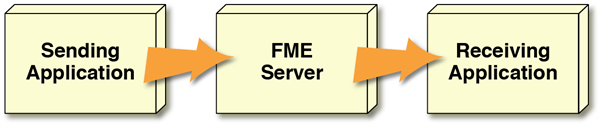

# Automations

Automations is a way for data to be pushed to FME Server in the form of short messages and react to these messages by triggering actions either internally or to external clients.

## What is an Automation? ##

Automations are built on the concept of the FME Server Notification Service using a simple message (sometimes called an “alert”) that informs someone or something that a particular event has happened.

Automations in FME Server are made up of two different components: **incoming Triggers** and **outgoing Actions**.

Incoming Triggers alert FME Server to an event that has taken place either on FME Server or from and external application.

Outgoing Actions are divided into two categories: Internal and External. Internal Actions submit jobs to run on FME Server whilst external Actions either send notifications to a client that an event has taken place on FME Server, or push result data out to a location.

In this way, FME Server can take action in response to an event notification, or a user can take action in response to a notification from FME Server.

**Automations** is the part of the FME Server architecture that handles all incoming and outgoing notifications.

## When to Use Automations ##

Automations allows you to incorporate a variety of triggers and actions into a single workflow, as such Automations should be used when you want to chain a number of different notification elements together in FME, or build multiple reactions to a single event. The event should not be a continuous series of messages; if there is more than one message per second you should consider using Message Streaming techniques instead.

As well as using Automations to trigger an FME Server response to something that happened outside of FME Server, they are also useful when you want to send a message about something that happened on FME Server, to an external client. Again, if there is likely to be more than one message per second you should consider using Message Streaming.

In either case, an automation is meant for sending a short message, usually in order to trigger an action from the recipient.
