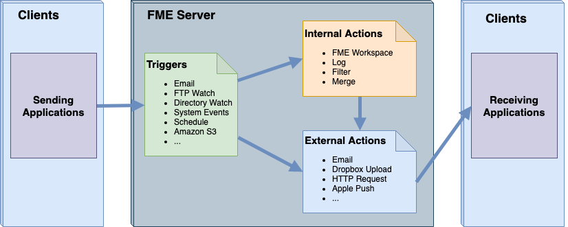

## Elements of Automations ##

Automations includes a number of different components:

- **Clients:** External users or systems that send or receive a message
- **Triggers:** Event handlers that listen for incoming messages
- **Internal Actions:** Event handlers that submit tasks to FME Server
- **External Actions:** Event handlers that dispatch outgoing messages to external services
- **Protocols:** Methods by which FME Server can receive or send notifications

