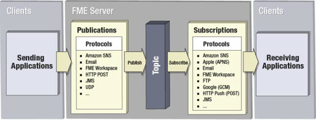

## Elements of the Notification Service ##

The Notification Service includes a number of different components.

- **Clients:** An external user or system that sends or receives a notification
- **Publications:** An event handler that listens for incoming notifications
- **Subscriptions:** An event handler that dispatches outgoing notifications
- **Topics:** A subject that describes what the notification is about
- **Protocols:** Methods by which FME Server can receive or send notifications

---

<!--Person X Says Section-->

<table style="border-spacing: 0px">
<tr>
<td style="vertical-align:middle;background-color:darkorange;border: 2px solid darkorange">
<i class="fa fa-quote-left fa-lg fa-pull-left fa-fw" style="color:white;padding-right: 12px;vertical-align:text-top"></i>
Ms Analyst says...
</td>
</tr>

<tr>
<td style="border: 1px solid darkorange">

As well as Publications/Subscriptions you'll also hear the terms Publishers/Subscribers. These are alternative names for clients. Publishers are clients that publish to FME Server Publications. Subscribers are clients that subscribe to FME Server Subscriptions. Try not to get the terms muddled!

</td>
</tr>
</table>

---

<!--Person X Says Section-->

<table style="border-spacing: 0px">
<tr>
<td style="vertical-align:middle;background-color:darkorange;border: 2px solid darkorange">
<i class="fa fa-quote-left fa-lg fa-pull-left fa-fw" style="color:white;padding-right: 12px;vertical-align:text-top"></i>
Miss Vector says...
</td>
</tr>

<tr>
<td style="border: 1px solid darkorange">

All notification setups must have which of these:
  <a href="http://52.73.3.37/fmedatastreaming/Manual/QAResponse2017.fmw?chapter=24&question=1&answer=1&DestDataset_TEXTLINE=C%3A%5CFMEOutput%5CQAResponse.html">1. Incoming components (Publisher, Publication) AND outgoing components (Subscription, Subscriber)</a>
 <a href="http://52.73.3.37/fmedatastreaming/Manual/QAResponse2017.fmw?chapter=24&question=1&answer=2&DestDataset_TEXTLINE=C%3A%5CFMEOutput%5CQAResponse.html">2. Incoming components OR outgoing components OR both</a>
 <a href="http://52.73.3.37/fmedatastreaming/Manual/QAResponse2017.fmw?chapter=24&question=1&answer=3&DestDataset_TEXTLINE=C%3A%5CFMEOutput%5CQAResponse.html">3. Incoming components OR outgoing components but never both</a>
 <a href="http://52.73.3.37/fmedatastreaming/Manual/QAResponse2017.fmw?chapter=24&question=1&answer=4&DestDataset_TEXTLINE=C%3A%5CFMEOutput%5CQAResponse.html">4. None of the above</a>

</td>
</tr>
</table>