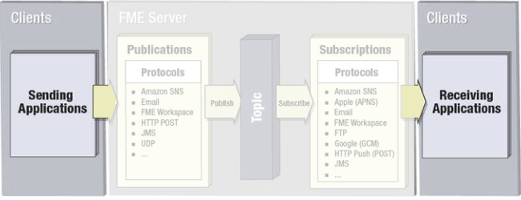

## Clients ##

A client is a user or system that sends or receives a notification. The client may be a physical person, or may just be a component in a computer system. Either way, a client is not a core part of FME Server, rather someone or somthing that interacts with it.

For example, a database update might cause a trigger to send a notification to FME Server, in which case the database system is the client. But a client could also be a person who, for example, triggers a notification by sending an email to FME Server.

Likewise, FME Server can send a notification for another client system to receive. Alternatively this client can also be a real person, who might receive a notification in the form of an email.

### Publishers vs Subscribers ###

Clients that send a notification to FME Server are called **Publishers**.

Clients that receive a notification from FME Server are called **Subscribers**.

---

<!--Person X Says Section-->

<table style="border-spacing: 0px">
<tr>
<td style="vertical-align:middle;background-color:darkorange;border: 2px solid darkorange">
<i class="fa fa-quote-left fa-lg fa-pull-left fa-fw" style="color:white;padding-right: 12px;vertical-align:text-top"></i>
Ms Analyst says...
</td>
</tr>

<tr>
<td style="border: 1px solid darkorange">

Don't confuse Publishers/Publications and Subscribers/Subscriptions.
  As we'll see, Publishers are clients that publish to FME Server Publications. Subscribers are clients that subscribe to FME Server Subscriptions. Got it?!

</td>
</tr>
</table>