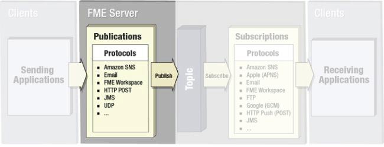
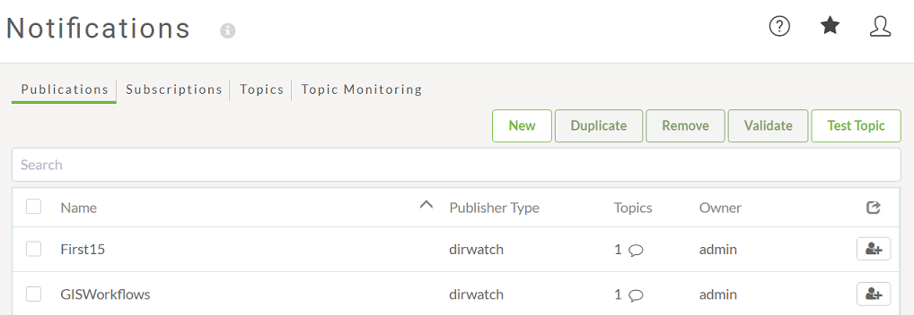
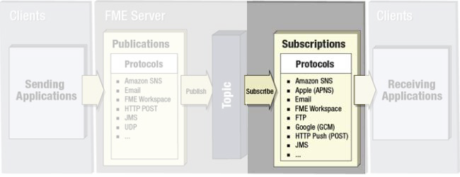

## Publications ##

A Publication is an FME Server component that receives incoming notifications from a client.

To receive a notification in FME Server, a workspace author (or administrator) must create a new Publication. A Publication is created in the FME Server web interface on the Notifications page:

 

---

## Subscriptions ##

A Subscription is an FME Server component that sends outgoing notifications to a client.

To send a notification in FME Server, a workspace author (or administrator) must create a new Subscription. A Subscription is created in the FME Server web interface on the Notifications page:

FME automatically creates some Subscriptions on installation, e.g. to alert clients to the success or failure of jobs that have been run.

---

<table style="border-spacing: 0px">
<tr>
<td style="vertical-align:middle;background-color:darkorange;border: 2px solid darkorange">
<i class="fa fa-quote-left fa-lg fa-pull-left fa-fw" style="color:white;padding-right: 12px;vertical-align:text-top"></i>
IMPORTANT
</td>
</tr>

<tr>
<td style="border: 1px solid darkorange">

Although the actions may seem odd in regard to the name – Publications receive messages, Subscriptions send them – it is correct. They are named in relation to how they interact with Topics.  So, a Publication <strong>publishes</strong> data to a topic (i.e. it sends data to a topic) and a Subscription <strong>subscribes</strong> to a topic (i.e. it receives data from the topic).

</td>
</tr>
</table>
