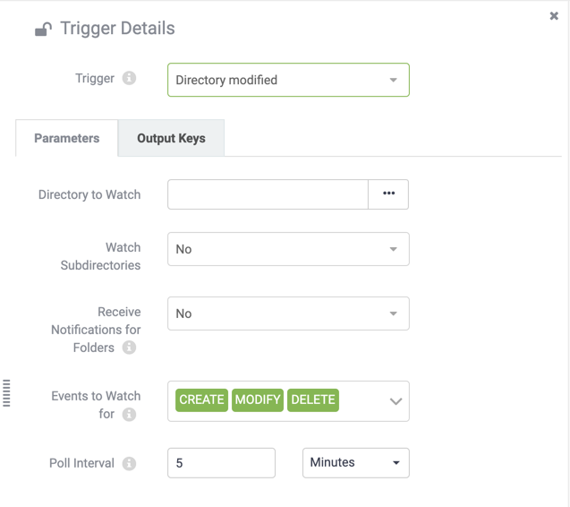

## Protocols ##

A protocol is a system of data exchange between FME Server and a client.

We know that FME sends and receives messages. Protocols are the method by which these messages are sent and received. Each Trigger and Action is defined using a particular communication protocol.

To trigger an incoming message by email – for example – you would create an Automation using an Email Trigger. To send a notification to a Java Message Service, you would create an Automation that contains a JMS message Action.

There are many different protocols available in FME Server; some of them are only for use as a Trigger, others are only available as Actions, and some of them can be used with both types.

This table lists the different Trigger and Action protocols and the following pages go into greater detail on some of the most commonly used types.

<table>
<tr><th>Protocol</th><th>Description</th><th>Trigger</th><th>Action</th></tr>
<tr><td>Amazon S3</td><td> Monitoring activity in an AWS S3 bucket/Communication to Amazon’s Simple Storage Service</td><td align="center">Y</td><td align="center">Y</td></tr>
<tr><td>Amazon SNS</td><td>Communication with Amazon’s Simple Notification Service</td><td align="center">Y</td><td align="center">Y</td></tr>
<tr><td>Amazon SQS</td><td>Communication with Amazon’s Simple Queue Service</td><td align="center">Y</td><td align="center">Y</td></tr>
<tr><td>Azure Event Grid</td><td>Communication with Microsoft Azure Events</td><td align="center">Y</td><td align="center">Y</td></tr>
<tr><td>Directory Watch</td><td>Monitoring activity in a Directory</td><td align="center">Y</td><td></td></tr>
<tr><td>Dropbox</td><td>Monitoring activity in a Dropbox folder/Communication of a notification (file) to the Dropbox web service</td><td align="center">Y</td><td align="center">Y</td></tr>
<tr><td>Email (IMAP)</td><td>Receive email messages from an IMAP Server</td><td align="center">Y</td><td align="center"></td></tr>
<tr><td>Email (SMTP)</td><td>FME Server itself receives email messages/Communication via an email server</td><td align="center">Y</td><td align="center">Y</td></tr>
<tr><td>Filter</td><td>Test incoming messages for the presence of a specified string</td><td align="center"></td><td align="center">Y</td></tr>
<tr><td>FME Server Topic</td><td>Receive/Send messages to a Topic to initiate workflow processes</td><td align="center">Y</td><td align="center">Y</td></tr>
<tr><td>FME Workspace</td><td>Run an FME Desktop Workspace published to FME Server</td><td align="center"></td><td align="center">Y</td></tr>
<tr><td>FME Dynamic Workspace</td><td>Run an FME Desktop Workspace published to FME Server, with the repository and workspace name coming from output keys in the Automation</td><td align="center"></td><td align="center">Y</td></tr>
<tr><td>FTP</td><td>Monitor activity/upload a file to an FTP Site</td><td align="center">Y</td><td align="center">Y</td></tr>
<tr><td>HTTP Request</td><td>Post HTTP requests to the specified URL</td><td></td><td align="center">Y</td></tr>
<tr><td>JMS</td><td>Communication with a Java Message Service</td><td align="center">Y</td><td align="center">Y</td></tr>
<tr><td>Log</td><td>Write Event/Automation details to a log</td><td align="center"></td><td align="center">Y</td></tr>
<tr><td>Merge</td><td>Combine messages before proceeding downstream in an Automation</td><td align="center"></td><td align="center">Y</td></tr>
<tr><td>SFTP</td><td>Communication with an SFTP site</td><td></td><td align="center">Y</td></tr>
<tr><td>Schedule</td><td>Complete workflow tasks at specific times in the future</td><td align="center">Y</td><td align="center"></td></tr>
<tr><td>System Events</td><td>Communication with FME Server systems</td><td align="center">Y</td><td align="center"></td></tr>
<tr><td>UDP</td><td>Communication via a User Datagram Protocol port</td><td align="center">Y</td><td></td></tr>
<tr><td>WebSocket</td><td>Communication via a WebSocket channel</td><td align="center">Y</td><td align="center">Y</td></tr>
<tr><td>Webhook</td><td>Receive messages sent as HTTP Post requests from another application</td><td align="center">Y</td><td align="center"></td></tr>
</table>

---

Protocols are pre-defined components in the FME Server architecture and do not need to be defined in the web interface.

However, a number of fields are made available to configure when an Automation is created.

For example, here are the parameters for a Directory modified Trigger:

These parameters must be set when the Automation is created as they are needed in order for FME to be able to watch and receive notifications about this Directory. Without configuring these parameters the Automation will have no behave as anticipated when enabled.
