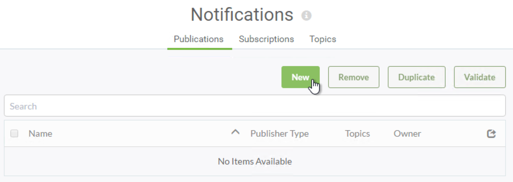
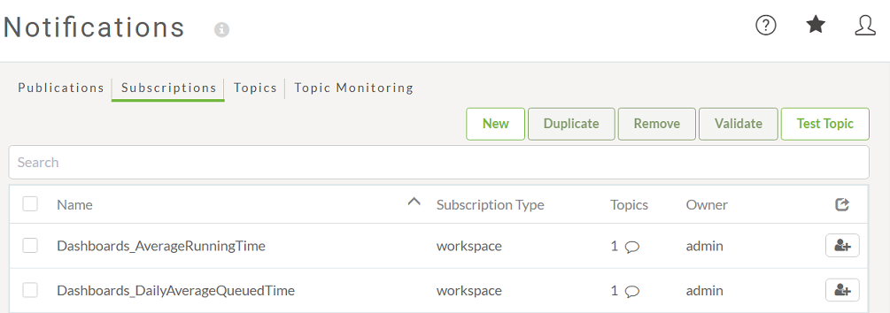

## Publications ##

A Publication is a component that receives incoming notifications from a client.

To receive a notification in FME Server a user must create a new Publication. A Publication is created in the FME Server Web User Interface under the Notifications section.

---

## Subscriptions ##

A Subscription is a component that sends outgoing notifications to a client.

To send a notification in FME Server a user must create a new Subscription.

A Subscription is created in the FME Server web interface under the Notifications section.

FME automatically creates some subscriptions on installation, e.g. to alert clients to the success or failure or jobs that have been run.

---

<table style="border-spacing: 0px">
<tr>
<td style="vertical-align:middle;background-color:darkorange;border: 2px solid darkorange">
<i class="fa fa-quote-left fa-lg fa-pull-left fa-fw" style="color:white;padding-right: 12px;vertical-align:text-top"></i>
IMPORTANT
</td>
</tr>

<tr>
<td style="border: 1px solid darkorange">

Although the actions may seem odd in regard to the name – Publications receive messages, Subscriptions send them – it is correct. The name refers to the Client, not the Server. So FME Server receives a Publication because the client is publishing it. Likewise, FME Server sends a Subscription because the client is subscribing to it.

</td>
</tr>
</table>

