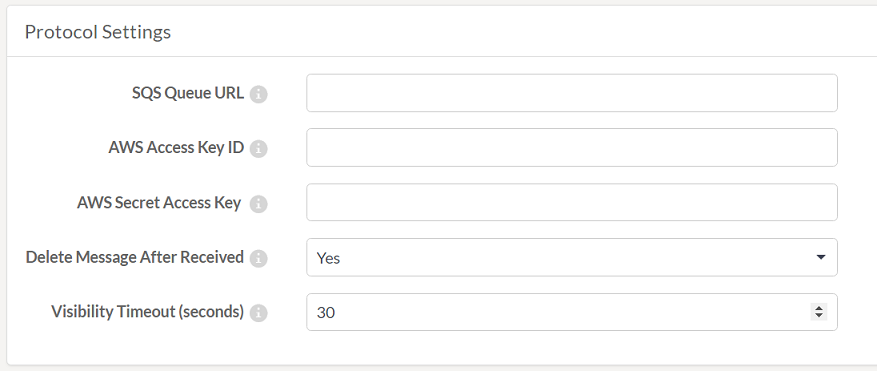

## Protocols ##

A protocol is a system of data exchange between FME Server and a client. 

We already know that FME sends and receives notifications. Protocols are the method by which these notifications are sent and received. Each Publication and Subscription is defined using a particular communication protocol. 

To trigger an incoming notification by email – for example – you would create an FME Publication using the Email protocol. To send a notification to subscribers with an Apple mobile device, you would create an FME Subscription using the Apple Push protocol.

There are many different protocols available in FME Server; some of them are only for use on Publications, some are only for Subscriptions, and some of them can be used with both notification types.

This table lists the different Publication and Subscription protocols and the following pages go into detail on some of the most important.

<table>
<tr><th>Protocol</th><th>Description</th><th>Publications</th><th>Subscriptions</th></tr>
<tr><td>Amazon S3</td><td>Communication with Amazon’s Simple Storage Service</td><td align="center">Y</td><td align="center">Y</td></tr>
<tr><td>Amazon S3 Watch</td><td>Monitoring an AWS S3 bucket for activity</td><td align="center">Y</td><td align="center"></td></tr>
<tr><td>Amazon SNS</td><td>Communication with Amazon’s Simple Notification Service</td><td align="center">Y</td><td align="center">Y</td></tr>
<tr><td>Amazon SQS</td><td>Communication with Amazon’s Simple Queue Service</td><td align="center">Y</td><td align="center">Y</td></tr>
<tr><td>Apple Push Notification</td><td>Communication with Apple mobile devices</td><td></td><td align="center">Y</td></tr>
<tr><td>Directory Watch</td><td>Monitoring a folder for new files as a trigger mechanism</td><td align="center">Y</td><td></td></tr>
<tr><td>Dropbox</td><td>Communication of a notification (file) to the Dropbox web service</td><td></td><td align="center">Y</td></tr>
<tr><td>Dropbox Watch</td><td>Like Directory Watch, but monitoring folders stored in the Dropbox web service</td><td align="center">Y</td><td></td></tr>
<tr><td>Email (IMAP)</td><td>Communication via an email service</td><td align="center">Y</td><td></td></tr>
<tr><td>Email (SMTP)</td><td>Communication via an email server</td><td align="center">Y</td><td align="center">Y</td></tr>
<tr><td>FME Workspace</td><td>Communication of notifications to an FME workspace</td><td align="center"></td><td align="center">Y</td></tr>
<tr><td>FTP/SFTP/FTP Watch</td><td>Communication with an FTP site</td><td align="center">Y</td><td align="center">Y</td></tr>
<tr><td>Google Cloud Messaging</td><td>Communication with Android mobile devices</td><td></td><td align="center">Y</td></tr>
<tr><td>JMS</td><td>Communication with a Java Message Service</td><td align="center">Y</td><td align="center">Y</td></tr>
<tr><td>Logger</td><td>Output to a simple log file</td><td align="center"></td><td align="center">Y</td></tr>
<tr><td>Push</td><td>Communication via HTTP requests</td><td></td><td align="center">Y</td></tr>
<tr><td>UDP</td><td>Communication via a User Datagram Protocol port</td><td align="center">Y</td><td></td></tr>
<tr><td>WebSocket</td><td>Communication via a WebSocket channel</td><td align="center">Y</td><td align="center">Y</td></tr>
</table>

---

Protocols are pre-defined components in the FME Server architecture and do not need to be defined in the web interface.

However, a number of fields are made available to configure them when a Publication or Subscription chooses to make use of that protocol.

For example, here are the parameters for an Amazon SQS Subscription:

These parameters must be set when the Subscription is created as they are needed in order to be able to send out a notification using the protocol.

---

<!--Person X Says Section-->

<table style="border-spacing: 0px">
<tr>
<td style="vertical-align:middle;background-color:darkorange;border: 2px solid darkorange">
<i class="fa fa-quote-left fa-lg fa-pull-left fa-fw" style="color:white;padding-right: 12px;vertical-align:text-top"></i>
Miss Vector says...
</td>
</tr>

<tr>
<td style="border: 1px solid darkorange">

Tell me, which one of these statements is correct:
  1. SMTP and IMAP can both be used as either a Subscription and/or a Publication protocol
 2. SMTP can be used as both a Subscription and a Publication; IMAP can only be used for a Publication
 3. SMTP can only be used for a Publication; IMAP can only be used as both a Subscription and a Publication 
 4. SMTP can only be used for a Subscription; IMAP can only be used for a Publication

</td>
</tr>
</table>