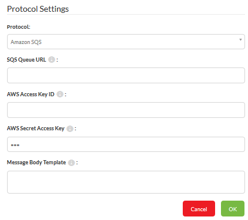

## Protocols ##

A protocol is a system of data exchange between FME Server and a client. 

We already know that FME sends and receives notifications. Protocols are the method by which these notifications are sent and received. 

For example, E-mail is a messaging protocol, as are Apple and Android alerts.

### Publications, Subscriptions, and Protocols ###

Each Publication and Subscription is defined using a particular communication protocol. An e-mail Publication – for example – will accept notifications via an incoming email message. An Apple Subscription will send notifications to an Apple mobile device.

Protocols are pre-defined components in the FME Server architecture and do not need to be defined in the Web User Interface.

However, a number of fields are made available to configure them when a Publication or Subscription chooses to make use of that protocol.

For example, here are the parameters for an Amazon SQS Subscription:

These parameters must be set when the Subscription is created as they are needed in order to be able to send out a notification using the protocol.