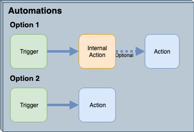
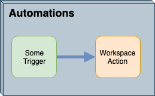

# Automations and Workspaces

Workspaces are what make FME Server the ideal engine for data notifications. That's because the same functionality used to carry out spatial and tabular data transformations is also perfect for creating and transforming notification messages.

## Message Transformation ##

### A Simple Automation Setup ###

An Automation requires a minimum of two components. The simplest is where a trigger sends an incoming message to an action:

Using Automations you do not need to perform data processing tasks and could deliver notifications without even taking up an FME Server Engine. For example, someone sends an email to FME Server, which triggers an outgoing email in response.

However, that scenario does not include any transformation/restructuring of the message contents. If the message needs to be processed in some way then an FME workspace can be employed within FME Server.

A workspace is the foundation of FME. For Automations, it can be used to read an incoming message, extract spatial data from the message (regardless of format), carry out spatial transformations on that data, and then write the results in some way. The workspace can even read in extra data against which the message is to be processed.

It can also generate an outgoing message - possibly in response to some other spatial processing - and pass that on to an action.

This blend of live messaging with Spatial ETL is unique.

Let's look at two specific scenarios:

- A workspace runs in response to an incoming message
- A workspace runs and triggers an outgoing message

---

### Workspaces Responding to Incoming Message ###

Let's think about this logically. An incoming message is received through a trigger. For a workspace to respond to an incoming message, there must be mechanisms for it to listen to that trigger and receive the information from it.

We already have terms for these mechanisms: **Triggers in Automations**

Yes, this scenario is set up by creating an Automation. The workspace action is a response to the trigger and receives the message content from it.

An example here is a trigger holds data - such as in the previous exercise - and goes on to submit a workspace that writes the incoming data to a database.

---

### Workspaces Triggering an Outgoing Message ###

To continue the logic, a subsequent outgoing message is activated by the workspace action. For a workspace to cause that outgoing message.

Again we already have terms for these mechanisms: **Actions in Automations**  

This scenario is a little different, this time the workspace can trigger an action indirectly in an Automation by passing a message through an FME Server Topic. This means that the workspace can be run manually, or via another mechanism such as the Rest API call, that isn't listed as an Automation Trigger type but still enables the author to have a notification response triggered.

An example here is a workspace, started as a scheduled task, that sends a notification email to an administrator once complete.

---

### Full System ###

Of course, the above diagrams show half-systems; i.e., the workspace either responds to a message (it is an Action) **OR** it causes a message (through a Topic Trigger).

However, it is just as appropriate to have a workspace that is both an Action **AND** a Trigger.

For example, a Trigger sends a message containing an emergency event and the coordinates of the client's position. A workspace runs in response to that emergency, processes the coordinates, and sends a new message on to an emergency response unit.  

Notice that this setup requires one Trigger and two Action objects in FME Server. There is a trigger from a client, a workspace that acts as both an internal action and a trigger, and an external action pushing information back out to a client.
