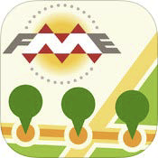
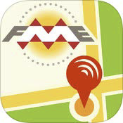

## Available Protocols ##

Probably the two most important protocols are Email and Workspaces, and they are covered in detail in the next few sections. Some other commonly used protocols are:

---

### Watch Notifications ###

There are several watch notification protocols: Directory Watch and FTP Watch are the two most common.

These are Publication-only protocols that monitor folders and FTP sites for new files to be added. When a file appears in that directory then the Topic to which it is tied becomes triggered. The name of the affected file is passed on through the topic message.

An obvious use is for monitoring a folder in which datasets are stored. When a new dataset is placed into the folder then a workspace automatically runs to process it.

This protocol allows files to be filtered by the action type, so that it is not just the creation of a new file that can be monitored. It's also possible to monitor for file deletions and modifications.

---

### Mobile Notifications ###

Mobile Notifications are Subscription-only protocols that send notifications to mobile devices. The two protocols available are **Apple Push Notification** and **Google Cloud Messaging**.

#### Apple Device Notifications ####

The Apple Push Subscriber allows delivery of messages to an Apple iOS device, like an iPhone.
Messages are sent from FME Server to the device via a cloud service called the Apple Push Notification service (APNs).

The FME Server Reference Manual explains how to set up such a notification and what is required in terms of Apple “SSL Keystore” and device tokens.

Two free FME apps on the iTunes store exist to provide a starting point for mobile apps; they are the FME Reporter and FME Alerts:

  

The FME Reporter is a Publication tool used for sending location from a device’s GPS to a notification topic on FME Server. Technically it’s a publisher, not a subscriber, so it won’t be using the Apple Push Notification protocol.

FME Alerts is a Subscription tool for receiving notifications from an FME Server using the Apple Push Notification protocol. Location is also sent to the FME Server to allow spatial-based filtering to occur. For example, you can push alerts on local traffic based on the GPS location.

The source code for both apps is made available from Safe Software, so that they can be used as
prototypes for your own custom applications.

#### Android Device Notifications ####

Google Cloud Messaging is the Android equivalent to Apple notifications. Again they involve sending content to a mobile device from an FME Publication.

There are also two free FME apps on the Google Play store to experiment with and use.

---

### Amazon Notifications ###

Several Amazon protocols are supported by FME Server notifications. SNS and SQS are two types of notification system. FME Server is capable of pushing messages to both of them and receiving messages from both of them. The difference (if you are interested) is that SNS pushes messages to subscribers immediately, whereas SQS stores the messages in a queue until the subscriber fetches them. 

Amazon S3 is an online file storage service. It can be either a publisher or subscriber in FME Server; i.e. FME can be notified to read from an S3 "buckets" and can issue a notification in the form of writing to an S3 bucket. The S3 publisher is actually a "Watch" type notification. FME Server can watch for files arriving there and trigger a notification in response.

---

### WebSockets Notifications ###

A WebSocket is an TCP-based line of communication. FME Server can accept and send notifications from/to another WebSockets client. WebSocket protocols are supported by most web browsers, meaning any web application can communicate to FME Server and FME Server can send notifications (even small quantities of data) directly to a web browser. 