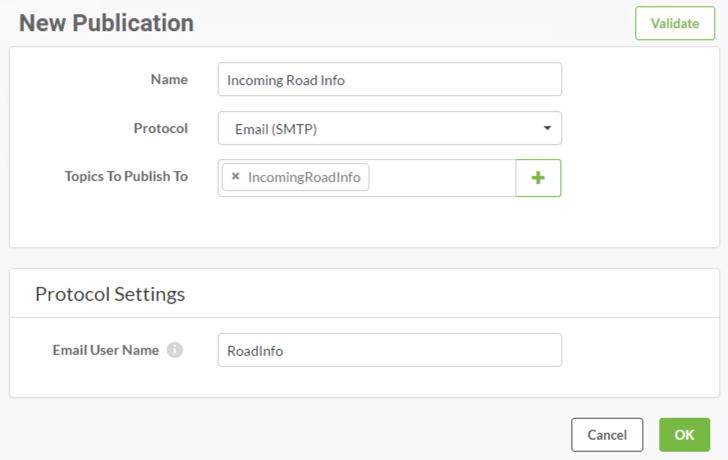

## SMTP Publications ##

SMTP Publications are used when data is published to FME Server via a direct email. FME Server receives an email and triggers a Topic in response.

Such Publications are possible because FME Server includes a built-in email server as one of its components. However, this does require that the host server has a domain name registered with a DNS name server.

---

<table style="border-spacing: 0px">
<tr>
<td style="vertical-align:middle;background-color:darkorange;border: 2px solid darkorange">
<i class="fa fa-quote-left fa-lg fa-pull-left fa-fw" style="color:white;padding-right: 12px;vertical-align:text-top"></i>
Sister Intuitive says …
</td>
</tr>

<tr>
<td style="border: 1px solid darkorange">

The steps to set up the built-in email server for notifications are documented in the FME Server Reference Manual.
  However, FME Cloud instances are automatically configured for email notifications, and have a public domain name too, so you don’t need to do any additional setup.

</td>
</tr>
</table>

---

### Creating an SMTP Publication ##

Creating an SMTP Publication is done in the Notifications section of the FME Server web interface, by choosing the Email (SMTP) protocol for a new Publication.

Once the protocol type is selected, the publication must also be given a name and an existing topic chosen to be triggered. The final parameter is the Email User Name; in the above example it is set up to be RoadInfo. Note that you do not need to add *@FMEServer-Hostname.com* to the Email User Name.

Notice the author is prefixing the Publication and Topic names with "Incoming" so that there is no confusion over which topics are being used for incoming notifications and which ones for outgoing.

Now, whenever an email is sent to RoadInfo@FMEServer-Hostname.com – for example someone is sending an email to report snow on the road – the *IncomingRoadInfo* topic is triggered.

