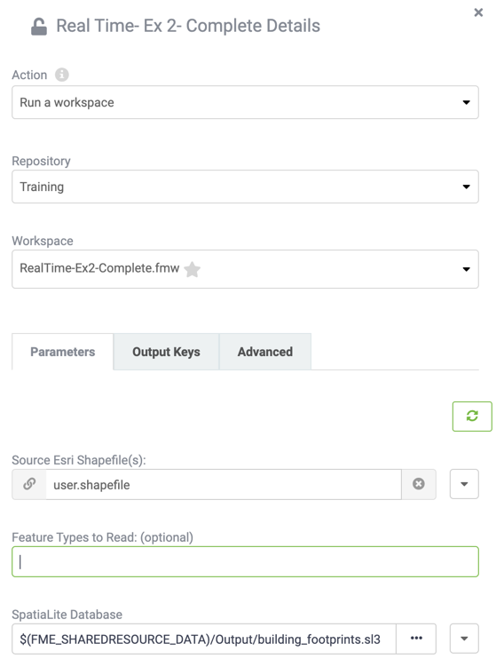

# Workspaces as Actions #

In Automations Run Workspace is labelled an action since it reacts to an incoming message and therefore must be set up by being connected to a Trigger.

Within an Automation the Action protocol is called (as you might have guessed) *Run a Workspace* and falls under the Internal Action Category (orange node).

After selecting Run Workspace as the Action type, the user must first specify a Repository and workspace, the selected workspace is then examined and a list of its published parameters provided:

Having the parameters in a dialog like this means it is simple and easy to set up a workspace to run however you want it to in response to a trigger. Once created, whenever that Trigger receives a message from the sending client, the action will react by submitting that workspace to run on FME Server.
