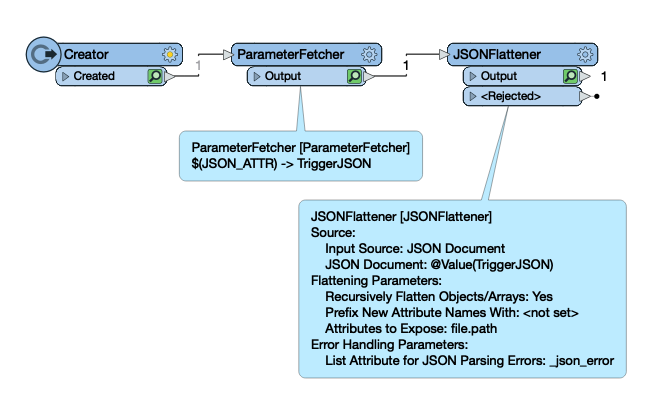
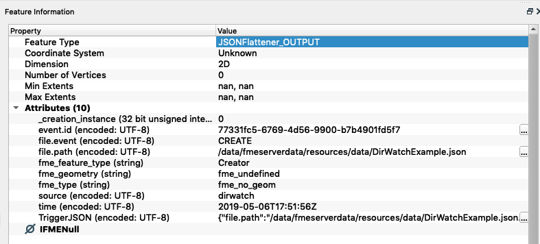

## Message Content ##

The ability to interpret and process message content is a key reason for using FME workspaces as a action. They can receive the message and then transform it in whatever way is required, incorporating spatial data and spatial conditions as necessary.

---

### Passing Messages ###

A trigger passes on messages to the Workspace action. When it does the message is written into a temporary JSON file, and the name of the file is passed to a workspace via a published parameter.

In Automations this JSON message is flattened into its separate objects so it is easy to retrieve the filename information downstream in the automation.

If the incoming trigger is a topic from a third party application you will need to digest this JSON in the workspace to retrieve additional attributes not recognised by FME Server. The message can be passed into the Workspace using a published parameter setting the value to Event as JSON.

---

### Interpreting the Message ###

An incoming message can be scanned and processed with a number of different transformers. If the messages are in JSON format there are transformers such as the JSONExtractor and JSONFlattener. Similarly there are XMLFlattener and XMLFragmenter transformers for XML content.

These transformers will convert the message from a JSON (or XML) string and into attributes that FME Workbench is able to process.

Here - for example - an author kickstarts the workspace using a Creator, and then has a ParameterFetcher to bring in the JSON message and finally a JSONFlattener to query and expose the attributes in the Topic message:

If the incoming message was a directory watch then the JSON content may look like this:

<pre>
{
  "file.path":"/data/fmeserverdata/resources/data/Example.txt",
  "file.event":"CREATE","source":"dirwatch",
  "time":"2019-05-06T18:21:22Z",
  "event.id":"f754c6b3-c75c-4e95-a49e-0a1db41decfc
}
</pre>

Notice how it includes the email from and to fields, plus the content itself.

When converted into FME attributes using the JSONFlattener transformer the result – as shown in Visual Preview – will look something like this:

Now the content is available to the workspace as a set of attributes and can be processed as required.

---

### Using the Message ###

What you do with the message depends on your required setup. If the topic is merely a trigger, and the message is unimportant, it could be ignored. However, in most cases, the message content *is* important.

There are almost limitless ways FME could be used to process an incoming message. However, one useful example to consider is where the message contains an X/Y coordinate - for example the location of a person. Here, the X/Y coordinate could be converted into a point feature with the VertexCreator transformer, and from there, any number of FME transformers could be used to carry out spatial processing such as a geofence.

This process is important when the Topic message contains contents that is not standard to the Trigger and needs to be processed within a workflow to get access to it.
