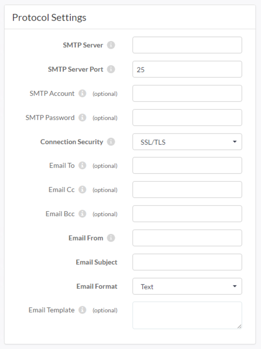

## Email Subscriptions ##

Email Subscriptions are used to have FME Server send an email in response to a Topic. The built-in email server in FME Server is only for incoming mail, as is the IMAP protocol, and so messages need to be sent via an existing (external) SMTP email server.

### Setting up an Email Subscription ###

Creating an Email Subscription is done in the Notifications page of the web interface, by choosing the Email protocol for a new Subscription.

The Subscription is given a name and an existing topic chosen to be triggered. There are many more parameters for outgoing mail because the full SMTP server connection parameters need to be defined, however, there is an option to load a template for the most common email services.

[comment]: <> (screen shot should include template button)

Various fields for the email itself (From, To, Subject, Template) do not need to be hard-coded and can be passed through to the Subscription from a workspace. Another important parameter is the Email Format, which can either be plain text or HTML.

See the following sections on workspaces for information on how to generate content for outgoing emails.
