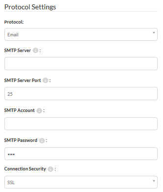

## Email Subscriptions ##

Email Subscriptions are when FME Server sends an email in response to a Topic. The in-built mail server in FME Server is only for incoming mail, and so messages need to be sent via an existing SMTP email server.

### Setting up an Email Subscription ###

Creating an Email subscription is done in the Notifications section of the Web User Interface, by choosing the email protocol for a new Subscription.

The Subscription is given a name and an existing topic chosen to be triggered. There are many more parameters for outgoing mail because the full SMTP server connection parameters need to be defined.

Various fields for the email itself (From, To, Subject, Template) do not need to be hardcoded and can be passed through to the Subscription from a workspace. Another important parameter is the Email Format, which can either be plain text or HTML.

