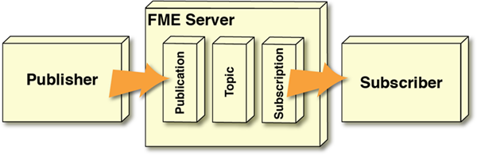

# Notifications and Workspaces

Workspaces are what make FME Server the ideal engine for spatial data notifications. That's because the same functionality used to carry out spatial and tabular data transformations is also perfect for creating and transforming notification messages - with the added bonus of spatially based conditional processing!

## Message Transformation ##

### A Simple Notification Setup ###

The simplest setup for the FME Server Notification Service is where a Publisher sends an incoming message to a Publication, which in turn triggers a specific Topic. A Subscription listens to the Topic and passes its information as an outgoing message to any Subscriber:

For example, someone sends an email to FME Server, which triggers an outgoing email in response.

However, that scenario does not include any transformation/restructuring of the message contents. If the message needs to be processed in some way then an FME workspace can be employed within FME Server.

A workspace is the foundation of FME. For notifications it can be used to read an incoming message, extract spatial data from the message (regardless of format), carry out spatial transformations on that data, and then write the results in some way. The workspace can even read in extra data against which the message is to be processed.

It can also generate an outgoing message - possibly in response to some other spatial processing - and pass that on to a subscriber.

This blend of live messaging with Spatial ETL is unique.

Let's look at two specific scenarios:

- A workspace runs in response to an incoming message
- A workspace runs and triggers an outgoing message

---

### Workspaces Responding to Incoming Message ###

Let's think about this logically. An incoming message triggers a topic. For a workspace to respond to an incoming message, there must be mechanisms for it to listen to that topic and receive the information from it.

We already have terms for these mechanisms: **Subscription and Subscriber!**

Yes, this scenario is set up by creating a Subscription. The workspace is literally a Subscriber to that Subscription and receives the message content from it. The only difference to the Simple Notification Setup is that the Subscriber now resides inside FME Server, rather than outside of it.

An example here is a Publisher/Publication triggers a workspace that writes the incoming data to a database.

---

### Workspaces Triggering an Outgoing Message ###

To continue the logic, an outgoing message is activated by a topic. For a workspace to cause that outgoing message there must be mechanisms for it to trigger that topic and send information to it.

Again we already have terms for these mechanisms: **Publication and Publisher!**  

Again the workspace is literally a Publisher. Once more that Publisher now resides inside FME Server, rather than outside of it.

However, there is another difference to the Simple Notification Setup from above: this scenario does not need a Publication component. A workspace is able to send information directly to a topic, without a Publication component being defined.

An example here is a workspace, started as a scheduled task, that sends a notification email to an administrator once complete.

---

### Full System ###

Of course, the above diagrams show half-systems; i.e. the workspace either responds to a message (it is a Subscriber) **OR** it causes a message (it is a Publisher).

However, it is just as appropriate to have a workspace that is both a Subscriber **AND** a Publisher.

For example, a publisher sends a message containing an emergency event and the coordinates of the publisher's position. A workspace runs in response to that emergency, processes the coordinates, and sends a new message on to an emergency response unit.  

Notice that this setup requires one Publication and two Subscription objects in FME Server. There is an outside publisher (with Publication), a workspace that is both subscriber and publisher (with Subscription), and an outside subscriber (with Subscription).

There are also two different Topic objects. That's important, as we shall see later.

---

<!--Person X Says Section-->

<table style="border-spacing: 0px">
<tr>
<td style="vertical-align:middle;background-color:darkorange;border: 2px solid darkorange">
<i class="fa fa-quote-left fa-lg fa-pull-left fa-fw" style="color:white;padding-right: 12px;vertical-align:text-top"></i>
Miss Vector says...
</td>
</tr>

<tr>
<td style="border: 1px solid darkorange">

When a workspace is part of a notification system, processing incoming messages, it is a...
  <a href="http://52.73.3.37/fmedatastreaming/Manual/QAResponse2017.fmw?chapter=24&question=4&answer=1&DestDataset_TEXTLINE=C%3A%5CFMEOutput%5CQAResponse.html">1. Subscription</a>
 <a href="http://52.73.3.37/fmedatastreaming/Manual/QAResponse2017.fmw?chapter=24&question=4&answer=2&DestDataset_TEXTLINE=C%3A%5CFMEOutput%5CQAResponse.html">2. Publication</a>
 <a href="http://52.73.3.37/fmedatastreaming/Manual/QAResponse2017.fmw?chapter=24&question=4&answer=3&DestDataset_TEXTLINE=C%3A%5CFMEOutput%5CQAResponse.html">3. Protocol</a>
 <a href="http://52.73.3.37/fmedatastreaming/Manual/QAResponse2017.fmw?chapter=24&question=4&answer=4&DestDataset_TEXTLINE=C%3A%5CFMEOutput%5CQAResponse.html">4. Client</a>

</td>
</tr>
</table>
