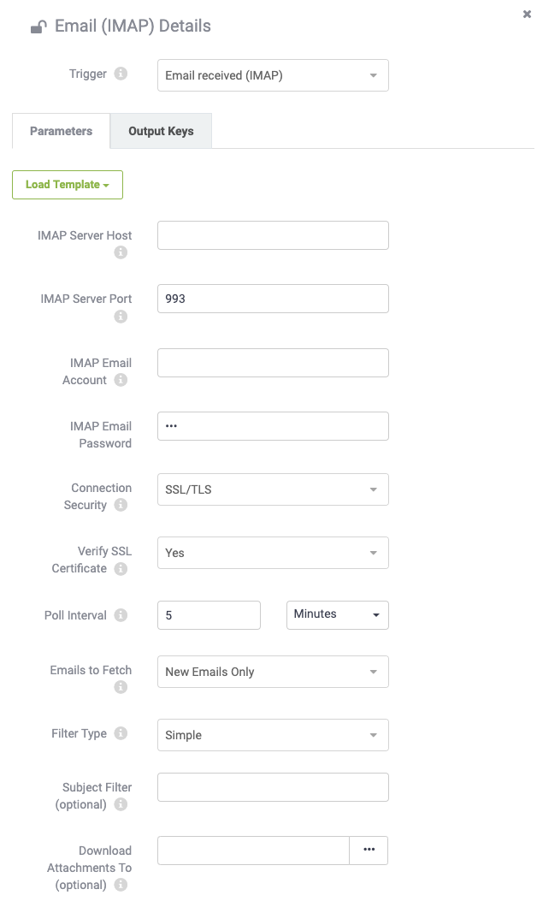

## IMAP Triggers ##

IMAP (Internet Message Access Protocol) is a variation on email for incoming notifications.

Instead of using the built-in email server, an IMAP Trigger connects to another email server and monitors it for incoming email. When a new email arrives in that account, the Automation is triggered.

---

### Creating an IMAP Trigger ###

Like the SMTP protocol, IMAP Triggers are set up in the Automations: Build section of the web interface by creating a new, or adding to an existing Automation, but this time choosing the Email (IMAP) protocol:

This Trigger has significantly more parameters, most are for defining the IMAP (Email) server connection.

There are two important parameters that let you decide what and when to watch this Email Server. The Poll interval determines how often FME Server should check for emails and second, the Emails to fetch decides whether to fetch all unread emails or new emails only.

Alike the SMTP Protocol there is a parameter to select an FME Server resource location in which to store any email attachments.

---

<table style="border-spacing: 0px">
<tr>
<td style="vertical-align:middle;background-color:darkorange;border: 2px solid darkorange">
<i class="fa fa-quote-left fa-lg fa-pull-left fa-fw" style="color:white;padding-right: 12px;vertical-align:text-top"></i>
Monsieur D. Server says …
</td>
</tr>

<tr>
<td style="border: 1px solid darkorange">

Most email servers support IMAP functionality, as do the majority of cloud-based email providers such as Gmail, Outlook.com, Yahoo!, etc; so it’s very easy to have FME Server scan a Gmail account (for example) for incoming mail, and then act on its contents. FME Server has the option to load templates for these popular email providers.

</td>
</tr>
</table>
