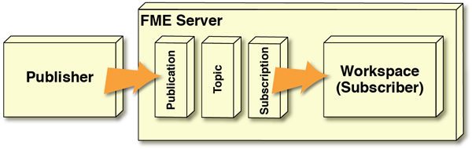
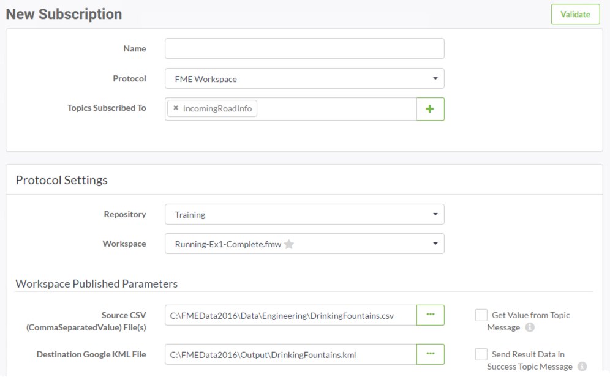
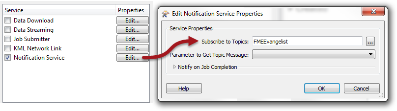
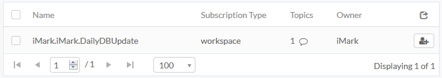

# Workspaces as Subscribers #

When a workspace needs to react to an incoming notification it is literally a Subscriber, subscribing to a topic. This is set up by connecting the workspace to that topic using a Subscription:

When that topic is triggered (by a Publication or any other means) any workspace connected to that topic through an *FME Workspace* protocol is run.

## Registering a Workspace ##

As the above diagram shows, a workspace that receives notifications requires a Subscription for the topic to be communicated to the workspace. 

There are two ways to create this Subscription:

- Through the FME Server Web Interface
- When publishing the workspace with the FME Server Publishing Wizard

---

### Web Interface Workspace Subscriptions ###

The Subscription to create should have a protocol called (as you might have guessed) *FME Workspace*. 

When that protocol is chosen for a new Subscription, the selected workspace is examined and a list of its published parameters provided:

Having the parameters in a dialog like this means it is simple and easy to set up a workspace to run however you want it to in response to a notification. Once created, when that topic is triggered, the workspace will run in response.

---

### Publishing Wizard Workspace Subscriptions ###

The second way to create an FME Workspace Subscription is when publishing the workspace from Workbench to FME Server. At this point you may choose the Notification service and select a topic to receive information from:

Having done this you don't need to create a new Subscription object; FME will create one for you. It will look like this:

The name used for the new Subscription includes the repository name, the owner's name, and the name of the workspace. 

---

<!--Warning Section--> 

<table style="border-spacing: 0px">
<tr>
<td style="vertical-align:middle;background-color:darkorange;border: 2px solid darkorange">
<i class="fa fa-exclamation-triangle fa-lg fa-pull-left fa-fw" style="color:white;padding-right: 12px;vertical-align:text-top"></i>
WARNING
</td>
</tr>

<tr>
<td style="border: 1px solid darkorange">

It's very important to be aware that FME creates this new Subscription. Otherwise there might be consequences in a number of scenarios; for example if you copy components to a new FME Server (in a Project), but don't include this one, then your notifications won't work on that server!

</td>
</tr>
</table>

