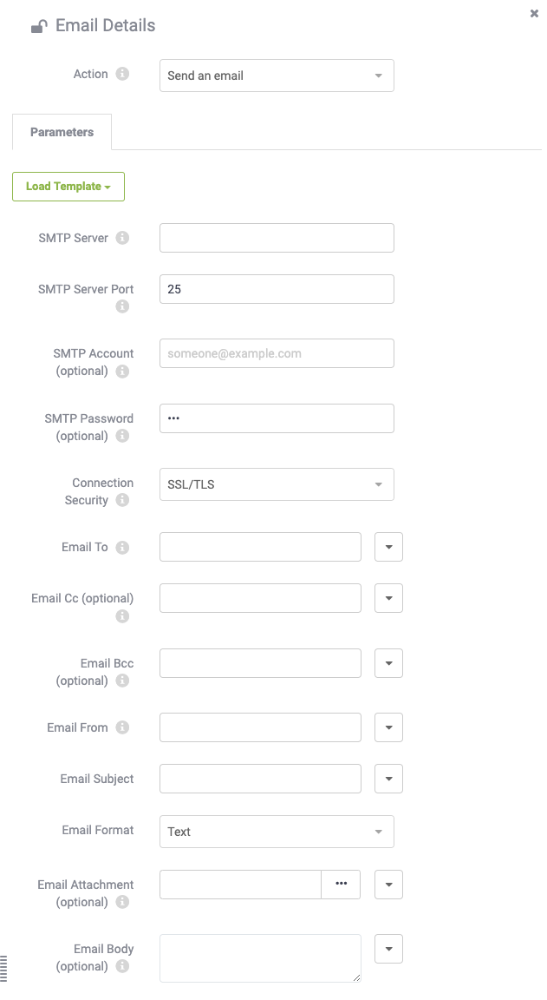

## Email Actions ##

Email Actions are designed to have FME Server send an email in response to a Trigger or Internal Action. The built-in email server in FME Server is only for incoming mail, as is the IMAP protocol, and so messages need to be sent via an existing (external) SMTP email server.

### Setting up an Email Action ###

Creating an Email Action is done on the Automations page of the web interface, and must connect to an existing Trigger. You can either create a new Automation and first set up a Trigger, or view existing Automations through the Manage page, where you can then extend these workflows to include an email notification.

There are many more parameters for outgoing mail because the full SMTP server connection parameters need to be defined. However, there is an option to load a template for the some of the most common email services.

Various fields for the email itself (From, To, Subject, Template) can be hard-coded or passed through to the Action from the previous connection in the Automation, whether that be a Trigger or Internal Action. One important parameter is the Email Format, which can either be plain text or HTML.

See the following sections for information on how to generate content for outgoing emails.
