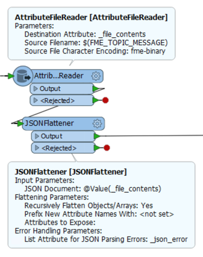
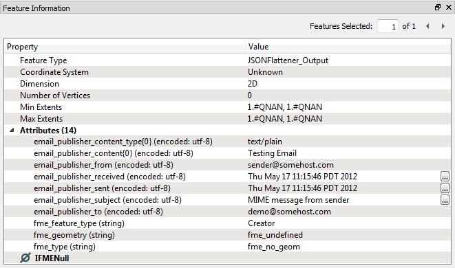

## Message Content ##

The ability to interpret and process message content is a key reason for using FME workspaces as a subscriber. They can receive the message and then transform it in whatever way is required, incorporating spatial data and spatial conditions as necessary.

As noted, a Workspace Subscription writes message content to a temporary file and passes the name of that file to the workspace through a published parameter. 

The workspace can then read the contents of that file. However, the message is usually in JSON format and must usually be interpreted before it can be used.

---

### Interpreting the Message ###

An incoming message can be scanned and processed with a number of different transformers. If the messages are in JSON format there are transformers such as the JSONExtractor and JSONFlattener. Similarly there are XMLFlattener and XMLFragmenter transformers for XML content.

These transformers will convert the message from a JSON (or XML) string and into attributes that FME Workbench is able to process.

Here - for example - an author has added AttributeFileReader and JSONFlattener transformers to their workspace. The AttributeFileReader reads the JSON content (using FME&#95;TOPIC&#95;MESSAGE to identify the file) and the JSONFlattener transformer processes the JSON to extract the message as an attribute called subscriber_content

 
If the incoming message was an email then the JSON content may look like this:

<pre>
{
"fns_type": "email_publisher",
"email_publisher_to": "demo@somehost.com",
"email_publisher_subject": "MIME message from sender",
"email_publisher_content{0}": "Testing Email",
"email_publisher_content_type{0}": "text/plain",
"email_publisher_from": "sender@somehost.com",
"email_publisher_received": "Thu May 18 11:15:46 PDT 2017",
"email_publisher_sent": "Thu May 18 11:15:46 PDT 2017",
}
</pre>

Notice how it includes the email from and to fields, plus the content itself. 

When converted into FME attributes using the JSONFlattener transformer the result – as shown in the FME Data Inspector – will look something like this:

Now the content is available to the workspace as a set of attributes and can be processed as required.

---

### Using the Message ###

What you do with the message depends on your required setup. If the topic is merely a trigger, and the message is unimportant, it could be ignored. However, in most case the message content *is* important.

There are almost limitless ways FME could be used to process an incoming message. However, one useful example to consider is when the message contains the name of a dataset that the workspace should read. There are two possible scenarios there.

If an email arrives with a dataset attached, the attachment will be stored on the file system and part of the JSON content will specify the attachment as a path:

<pre>
"email_publisher_attachment{0}": "C:\\Temp\\demo246129673106713_canada.dwg"
</pre>
 
Similarly, the message might just include the name of a dataset that needs to be read (without it being an attachment). In both cases a reader can't be used because we need to extract the name of the dataset before we can read it, so a FeatureReader transformer - with its ability to read data mid-workspace - becomes the perfect solution.

Another interesting scenario is where the message contains an X/Y coordinate - for example the location of a person. Here the X/Y coordinate could be converted into a point feature with the VertexCreator transformer and from there any number of FME transformers could be used to carry out spatial processing such as a geofence.
