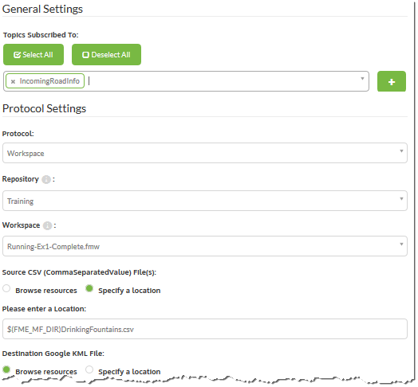
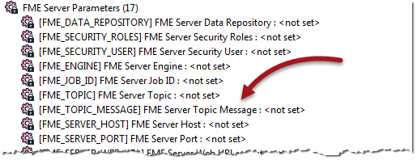
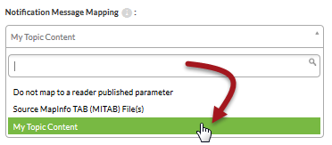

# Workspaces as a Subscription #

When a workspace needs to react to an incoming notification it is done by connecting the workspace to a particular topic using a specific Subscriber protocol called (as you might have guessed) *workspace*. 

When that topic is triggered (by a Publication or any other means) any workspace connected to that topic through a *workspace* protocol is run.

---

<!--New Section--> 

<table style="border-spacing: 0px">
<tr>
<td style="vertical-align:middle;background-color:darkorange;border: 2px solid darkorange">
<i class="fa fa-bolt fa-lg fa-pull-left fa-fw" style="color:white;padding-right: 12px;vertical-align:text-top"></i>
NEW
</td>
</tr>

<tr>
<td style="border: 1px solid darkorange">

The workspace subscriber protocol is new for FME2016. It is now the default method to subscribe a workspace to a particular topic. You should no longer use the Push protocol that was the previous method, even though it still exists. The new subscriber protocol has more options and is twice as fast in triggering a workspace. 

</td>
</tr>
</table>

---

### Registering a Workspace ###

Registering is done by creating a new subscription using the workspace protocol. The workspace is examined and a list of its published parameters provided:

Having the parameters in a dialog like this means it is simple and easy to set up a workspace to run however you want it to in response to a notification.

---

### Passing Messages ###

A topic passes on a message in a notification, and the same is true here. For this protocol the topic message is written into a temporary JSON file and the name of that file passed to a workspace via a published parameter.

There are two ways to set up a workspace to retrieve the filename information.

The first method uses an FME Server parameter called FME&#95;TOPIC&#95;MESSAGE. This is one of the fixed FME Server parameters exposed inside FME Workbench:

Another way to obtain the message file location is to send it to a user parameter of your own choice. When the workspace Subscription is created, this parameter can be selected to receive the topic content file name, in the same way that FME&#95;TOPIC&#95;MESSAGE does:

Remember, this is only passing the name of the file containing the message - it does not include the message itself. For that you have to read the contents of that json file. 

For instance, you could add a JSON (or Text File) Reader to your workspace and choose its source dataset parameter as the one to receive the name of the json file. That way the data is read directly into the workspace.

Alternatively, you could use a transformer such as the AttributeFileReader to read the file contents.

Having got the message into Workbench, it's then necessary to deal with it.