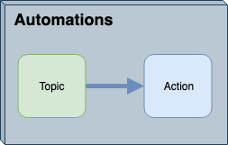

# Workspaces as a 'Trigger' #

Workspaces and other Internal Actions are the only protocols that have both input and output ports. This means that although they are treated as an Action, since they need something to kick them off, they can also act as a trigger to subsequent actions downstream an Automation.

Notifications from the Workspace are important for both sending messages containing content from the data being processed, and for reporting the status of a translation, such as whether it ran successfully or ended in failure.

## Workspace Action Output Ports ##

By default, workspace nodes have two outports representing the workspace status. One for Success and the other for Failure, this allows you to build an action in response to one or both job statuses. Each output includes a set of Output Keys with additional information about the workspace that was run that can be used within Actions connected to either port.

Automations Writer can be used to add additional output ports to a Workspace Action simply by adding the writer into the workspace to be run. This will allow for setting up Actions to be triggered based on what happens within the workspace. The Automations Writer also allows for passing custom messages from within the workspace to Actions connected to any of the output ports.

## Workspaces and FME Server Topics ##

Alternatively, Workspaces can be set up to trigger FME Server Topics to be used in an Automation. This is handy if the workspace is run from a process other than a listed protocol e.g. via an FME Server App, however you still want there to be an external response to the workspace.  A workspace can be registered to notify a topic in one of two ways:

- Registering with the topic when it is published
- Using a transformer inside the workspace

A Topic is a component on FME Server that acts as a mediator for messages and defines the message content. Think of it as a mix of the subject line for notifications and a trigger for them to occur. You can create a Topic trigger in the FME Server web user interface through Automations.

A Workspace can be linked to multiple topics, so each incoming message can trigger multiple actions to occur. Additionally, multiple workspaces can link to a single topic.
