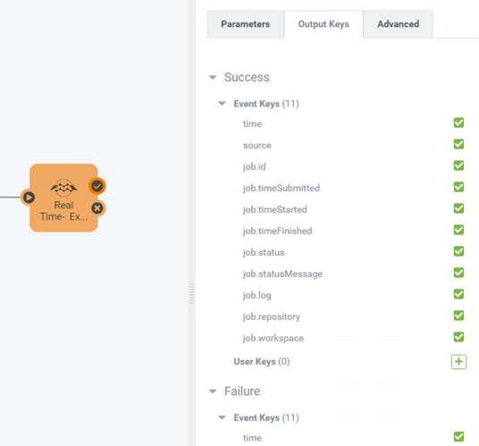
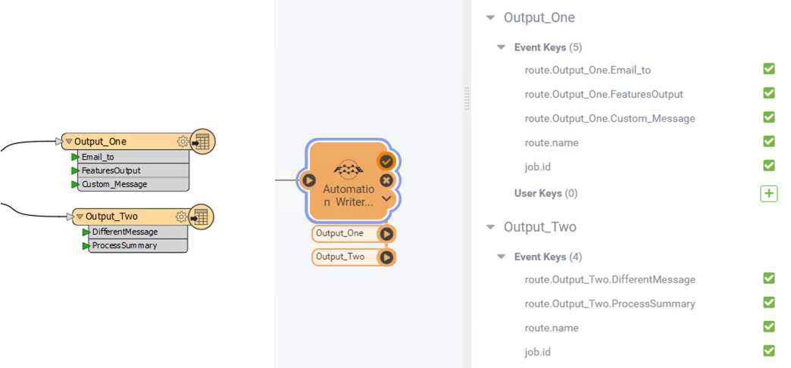

## Workspace Action Output Ports ##

As mentioned in the previous section, all Workspace Actions will have two output ports by default (one for success and another for failed jobs). Each of these ports will have a set of Output Keys on them. These Output Keys allow for passing some basic information about the job that was run to any Actions connected downstream from that port.

For example, a user may want set up a workflow in which an email containing the job log file is sent to an administrator when a job fails. They could do this by connecting an Email Action to the failure port of the Workspace Action and use the job.log Output Key in the attachment field within the email configuration to pass in the path to the log file.

But what if you need to pass more detailed information to an Action within your Automation? For example: a summary of the number of features that were written out or a list of files to be processed by other Workspace Actions within an Automation.

## Using the Automations Writer ##

This is where the Automations Writer is useful. The Automations writer can be added to any workspace to create additional output ports when the workspace is used in an Automation. The Automations writer can be added to a workspace in the same way any other writer is added. One output port will be created for each feature type added to the Workspace Canvas and all attributes on each feature type will be included as Output Keys within the Automation.

For example, this writer has two feature types (Output_One and Output_Two) with different sets of attributes on each. The image on the left shows how this looks within Workbench and the right shows the same Workspace used within an Automation:

The Automations Writer allows for lots of flexibility in what information gets passed out of a workspace. It can be used to create as many output ports as needed to allow for advanced filtering within the Automation to trigger specific Actions in response to anything that may happen within a Workspace. Multiple features can also be passed into any Automations Writer feature type to allow for triggering an Action multiple times. 
