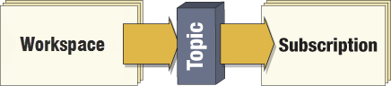

# Workspaces as a Publication #

When a workspace needs to send an outgoing notification it is done by having the workspace trigger a particular topic. 

When that topic is triggered any Subscriber connected to that topic receives the notification, plus any message that the workspace is passing on.

Publishing notification messages from FME is useful for both sending messages containing content from the data being processed, and for reporting the status of a translation, such as whether it has run successfully or ended in a failure.

Workspaces can be set up to trigger topics in one of two ways: 

- Registering with the topic when published
- Using a transformer 