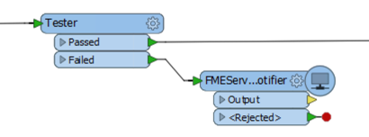
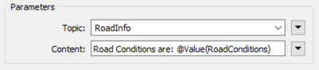

## Workspace Publishing with a Transformer ##

Instead of having a workspace send a notification at its completion, it could instead send a notification through a special transformer called the *FMEServerNotifier*.

Here a workspace author is sending an FME Server notification when a feature fails the conditions of a Tester transformer:

Notification properties are set in the transformer parameters. The parameters include those for connecting to FME Server, one for the topic to post to, and one for the message to be included. 

Here the author intends to publish information to a topic called RoadInfo:

There are two advantages to issuing a notification this way, over using the registration method:

- The workspace can issue a notification *during* a translation, rather than at the end of it.

- The workspace does not need to be run on FME Server to generate an FME Server notification. It will produce the same notification when run using FME Desktop.

The disadvantage is that you won't know whether the workspace completed successfully - or not - when the notification is issued.

---

<!--Tip Section--> 

<table style="border-spacing: 0px">
<tr>
<td style="vertical-align:middle;background-color:darkorange;border: 2px solid darkorange">
<i class="fa fa-info-circle fa-lg fa-pull-left fa-fw" style="color:white;padding-right: 12px;vertical-align:text-top"></i>
TIP
</td>
</tr>

<tr>
<td style="border: 1px solid darkorange">

Just like triggering a topic at workspace completion, this method needs to Publication to be created. In fact, assuming the topic already exists, this method can be set up without having to open the FME Server web interface at all!

</td>
</tr>
</table>

---

<table style="border-spacing: 0px">
<tr>
<td style="vertical-align:middle;background-color:darkorange;border: 2px solid darkorange">
<i class="fa fa-quote-left fa-lg fa-pull-left fa-fw" style="color:white;padding-right: 12px;vertical-align:text-top"></i>
Miss Vector says…
</td>
</tr>

<tr>
<td style="border: 1px solid darkorange">

I've got a workspace that reads 50,000 features, transforms them, and writes them out. If I want to send a single notification that the features have been read, which combination of transformers would be of most use?
  <a href="http://52.73.3.37/fmedatastreaming/Manual/QAResponse2017.fmw?chapter=24&question=6&answer=1&DestDataset_TEXTLINE=C%3A%5CFMEOutput%5CQAResponse.html">1. Creator/FeatureWriter/FMEServerNotifier</a>
 <a href="http://52.73.3.37/fmedatastreaming/Manual/QAResponse2017.fmw?chapter=24&question=6&answer=2&DestDataset_TEXTLINE=C%3A%5CFMEOutput%5CQAResponse.html">2. Creator/FMEServerJobSubmitter</a>
 <a href="http://52.73.3.37/fmedatastreaming/Manual/QAResponse2017.fmw?chapter=24&question=6&answer=3&DestDataset_TEXTLINE=C%3A%5CFMEOutput%5CQAResponse.html">3. Creator/FeatureReader/FMEServerNotifier</a>
 <a href="http://52.73.3.37/fmedatastreaming/Manual/QAResponse2017.fmw?chapter=24&question=6&answer=4&DestDataset_TEXTLINE=C%3A%5CFMEOutput%5CQAResponse.html">4. FeatureHolder/Sampler/FMEServerNotifier</a>

</td>
</tr>
</table>