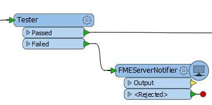

## Workspace Transformer as a Trigger##

Instead of having a workspace send a notification on job completion, it could instead send a notification through a transformer called the *FMEServerNotifier*.

In the example below, a workspace author is sending an FME Server notification when a feature fails the conditions of a Tester transformer:

Notification properties are set in the transformer parameters. The parameters include those for connecting to FME Server, one for the topic to post to, and one for the message to be included.

Here the author intends to publish information to a topic called RoadInfo:

There are two advantages to issuing a notification this way, over using the registration method:

- The workspace can issue a notification *during* a translation, rather than at the end of it.

- The workspace does not need to be run on FME Server to generate an FME Server notification. It will produce the same notification when run using FME Desktop.

The disadvantage is that you won't know whether the workspace completed successfully - or not - when the notification is issued.
