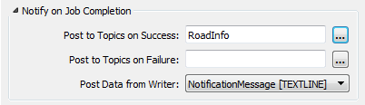
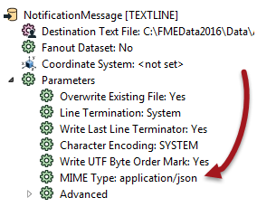

## Outgoing Message Content ##

When a workspace triggers a topic it can include (like other publishers) a message.

The ability to construct message content from a variety of sources – including spatial – is a key reason for using FME workspaces as a publisher. Workspaces can transform data in multiple ways, use it to construct a message, and then dispatch that message to users as a notification.

When a topic is triggered by the FMEServerNotifier transformer, the message can be defined by an attribute, constructed in a text editor, obtained from a user parameter, or even set up as a conditional value: 

When a topic is triggered by registering the workspace with a service topic, the message is sent via a Writer:

Here the message is being passed through a Text File Writer.

---

### Content Format ###

For the purposes of FME notifications, the content of a workspace publication can be in any format, maybe even a plain text message. However, for the benefit of a web-based subscriber the outgoing message is often in a JSON or XML format.

For example, here a workspace constructs a plain-text weather (lightning) alert using an AttributeCreator. The message attribute is connected to a Text File Writer in order to provide a means for publishing the outgoing message:

Importantly, the Text File Writer has a MIME type setting that can be applied:

So even if the message were JSON or XML, standard practice is to use a text writer. 

---

<!--Person X Says Section-->

<table style="border-spacing: 0px">
<tr>
<td style="vertical-align:middle;background-color:darkorange;border: 2px solid darkorange">
<i class="fa fa-quote-left fa-lg fa-pull-left fa-fw" style="color:white;padding-right: 12px;vertical-align:text-top"></i>
Ms Analyst says...
</td>
</tr>

<tr>
<td style="border: 1px solid darkorange">

A Text File Writer is the usual method of supplying messages, regardless of format. Even if the message is constructed as a snippet of JSON or XML it would still be passed through the Text File Writer.

</td>
</tr>
</table>

---

### Email Content in a Workspace ###

The message being passed out of a workspace may need to be in the form of an email. This, like any other message, can be constructed as an attribute with transformers.

For example, for a JSON-formatted email you could construct an attribute like this:

<pre>
{
"email_to" : "notifications@enduser.com",
"email_cc" : "",
"email_from" : "notifications@fmeserver.com",
"email_replyto" : "",
"email_subject" : "Notification Subject",
"subscriber_content" : "Notification Content"
}
</pre>

This could be created using an AttributeCreator transformer, where the email addresses and content can be substituted with attribute or parameter values as required.

The actual email content could be plain text or, if the Email format is set to HTML in the Notification GUI, it could be constructed as HTML instead.

---

<!--Person X Says Section-->

<table style="border-spacing: 0px">
<tr>
<td style="vertical-align:middle;background-color:darkorange;border: 2px solid darkorange">
<i class="fa fa-quote-left fa-lg fa-pull-left fa-fw" style="color:white;padding-right: 12px;vertical-align:text-top"></i>
Ms Analyst says...
</td>
</tr>

<tr>
<td style="border: 1px solid darkorange">

The FMEServerEmailGenerator is a custom transformer available in FME Workbench for generating email content in the correct format and structure

</td>
</tr>
</table>
