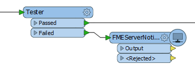
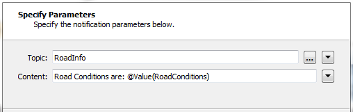

## Workspace Publishing with a Transformer ##

Instead of using a Writer and sending a notification at its completion, a workspace can send a notification through a special transformer called the FMEServerNotifier.

Here a workspace author is sending an FME Server notification when a feature fails the conditions of a Tester transformer:

Notification properties are set in the transformer parameters dialogs (it is a wizard composed of two panes)

The transformer parameters include those for connecting to FME Server, and ones for the topic to post to and the message to be included. Here the author intends to publish information to a topic called RoadInfo:

There are two advantages to issuing a notification this way, over using the registration method:

- The workspace can issue a notification *during* a translation, rather than at the end of it.

- The workspace does not need to be run on FME Server to generate an FME Server notification. It will produce the same notification when run using FME Desktop.

---

<table style="border-spacing: 0px">
<tr>
<td style="vertical-align:middle;background-color:darkorange;border: 2px solid darkorange">
<i class="fa fa-quote-left fa-lg fa-pull-left fa-fw" style="color:white;padding-right: 12px;vertical-align:text-top"></i>
Miss Vector says…
</td>
</tr>

<tr>
<td style="border: 1px solid darkorange">

I've got a workspace that reads 50,000 features, transforms them, and writes them out. If I want to send a single notification that the features have been read, which combination of transformers would be of most use?
  1. Creator/FeatureWriter/FMEServerNotifier
 2. Creator/FMEServerJobSubmitter
 3. Creator/FeatureReader/FMEServerNotifier
 4. FeatureHolder/Sampler/FMEServerNotifier

</td>
</tr>
</table>