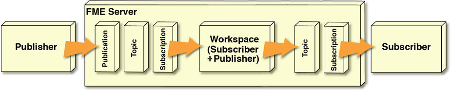

## Workspaces as a Subscriber AND a Publisher ##

We've now looked at how to set up a workspace to be a Subscriber (reacting to incoming messages) and how to set up a workspace as a Publisher (sending outgoing messages). A workspace can do each task individually, but when it is set as both a Subscriber and a Publisher, the overall setup looks like this:

In this scenario, the same workspace that receives an incoming notification also sends an outgoing notification. It is set up as a Subscriber with a Subscription component in order to receive incoming notifications and set up as a Publisher by registering it with the notification parameters on a different service.

For example, details of a lightning strike are received via a LightningStrike topic. A Publication watching for this topic starts a workspace that processes the incoming information; for example, it determines which state/province/county the strike occurred in. The workspace then creates a new message and dispatches it to subscribers via a WeatherAlert topic.

The important thing to realize is that the scenario must involve at least two different topics.

A major problem occurs if you set up such a scenario but attempt to use the same topic for both incoming and outgoing messages. That’s because the workspace would be set up as a subscriber to each message that it is publishing! It would republish each of its outgoing messages, causing an infinite loop of messages!

---

<table style="border-spacing: 0px">
<tr>
<td style="vertical-align:middle;background-color:darkorange;border: 2px solid darkorange">
<i class="fa fa-quote-left fa-lg fa-pull-left fa-fw" style="color:white;padding-right: 12px;vertical-align:text-top"></i>
Daily Interop Reporter, Chad Pugh-Litzer says …
</td>
</tr>

<tr>
<td style="border: 1px solid darkorange">

Using the same topic for incoming and outgoing notifications is like setting up your email to forward all incoming messages to yourself, or automatically re-tweeting your own tweets. You end up with a loop that continues until you crash the system!
  To avoid confusion it’s a good idea to clarify which topics are for in and out communication through their names; for example, use LightningStrike_In and LightningStrike_Out to differentiate.

</td>
</tr>
</table>
