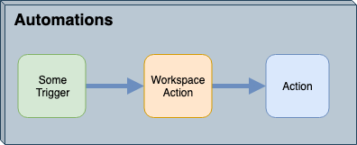

## Workspaces as a Action AND a Trigger ##

We've now looked at how to set up a workspace to be an Action (reacting to incoming messages) and how to set up a workspace as a Trigger (sending outgoing messages). A workspace can do each task individually, but when it is set as both an Action and a Trigger, the overall setup looks like this:

Unlike most Triggers/Actions in Automations the Run Workspace node has both an incoming and outgoing port meaning it can both receive messages from a Trigger, and continue the Automation by sending messages out to another action.

In this scenario, the same workspace that receives an incoming notification also sends an outgoing notification. For example, details of a lightning strike are received via a LightningStrike topic. This trigger starts a workspace that processes the incoming information; for example, it determines which state/province/county the strike occurred in. The workspace then creates a new message and dispatches it to a WeatherAlert Action.

---

<table style="border-spacing: 0px">
<tr>
<td style="vertical-align:middle;background-color:darkorange;border: 2px solid darkorange">
<i class="fa fa-quote-left fa-lg fa-pull-left fa-fw" style="color:white;padding-right: 12px;vertical-align:text-top"></i>
Daily Interop Reporter, Chad Pugh-Litzer says …
</td>
</tr>

<tr>
<td style="border: 1px solid darkorange">

If you are using topics as both the Trigger and External Action be sure not to use the same topic. This would be like setting up your email to forward all incoming messages to yourself, or automatically re-tweeting your own tweets. You end up with a loop that continues until you crash the system!
  To avoid confusion it’s a good idea to clarify which topics are for in and out communication through their names; for example, use LightningStrike_In and LightningStrike_Out to differentiate.

</td>
</tr>
</table>
