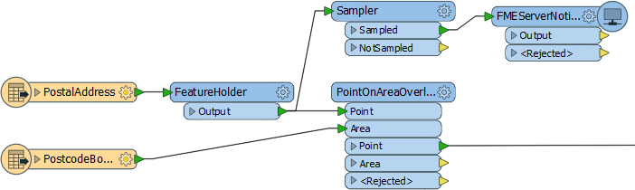

# Questions #

Here are the answers to the questions in this chapter.

---

<!--Person X Says Section-->

<table style="border-spacing: 0px">
<tr>
<td style="vertical-align:middle;background-color:darkorange;border: 2px solid darkorange">
<i class="fa fa-quote-left fa-lg fa-pull-left fa-fw" style="color:white;padding-right: 12px;vertical-align:text-top"></i>
Miss Vector says...
</td>
</tr>

<tr>
<td style="border: 1px solid darkorange">

All notification setups must have which of these:
  1. Incoming components (Publisher, Publication) AND outgoing components (Subscription, Subscriber)
 2. Incoming components OR outgoing components OR both
 3. Incoming components OR outgoing components but never both
 4. None of the above
  Although the diagram (under Elements of the Notification System) shows a continuous process, it is not necessary for all of these components to be used in a setup. If the system is designed for FME Server to only receive notifications, then only a publisher/publication is needed. Likewise, if the system is intended for FME Server to only send notifications, then only a subscription/subscriber is required. But if both receiving and sending notifications are required then all components apply. 
</td>
</tr>
</table>

---

<!--Person X Says Section-->

<table style="border-spacing: 0px">
<tr>
<td style="vertical-align:middle;background-color:darkorange;border: 2px solid darkorange">
<i class="fa fa-quote-left fa-lg fa-pull-left fa-fw" style="color:white;padding-right: 12px;vertical-align:text-top"></i>
Miss Vector says...
</td>
</tr>

<tr>
<td style="border: 1px solid darkorange">

Please don't get this wrong! Publications and Topics have what relationship?
  1. One:One (Each Publication has one Topic, each Topic belongs to one Publication)
 2. One:Many (Each Publication can have many Topics, each Topic belongs to one Publication)
 3. Many:One (Each Publication has one Topic, each Topic can belong to multiple Publications)
 4. Many:Many (Each Publication can have many Topics, each Topic can belong to multiple Publications)
  You got it wrong? I'm not angry... just terribly, terribly disappointed! 
</td>
</tr>
</table>

---

<!--Person X Says Section-->

<table style="border-spacing: 0px">
<tr>
<td style="vertical-align:middle;background-color:darkorange;border: 2px solid darkorange">
<i class="fa fa-quote-left fa-lg fa-pull-left fa-fw" style="color:white;padding-right: 12px;vertical-align:text-top"></i>
Miss Vector says...
</td>
</tr>

<tr>
<td style="border: 1px solid darkorange">

Tell me, which one of these statements is correct:
  1. SMTP and IMAP can both be used as either a Subscription and/or a Publication protocol
 2. SMTP can be used as both a Subscription and a Publication; IMAP can only be used for a Publication
 3. SMTP can only be used for a Publication; IMAP can only be used as both a Subscription and a Publication
 4. SMTP can only be used for a Subscription; IMAP can only be used for a Publication
  See the table under Notification Protocols for the full list of which protocol can be used for which type of notification. 
</td>
</tr>
</table>

---

<!--Person X Says Section-->

<table style="border-spacing: 0px">
<tr>
<td style="vertical-align:middle;background-color:darkorange;border: 2px solid darkorange">
<i class="fa fa-quote-left fa-lg fa-pull-left fa-fw" style="color:white;padding-right: 12px;vertical-align:text-top"></i>
Miss Vector says...
</td>
</tr>

<tr>
<td style="border: 1px solid darkorange">

When a workspace is part of a notification system, processing incoming messages, it is a...
  1. Subscription
 2. Publication
 3. Protocol
 4. Client
  It is a client! In this case it is a subscriber (it is subscribing to messages produced by a Publication). If it were sending messages it would be a publisher (publishing messages to a Subscription).
  It's not a Publication or a Subscription because those are specific components of FME Server.
</td>
</tr>
</table>

---

<!--Person X Says Section-->

<table style="border-spacing: 0px">
<tr>
<td style="vertical-align:middle;background-color:darkorange;border: 2px solid darkorange">
<i class="fa fa-quote-left fa-lg fa-pull-left fa-fw" style="color:white;padding-right: 12px;vertical-align:text-top"></i>
Miss Vector says...
</td>
</tr>

<tr>
<td style="border: 1px solid darkorange">

I want my workspace to send me an email when it is run, so I know when people are using it to download data. When I publish it, what should I register it to?
  1. The Notification Service
 2. The Data Download Service
 3. The Email (SMTP) Protocol
 4. The Workspace Subscriber Protocol
  I'm setting it up for people to download data, so I register it as a Data Download service. It's as simple as that. To get a notification I just have to pick a topic to trigger in the Data Download settings. Of course, to get an email I must set up an Email Subscription connected to that topic - but that has nothing at all to do with how I register the workspace!

</td>
</tr>
</table>

---

<!--Person X Says Section-->

<table style="border-spacing: 0px">
<tr>
<td style="vertical-align:middle;background-color:darkorange;border: 2px solid darkorange">
<i class="fa fa-quote-left fa-lg fa-pull-left fa-fw" style="color:white;padding-right: 12px;vertical-align:text-top"></i>
Miss Vector says...
</td>
</tr>

<tr>
<td style="border: 1px solid darkorange">

I've got a workspace that reads 50,000 features, transforms them, and writes them out. If I want to send a single notification that the features have been read, which combination of transformers would be of most use?
  1. Creator/FeatureWriter/FMEServerNotifier
 2. Creator/FMEServerJobSubmitter
 3. Creator/FeatureReader/FMEServerNotifier
 4. FeatureHolder/Sampler/FMEServerNotifier
  I'm sending a notification (not running a job) so I use the FMEServerNotifier. I already have a Reader so I don't need a transformer to read or write data. However I do need a Sampler transformer to reduce the number of features down to one; otherwise I'll send 50,000 notifications. The FeatureHolder ensures the notification is not triggered until all features have been read. It would look like this:
  

</td>
</tr>
</table>

---

<!--Person X Says Section-->

<table style="border-spacing: 0px">
<tr>
<td style="vertical-align:middle;background-color:darkorange;border: 2px solid darkorange">
<i class="fa fa-quote-left fa-lg fa-pull-left fa-fw" style="color:white;padding-right: 12px;vertical-align:text-top"></i>
Miss Vector says...
</td>
</tr>

<tr>
<td style="border: 1px solid darkorange">

Which of the Receiver transformers has a parameter to stop it running continuously? Select all that apply.
  1. SQSReceiver
 2. WebSocketReceiver
 3. JMSReceiver
 4. TCPIPReceiver
  The SQSReceiver has the ability to switch to a number of messages to read, and the TCPIPReceiver has the option to close the connection once the publishing client disconnects.   
</td>
</tr>
</table>

---

<!--Person X Says Section-->

<table style="border-spacing: 0px">
<tr>
<td style="vertical-align:middle;background-color:darkorange;border: 2px solid darkorange">
<i class="fa fa-quote-left fa-lg fa-pull-left fa-fw" style="color:white;padding-right: 12px;vertical-align:text-top"></i>
Miss Vector says...
</td>
</tr>

<tr>
<td style="border: 1px solid darkorange">

Writing to a database in a High Capacity Message Streaming setup requires that the transaction interval is set to what value?
  1. &lt;Not Set&gt;
 2. Zero (0)
 3. One (1)
 4. Infinity (&infin;)
  Setting the transaction interval to one means that each message is committed as it arrives. Any other value (in this list at least) would probably mean the data is never committed until the workspace was terminated. 
</td>
</tr>
</table>

---

