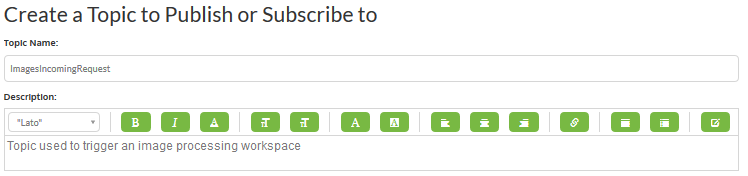
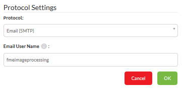
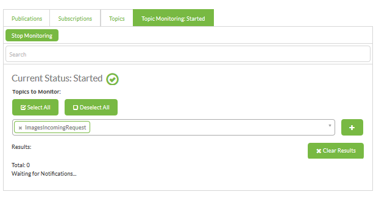
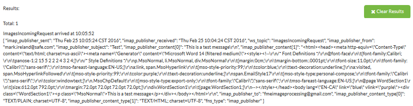

<!--Instructor Notes-->

<!--Exercise Section-->
<!--NB: In GitBook world we don't give a number to exercises-->

<table style="border-spacing: 0px;border-collapse: collapse;font-family:serif">
<tr>
<td width=25% style="vertical-align:middle;background-color:darkorange;border: 2px solid darkorange">
<i class="fa fa-cogs fa-lg fa-pull-left fa-fw" style="color:white;padding-right: 12px;vertical-align:text-top"></i>
Exercise 1
</td>
<td style="border: 2px solid darkorange;background-color:darkorange;color:white">

</td>
</tr>

<tr>
<td style="border: 1px solid darkorange; font-weight: bold">Data</td>
<td style="border: 1px solid darkorange">Orthophoto images (GeoTIFF)</td>
</tr>

<tr>
<td style="border: 1px solid darkorange; font-weight: bold">Overall Goal</td>
<td style="border: 1px solid darkorange">Provide email-driven access to orthophoto files</td>
</tr>

<tr>
<td style="border: 1px solid darkorange; font-weight: bold">Demonstrates</td>
<td style="border: 1px solid darkorange">Notification topics and email publications</td>
</tr>

<tr>
<td style="border: 1px solid darkorange; font-weight: bold">Start Workspace</td>
<td style="border: 1px solid darkorange">N/A</td>
</tr>

<tr>
<td style="border: 1px solid darkorange; font-weight: bold">End Workspace</td>
<td style="border: 1px solid darkorange">N/A</td>
</tr>

</table>

---

As a technical analyst in the GIS department a recent project involved setting up a Data Download solution for users to serve orthophoto data to themselves. Having read up about notifications in FME Server, you think that it should be possible to also set up a system that uses email-based automation.

---

<!--Person X Says Section-->

<table style="border-spacing: 0px">
<tr>
<td style="vertical-align:middle;background-color:darkorange;border: 2px solid darkorange">
<i class="fa fa-quote-left fa-lg fa-pull-left fa-fw" style="color:white;padding-right: 12px;vertical-align:text-top"></i>
Miss Vector says...
</td>
</tr>

<tr>
<td style="border: 1px solid darkorange">

This exercise uses either the SMTP or IMAP protocol for email. To carry out this exercise you will need access to at least one email account in one of these types.
  For SMTP, this requires your FME Server to have a DNS record and SMTP configured. 
 For IMAP this requires access to an email server that supports the IMAP protocol. Gmail, Outlook, and Yahoo! all are acceptable web-based solutions. 
</td>
</tr>
</table>

---

 **1) Create Topic**
 The first step is to create a publication and topic that will be triggered by the email. So log in to the FME Server web interface and click on the menu item labelled Manage &gt; Notifications.

Click the Publications tab and then click the New button.

Enter EmailReceiver as the new publication's name. Then click in the text box under Topics to Publish To. Type in ImagesIncomingRequest and click on "Click to Add". This will create a new topic and assign it to this publication. 

The new publication can be created to use either the Email protocol or the IMAP protocol. 

SMTP is easier to set up but FME Server must reside on a server with a proper DNS record (all FME Cloud machines will have this). IMAP is necessary where FME Server resides on an internal network.

---

***Email Protocol***

To use the Email protocol select Email (SMTP) as the Publication Protocol. This will open the Email User Name parameter. Enter a name for receiving email, for example *fmeimageprocessing*

Clicking OK will create an email address *fmeimageprocessing@&lt;hostname&gt;* - for example: 

<table>
<tr><th>Host</th><th>Example Email Address</th></tr>
<tr><td>FME Cloud</td><td>fmeimageprocessing@myfmeserver.fmecloud.com</td></tr>
<tr><td>Amazon AWS</td><td>fmeimageprocessing@ec1-23-456-789-012.compute-1.amazonaws.com</td></tr>
</table>

Now all emails sent to that address will trigger the ImagesIncomingRequest topic. 

---

***IMAP Protocol***

To use the IMAP protocol select Email (IMAP) as the Publication Protocol. This will open a number of other parameters. Enter them according to your email account.

In case it is of use, the server information for Gmail is as follows:

- IMAP Server Host: imap.gmail.com
- IMAP Server Port: 993
- Connection Security: SSL
- Verify SSL Certificate: Yes

You will also need to check the settings in your Gmail account to make sure IMAP is turned on (by default it is not). Regardless of the email provider, you should set these parameters as follows:

- Poll Interval: 1 minute
- Emails to Fetch: New Emails Only.

Select a Resource Folder for attachments to be saved to and click OK to close the dialog and create the new Publication.

---

<table style="border-spacing: 0px">
<tr>
<td style="vertical-align:middle;background-color:darkorange;border: 2px solid darkorange">
<i class="fa fa-quote-left fa-lg fa-pull-left fa-fw" style="color:white;padding-right: 12px;vertical-align:text-top"></i>
InteropGeek68 says …
</td>
</tr>

<tr>
<td style="border: 1px solid darkorange">

For IMAP, if you don’t have access to a web-based email account, use <strong>fmeimageprocessing@gmail.com</strong> with the password <strong>FMENotifications</strong>.

</td>
</tr>
</table>

---

 **2) Test Publication**
 Now let's test the publication. In the Notifications page on FME Server, click the tab marked Topic Monitoring. Select *ImagesIncomingRequest* as the topic to monitor:

Now send an email to the address selected for the new publication. When the email is received by FME Server (SMPT) or FME Server fetches it (IMAP) the topic will be triggered with a message:

Remember, an IMAP publication only checks for an email every 60 seconds, so the result might not be immediate.

---

<!--Person X Says Section-->

<table style="border-spacing: 0px">
<tr>
<td style="vertical-align:middle;background-color:darkorange;border: 2px solid darkorange">
<i class="fa fa-quote-left fa-lg fa-pull-left fa-fw" style="color:white;padding-right: 12px;vertical-align:text-top"></i>
Ms Analyst says...
</td>
</tr>

<tr>
<td style="border: 1px solid darkorange">

In a training course more than one student might be using the IMAP account fmeimageprocessing@gmail.com, so don't be surprised by multiple messages arriving!

</td>
</tr>
</table>

 
---

<!--Exercise Congratulations Section--> 

<table style="border-spacing: 0px">
<tr>
<td style="vertical-align:middle;background-color:darkorange;border: 2px solid darkorange">
<i class="fa fa-thumbs-o-up fa-lg fa-pull-left fa-fw" style="color:white;padding-right: 12px;vertical-align:text-top"></i>
CONGRATULATIONS
</td>
</tr>

<tr>
<td style="border: 1px solid darkorange">

By completing this exercise you have learned how to:
 
<ul><li>Create a new Publication</li>
<li>Create a new Topic as part of the Create Publication process</li>
<li>Use incoming email to trigger topics/notifications</li>
<li>Test a publication/topic using Topic Monitoring</li></ul>

</td>
</tr>
</table>   
