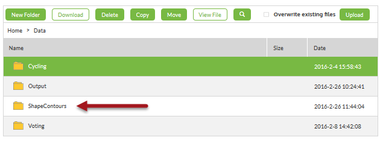
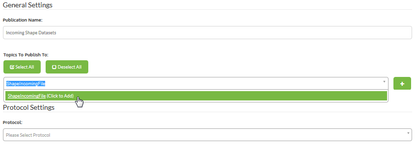
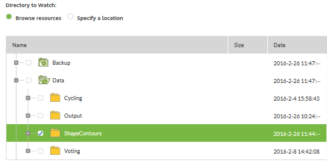
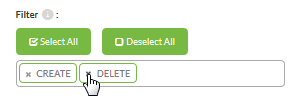
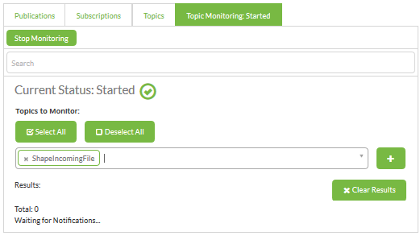
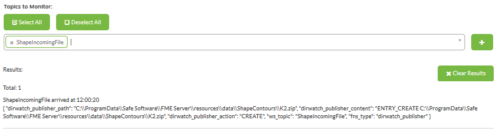

<!--Instructor Notes-->

<!--Exercise Section-->

<table style="border-spacing: 0px;border-collapse: collapse;font-family:serif">
<tr>
<td width=25% style="vertical-align:middle;background-color:darkorange;border: 2px solid darkorange">
<i class="fa fa-cogs fa-lg fa-pull-left fa-fw" style="color:white;padding-right: 12px;vertical-align:text-top"></i>
Exercise 1
</td>
<td style="border: 2px solid darkorange;background-color:darkorange;color:white">
Shape Dataset Processing
</td>
</tr>

<tr>
<td style="border: 1px solid darkorange; font-weight: bold">Data</td>
<td style="border: 1px solid darkorange">Orthophoto images (GeoTIFF)</td>
</tr>

<tr>
<td style="border: 1px solid darkorange; font-weight: bold">Overall Goal</td>
<td style="border: 1px solid darkorange">Trigger notification for new files</td>
</tr>

<tr>
<td style="border: 1px solid darkorange; font-weight: bold">Demonstrates</td>
<td style="border: 1px solid darkorange">Notification topics and Directory Watch publications</td>
</tr>

<tr>
<td style="border: 1px solid darkorange; font-weight: bold">Start Workspace</td>
<td style="border: 1px solid darkorange">N/A</td>
</tr>

<tr>
<td style="border: 1px solid darkorange; font-weight: bold">End Workspace</td>
<td style="border: 1px solid darkorange">N/A</td>
</tr>

</table>

---

As a technical analyst in the GIS department you want to start trying out notifications. The Directory Watch protocol seems like a good place to start, and you already were thinking about a shared folder where users occasionally put Shape datasets for adding to the corporate database. 

 **1) Create Resources Folder**
 The first step is to create a Resources folder to copy the data to. Open the FME Server web interface and navigate to Manage &gt; Resources

Browse to the Data folder and create a new sub-folder called ShapeContours:

 **2) Create Topic**
 Now to create a publication and topic that will be triggered by a new file. Navigate to Manage &gt; Notifications, click the Publications tab, and then click the New button.

Enter "Incoming Shape Datasets" as the new publication's name. Then click in the text box under Topics to Publish To. Type in ShapeIncomingFile and click on "Click to Add". This will create a new topic and assign it to this publication. 

 **3) Create Publication**
 Now select Directory Watch as the protocol for this publication. In the dialog that opens below select the newly created resources folder:

Under the Filter setting, remove the Modify and Delete actions. All we really want to monitor are new files arriving, not old ones being removed:

Click OK to create the new publication.

 **4) Monitor Topic**
 Click on the tab for Topic Monitoring. Add the ShapeIncomingFile topic to the list being monitored:

 **5) Test Topic**
 Now let's test the topic. Locate the source Shape datasets in C:\FMEData2017\Data\ElevationModel\Contours - select a set of Shape files (.dbf, .prj, .shp, .shx) and create a zip file out of them.

Copy the zip file into the newly created Resources folder. You can do this through the file system (by copying the file to C:\ProgramData\Safe Software\FME Server\resources\data\ShapeContours) or using the web interface. If you use the web interface, open a new window or tab, so as not to stop the topic monitoring.

Check back in the topic monitoring window and you will see that the topic has been triggered by the new file:

So now we know how the Directory Watch notification works. For now you can put this project to one side - but come back to it later when you've learned how to process this information.
 
---

<!--Exercise Congratulations Section--> 

<table style="border-spacing: 0px">
<tr>
<td style="vertical-align:middle;background-color:darkorange;border: 2px solid darkorange">
<i class="fa fa-thumbs-o-up fa-lg fa-pull-left fa-fw" style="color:white;padding-right: 12px;vertical-align:text-top"></i>
CONGRATULATIONS
</td>
</tr>

<tr>
<td style="border: 1px solid darkorange">

By completing this exercise you have learned how to:
 
<ul><li>Create a new Publication</li>
<li>Create a new Topic as part of the Create Publication process</li>
<li>Use Directory Watch to trigger topics/notifications</li>
<li>Test a publication/topic using Topic Monitoring</li></ul>

</td>
</tr>
</table>   
