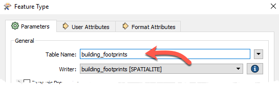
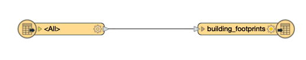
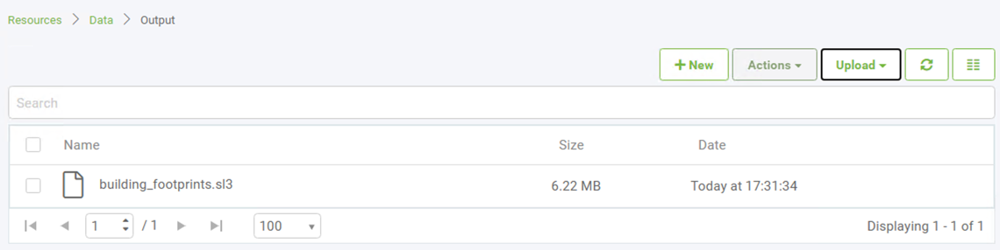
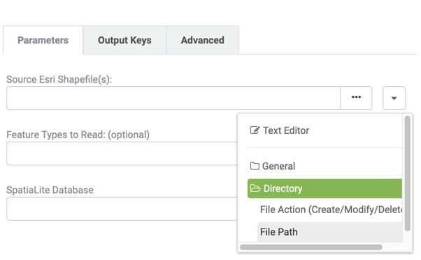
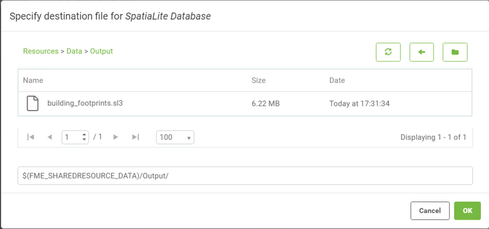
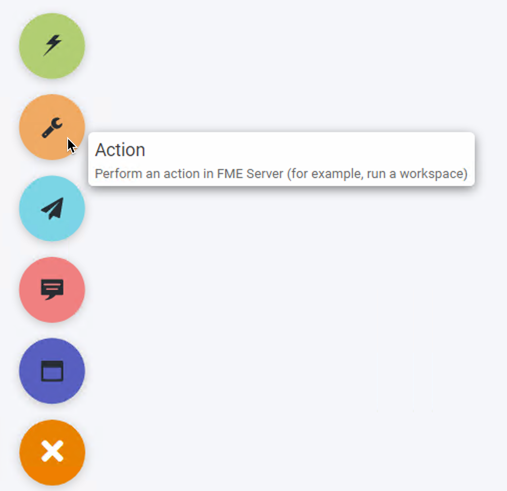
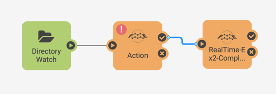
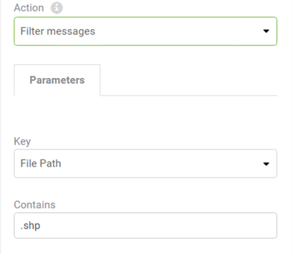

<!--Instructor Notes-->

<!--Exercise Section-->

<table style="border-spacing: 0px;border-collapse: collapse;font-family:serif">
<tr>
<td width=25% style="vertical-align:middle;background-color:darkorange;border: 2px solid darkorange">
<i class="fa fa-cogs fa-lg fa-pull-left fa-fw" style="color:white;padding-right: 12px;vertical-align:text-top"></i>
Exercise 4.2
</td>
<td style="border: 2px solid darkorange;background-color:darkorange;color:white">
Building Updates Automation
</td>
</tr>

<tr>
<td style="border: 1px solid darkorange; font-weight: bold">Data</td>
<td style="border: 1px solid darkorange">Building footprints (Esri Shapefile)</td>
</tr>

<tr>
<td style="border: 1px solid darkorange; font-weight: bold">Overall Goal</td>
<td style="border: 1px solid darkorange">Triggering real-time updates to databases</td>
</tr>

<tr>
<td style="border: 1px solid darkorange; font-weight: bold">Demonstrates</td>
<td style="border: 1px solid darkorange">Processing Directory Watch messages</td>
</tr>

<tr>
<td style="border: 1px solid darkorange; font-weight: bold">Start Workspace</td>
<td style="border: 1px solid darkorange">None</td>
</tr>

<tr>
<td style="border: 1px solid darkorange; font-weight: bold">End Workspace</td>
<td style="border: 1px solid darkorange">C:\FMEData2019\Workspaces\ServerAuthoring\RealTime-Ex2-Complete.fmw</td>
</tr>

</table>

---

As a technical analyst in the GIS department, you have realized the overhead associated with pushing manual updates to your corporate database. Having read up about automations in FME Server, you think that it should be possible to set up a system that automates this process.

So far you have set up a system for added file notifications to be registered by FME Server. Now you must create a workspace to process these and publish it to FME Server. The workspace must then be triggered by the Directory Watch in Automations.

Since the Log Action runs a workspace in response to the Directory Watch trigger, we have already covered how to set this up in Automations. Now it's time to create a new workspace to fit in with your overall goal: to provide real-time updates to your corporate database.

---

<!--Person X Says Section-->

<table style="border-spacing: 0px">
<tr>
<td style="vertical-align:middle;background-color:darkorange;border: 2px solid darkorange">
<i class="fa fa-quote-left fa-lg fa-pull-left fa-fw" style="color:white;padding-right: 12px;vertical-align:text-top"></i>
Miss Vector says...
</td>
</tr>

<tr>
<td style="border: 1px solid darkorange">

This exercise continues where Exercise 1 left off. You must have completed Exercise 1 to carry out this exercise.
</td>
</tr>
</table>

---

 **1) Create Workspace**
 Start FME Workbench and begin with an empty workspace.

Select Readers &gt; Add Reader from the menu bar. When prompted set the parameters as follows:

<table style="border: 0px">

<tr>
<td style="font-weight: bold">Reader Format</td>
<td style="">ESRI Shapefile</td>
</tr>

<tr>
<td style="font-weight: bold">Reader Dataset</td>
<td style="">C:\FMEData2019\Data\Engineering\BuildingFootprints\Updates001.shp</td>
</tr>

<tr>
<td style="font-weight: bold">Workflow Options</td>
<td style="">Single Merged Feature Type</td>
</tr>

</table>

It doesn't matter what Shapefile we use as the source right now; setting the source dataset in this step is only to satisfy the shapefile reader requirements. At runtime, the source dataset will be replaced by the content of the incoming message. By setting the Workflow options to Single Merged Feature Type this means it is possible to process any source dataset (of the right format) and have it translated.

 **2) Add Writer**
 Having read the data from a Shapefile, we can now add it to the corporate database.

Select Writers &gt; Add Writer from the menubar. When prompted set the parameters as follows:

<table style="border: 0px">

<tr>
<td style="font-weight: bold">Writer Format</td>
<td style="">SpatiaLite</td>
</tr>

<tr>
<td style="font-weight: bold">Writer Dataset</td>
<td style="">C:\FMEData2019\Data\Engineering\BuildingFootprints\building_footprints.sl3</td>
</tr>

<tr>
<td style="font-weight: bold">Writer Parameters</td>
<td style="">Overwrite Existing Database: No</td>
</tr>

<tr>
<td style="font-weight: bold">Add Feature Types</td>
<td style="">Table Definition: Manual</td>
</tr>

</table>

In the new feature type that is created, change the Table Name parameter to *building_footprints*:

Ensure that the Table Handling is set to "Create if Needed". Click OK to close the dialog and then connect the new feature type to the Shapefile Reader's &lt;Generic&gt; output port.

 **3) Inspect Data**
After adding the writer, click on the building_footprints feature type to bring up the popup menu. Then click the Inspect button to open the dataset in Visual Preview. There is already data in the building_footprints.sl3 dataset, but we should take note of what the data looks like so we will know where it has changed once we update the dataset with the new data. The area within the red box will be where the new data will be added:

 **4) Publish Workspace**
 Save the workspace and publish it to FME Server. We only need it to be run (not do anything special) so register it only with the Job Submitter service.

 **5) Add Dataset to FME Server**
 Since the purpose of this notification system is to *update* our database – let's make sure that it is accessible in FME Server. To do this, we will upload the *building_footprints.sl3* SpatiaLite database to FME Server's shared resources.

Use the FME Server web interface to create a new folder **Output** in **Resources &gt; Data** and upload the file located at C:\FMEData2019\Data\Engineering\BuildingFootprints\building_footprints.sl3

 **6) Edit Automation**
 Navigate to the Automations: Manage page and select Incoming Building Footprints to open the automation for editing. Before you can make any changes stop the automation using the button in the top right corner. Select the Log node and change the trigger parameter to Run Workspace.

Select the Repository and workspace uploaded in the previous step. The parameters should now include one for the Source shapefile file path and the output database.

The source dataset needs to pick up the file path from the Directory Watch trigger. From the drop-down menu select file path from under the Directory folder. This drop down list divides the incoming message JSON from the trigger into it's separate components.

For the output database the browse button to locate the database uploaded in the previous step:

 **7) Add Filter**
 The ESRI Shapefile Reader will only accept .shp file extension types, however the Directory Watch will pass a message to the workspace for every file uploaded.
To prevent the Automation triggering workspaces that will fail add a Filter action so that only the file path containing .shp is passed to the workspace.

Select the plus icon at the bottom of the canvas, drag an internal action (orange) onto the canvas.

Move the connection lines so that the Directory Watch enters this new Action node, the Run Workspace is connected to the Success Output port of this action.

Click on the action to configure the filter. There are two parameter values required. Similar to how the Source dataset of the workspace was set, specify the File Path as the Value to Filter. In the Contains String set the string to search for to .shp.

Click Apply to save the changes and restart the automation.

---

<!--Person X Says Section-->

<table style="border-spacing: 0px">
<tr>
<td style="vertical-align:middle;background-color:darkorange;border: 2px solid darkorange">
<i class="fa fa-quote-left fa-lg fa-pull-left fa-fw" style="color:white;padding-right: 12px;vertical-align:text-top"></i>
Dr. Workbench says...
</td>
</tr>

<tr>
<td style="border: 1px solid darkorange">

Instead of using a filter action we could have zipped up the update002.shp/.dbf/.shx/.prj files so that the Directory Watch was only triggered once. Notice the Filter Action triggers a FilterMessage.fmw workspace so if you are handling a high volume of incoming data zipping files may be the preferred option.
</td>
</tr>
</table>

---

 **7) Test Solution**
 Now test the solution by putting update001, update002 or update003.shp (and other extensions) into the BuildingUpdates folder. If these files already exist from an eariler exercise, delete them first, and then re-add them. You will find that each dataset put into the folder is added to the SpatiaLite database.

Check the Completed Jobs page to confirm that the workspace was run.

 **7) Inspect the Output**
 In the FME Data Inspector, add a new dataset, and browse to the C:\ProgramData\Safe Software\FMEServer\resources\data\Output\ folder and add the building_footprints.sl3 dataset. Depending on which update file you added, you should see one of the three buildings added to the dataset:

---

<!--Exercise Congratulations Section-->

<table style="border-spacing: 0px">
<tr>
<td style="vertical-align:middle;background-color:darkorange;border: 2px solid darkorange">
<i class="fa fa-thumbs-o-up fa-lg fa-pull-left fa-fw" style="color:white;padding-right: 12px;vertical-align:text-top"></i>
CONGRATULATIONS
</td>
</tr>

<tr>
<td style="border: 1px solid darkorange">

By completing this exercise you have learned how to:
 
<ul><li>Identify JSON attributes from an incoming Topic Message</li>
<li>Configure the Automation to run a workspace in response to a Trigger</li></ul>
<li>Pass an element of the incoming JSON through a filter</li></ul>

</td>
</tr>
</table>
