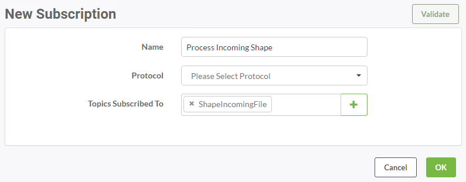
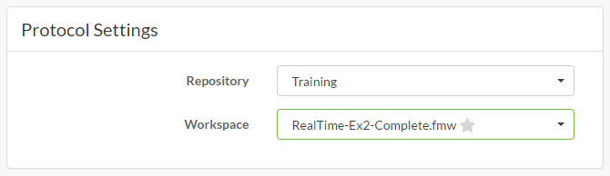
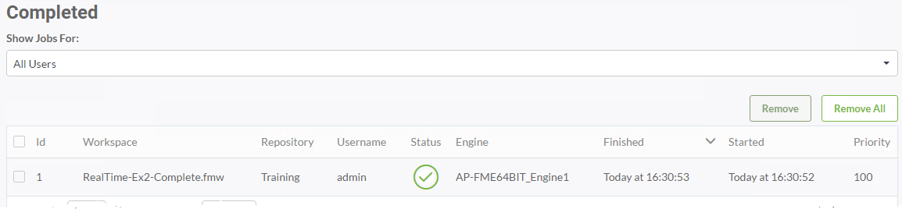

<!--Instructor Notes-->

<!--Exercise Section-->

<table style="border-spacing: 0px;border-collapse: collapse;font-family:serif">
<tr>
<td width=25% style="vertical-align:middle;background-color:darkorange;border: 2px solid darkorange">
<i class="fa fa-cogs fa-lg fa-pull-left fa-fw" style="color:white;padding-right: 12px;vertical-align:text-top"></i>
Exercise 2
</td>
<td style="border: 2px solid darkorange;background-color:darkorange;color:white">
Building Updates Notification System
</td>
</tr>

<tr>
<td style="border: 1px solid darkorange; font-weight: bold">Data</td>
<td style="border: 1px solid darkorange">Building footprints (Esri Shapefile)</td>
</tr>

<tr>
<td style="border: 1px solid darkorange; font-weight: bold">Overall Goal</td>
<td style="border: 1px solid darkorange">Real-time updates to databases</td>
</tr>

<tr>
<td style="border: 1px solid darkorange; font-weight: bold">Demonstrates</td>
<td style="border: 1px solid darkorange">Running a workspace in response to a notification</td>
</tr>

<tr>
<td style="border: 1px solid darkorange; font-weight: bold">Start Workspace</td>
<td style="border: 1px solid darkorange">None</td>
</tr>

<tr>
<td style="border: 1px solid darkorange; font-weight: bold">End Workspace</td>
<td style="border: 1px solid darkorange">C:\FMEData2017\Workspaces\ServerAuthoring\RealTime-Ex2-Complete.fmw</td>
</tr>

</table>

---

As a technical analyst in the GIS department you have realized the overhead associated with pushing manual updates to your corporate database. Having read up about notifications in FME Server, you think that it should be possible to set up a system that automates this process.

So far you have set up a system for added file notifications to be registered by FME Server. Now you must create a workspace to process these and publish it to FME Server. The workspace must then be triggered by a notification topic.

---

<!--Person X Says Section-->

<table style="border-spacing: 0px">
<tr>
<td style="vertical-align:middle;background-color:darkorange;border: 2px solid darkorange">
<i class="fa fa-quote-left fa-lg fa-pull-left fa-fw" style="color:white;padding-right: 12px;vertical-align:text-top"></i>
Miss Vector says...
</td>
</tr>

<tr>
<td style="border: 1px solid darkorange">

This exercise continues where Exercise 1 left off. You must have completed Exercise 1 to carry out this exercise.
</td>
</tr>
</table>

---

 **1) Create Workspace**
 Start FME Workbench and begin with an empty workspace. Simply add a Creator and Logger transformer:

This will give us a workspace to run in response to new files; albeit one that doesn’t do much yet. We're just creating this to check that we can get the setup to work.

 **2) Save and Publish Workspace**
 Save the workspace and publish it to FME Server. We only need it to be run (not do anything special) so register it only with the Job Submitter service.

 **3) Create Subscription**
 Return to the FME Server web interface and navigate to the Notifications page. Click on the Subscriptions tab and click New to create a new Subscription.

Call the subscription "Process Building Updates". Subscribe to the topic ShapeIncomingFile:

Now set the protocol to FME Workspace and select the workspace uploaded in the previous step:

Click OK to create the subscription. This will cause the workspace to run every time an incoming Shape dataset triggers the ShapeIncomingFile topic.

 **4) Test Subscription**
 Test the subscription by uploading another Shapefile dataset.

***NB:** Since we set the Directory Watch to watch only for new files, the Shapefile uploaded should be a different one - or at least have a different name - to the first.*

This time, instead of monitoring the topic (although it will appear there again), check the Jobs page. You should see that the workspace has been run in response to the new file:

This proves that the workspace has run.

---

<!--Exercise Congratulations Section--> 

<table style="border-spacing: 0px">
<tr>
<td style="vertical-align:middle;background-color:darkorange;border: 2px solid darkorange">
<i class="fa fa-thumbs-o-up fa-lg fa-pull-left fa-fw" style="color:white;padding-right: 12px;vertical-align:text-top"></i>
CONGRATULATIONS
</td>
</tr>

<tr>
<td style="border: 1px solid darkorange">

By completing this exercise you have learned how to:
 
<ul><li>Create a new FME Workspace Subscription</li>
<li>Configure the Subscription to run a workspace in response to a Topic triggering</li>
<li>Test the Notification system by verifying its success on the Completed Jobs page</li></ul>

</td>
</tr>
</table>   
