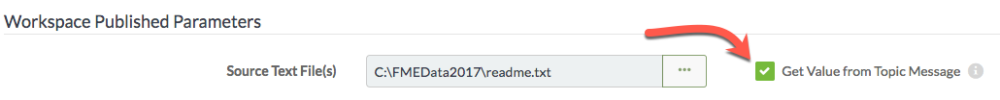
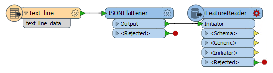
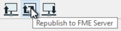
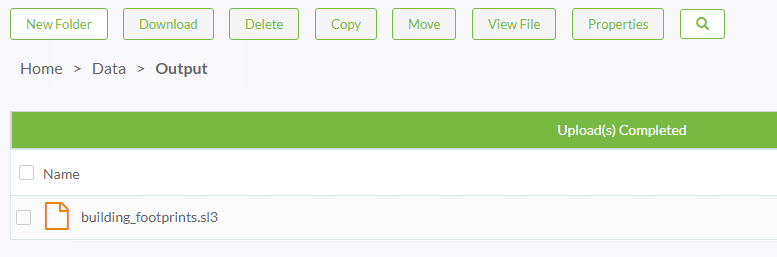
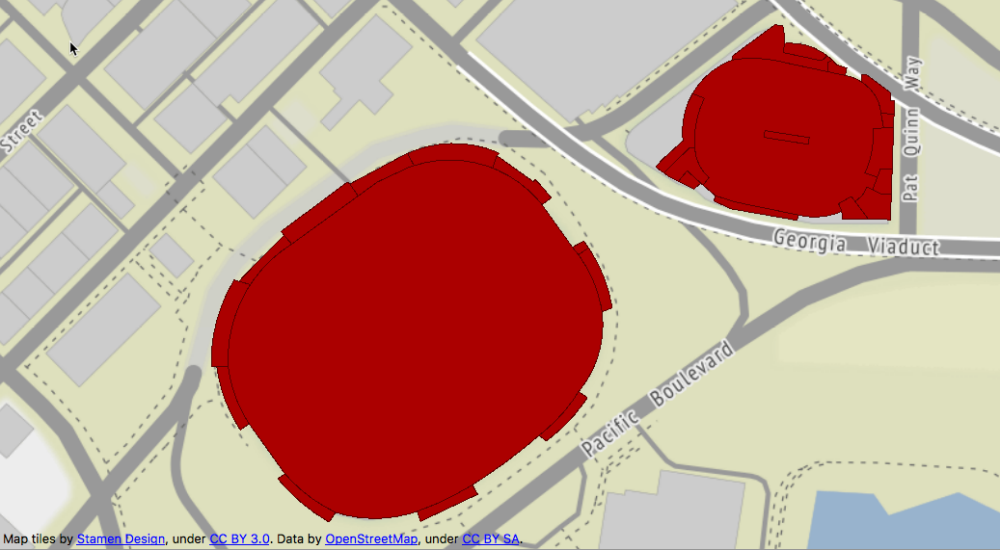

<!--Instructor Notes-->

<!--Exercise Section-->

<table style="border-spacing: 0px;border-collapse: collapse;font-family:serif">
<tr>
<td width=25% style="vertical-align:middle;background-color:darkorange;border: 2px solid darkorange">
<i class="fa fa-cogs fa-lg fa-pull-left fa-fw" style="color:white;padding-right: 12px;vertical-align:text-top"></i>
Exercise 3
</td>
<td style="border: 2px solid darkorange;background-color:darkorange;color:white">
Building Updates Notification System
</td>
</tr>

<tr>
<td style="border: 1px solid darkorange; font-weight: bold">Data</td>
<td style="border: 1px solid darkorange">Building footprints (Esri Shapefile)</td>
</tr>

<tr>
<td style="border: 1px solid darkorange; font-weight: bold">Overall Goal</td>
<td style="border: 1px solid darkorange">Triggering real-time updates to databases</td>
</tr>

<tr>
<td style="border: 1px solid darkorange; font-weight: bold">Demonstrates</td>
<td style="border: 1px solid darkorange">Processing Directory Watch notifications</td>
</tr>

<tr>
<td style="border: 1px solid darkorange; font-weight: bold">Start Workspace</td>
<td style="border: 1px solid darkorange">None</td>
</tr>

<tr>
<td style="border: 1px solid darkorange; font-weight: bold">End Workspace</td>
<td style="border: 1px solid darkorange">C:\FMEData2017\Workspaces\ServerAuthoring\RealTime-Ex3-Complete.fmw</td>
</tr>

</table>

---

Now that you have learned how to run a workspace in response to a notification, it's time to take that basic workspace and adjust it for your overall goal: to provide real-time updates to your corporate database.

The next step towards achieving this is understanding how to extract information from the notifications and configure an FME Workspace to process that incoming data.

---

<!--Person X Says Section-->

<table style="border-spacing: 0px">
<tr>
<td style="vertical-align:middle;background-color:darkorange;border: 2px solid darkorange">
<i class="fa fa-quote-left fa-lg fa-pull-left fa-fw" style="color:white;padding-right: 12px;vertical-align:text-top"></i>
Miss Vector says...
</td>
</tr>

<tr>
<td style="border: 1px solid darkorange">

This exercise continues where Exercise 2 left off. You must have completed Exercise 2 to carry out this exercise.
</td>
</tr>
</table>

---

 **1) Create Workspace**
 Start FME Workbench and begin with an empty workspace. 

Select Readers &gt; Add Reader from the menubar. When prompted set the parameters as follows: 

<table style="border: 0px">

<tr>
<td style="font-weight: bold">Reader Format</td>
<td style="">Text File</td>
</tr>

<tr>
<td style="font-weight: bold">Reader Dataset</td>
<td style="">C:\FMEData2017\readme.txt</td>
</tr>

<tr>
<td style="font-weight: bold">Reader Parameters</td>
<td style="">Read Whole File at Once: Yes</td>
</tr>

</table>

It doesn't matter what text file we use as the source right now; setting the source dataset in this step is only to satisfy the text file reader requirements. At run time, the source dataset will be replaced by the content of the incoming message.

 **2) Add JSONFlattener**
 Now add a JSONFlattener transformer to the workspace, after the Text File Reader. The incoming message is formatted as JSON, and this transformer will expose attributes on the canvas - making them available to work with.

Inspect the transformer parameters and - under the JSON Document parameter - select the attribute *text&#95;line&#95;data* as the source of the JSON content.

Add a Logger transformer to each output port on the JSONFlattener.

---

<!--Person X Says Section-->

<table style="border-spacing: 0px">
<tr>
<td style="vertical-align:middle;background-color:darkorange;border: 2px solid darkorange">
<i class="fa fa-quote-left fa-lg fa-pull-left fa-fw" style="color:white;padding-right: 12px;vertical-align:text-top"></i>
Dr. Workbench says...
</td>
</tr>

<tr>
<td style="border: 1px solid darkorange">

Instead of using Text Reader &gt; JSONFlattener we could have used the JSON Reader. Why didn't we? The JSON Reader requires a source file with valid schema. At this stage in the exercise, we do not have a file with this structure yet.
</td>
</tr>
</table>

---

 **3) Publish to FME Server**
 Publish the workspace to FME Server, registering it under the Job Submitter service. 

 **4) Update Subscription**
 Now log in to the FME Server web interface and navigate to the Notifications page. 

Click on the Subscriptions tab and select the existing "Process Building Updates" Subscription to edit it.

Change the specified workspace, from the one created in Exercise 2, to the one uploaded in the previous step. 

The change of workspace will cause a Source Text File parameter to appear. Here just select the checkbox to the right for *Get Value from Topic Message*.

Click OK to update the Subscription.

 **5) Test Topic**
 Once more (as in exercises 1 and 2) locate the source Shapefile datasets in C:\FMEData2017\Data\Engineering\BuildingFootprints and create a compressed (zip) file from a set of Shapefiles (.dbf, .prj, .shp, .shx).

Be sure to give the zip file a different name to any used previously.

Copy the zip file into the Resources folder data\BuildingUpdates. You can do this through the file system (by copying the file to C:\ProgramData\Safe Software\FME Server\resources\data\BuildingUpdates) or by using the FME Server web interface. 

 **6) Check Results**
 Open the Jobs page in the web interface. The completed jobs list should include the workspace you updated in the subscription. View or download the log file and look for the logged feature. You should find it has an attribute containing JSON, and a number of attributes extracted from the JSON. 

<table>
<tr><td>dirwatch_publisher_action</td><td>CREATE</td></tr>
<tr><td>dirwatch_publisher_content</td><td>ENTRY_CREATE C:\ProgramData\Safe Software\FME Server\resources\data\BuildingUpdates\update002.zip</td></tr>
<tr><td>dirwatch_publisher_path</td><td>C:\ProgramData\Safe Software\FME Server\resources\data\BuildingUpdates\update002.zip</td></tr>
</table>

So now we know what the data looks like and can process it accordingly. 

---

<!--Person X Says Section-->

<table style="border-spacing: 0px">
<tr>
<td style="vertical-align:middle;background-color:darkorange;border: 2px solid darkorange">
<i class="fa fa-quote-left fa-lg fa-pull-left fa-fw" style="color:white;padding-right: 12px;vertical-align:text-top"></i>
Mr. Flibble says...
</td>
</tr>

<tr>
<td style="border: 1px solid darkorange">

You may recognize these attributes from the Topic Monitoring exercise - indeed you can view the same information there without going through this process of adding Logger transformers!

</td>
</tr>
</table>

---

 **7) Edit JSONFlattener Transformer**
 Back in FME Workbench inspect the JSONFlattener transformer parameters once more. Under Attribute to Expose add the attribute *dirwatch&#95;publisher&#95;path* by clicking the browse button and then manually typing its name.

 **8) Add FeatureReader Transformer**
 Now remove the Logger transformers and add a FeatureReader transformer to the output of the JSONFlattener:

This is a transformer that will let us read the contents of the dataset into the workflow mid-translation. Inspect the transformer's parameters and set the following values:

<table>
<tr><td><strong>Reader Format</strong></td><td>Esri Shapefile</td></tr>
<tr><td><strong>Reader Dataset</strong></td><td>Select Attribute Value &gt; dirwatch&#95;publisher&#95;path</td></tr>
<tr><td><strong>Output Port</strong></td><td>Single Output Port</td></tr>
</table>

Select to have a Single Output Port:

You may receive a warning message, but it can be safely ignored.

 **9) Add Writer**
 Having read the data from a Shapefile, we can now add it to the corporate database.

Select Writers &gt; Add Writer from the menubar. When prompted set the parameters as follows: 

<table style="border: 0px">

<tr>
<td style="font-weight: bold">Writer Format</td>
<td style="">SpatiaLite</td>
</tr>

<tr>
<td style="font-weight: bold">Writer Dataset</td>
<td style="">C:\FMEData2017\Data\Engineering\BuildingFootprints\building_footprints.sl3</td>
</tr>

<tr>
<td style="font-weight: bold">Writer Parameters</td>
<td style="">Overwrite Existing Database: No</td>
</tr>

<tr>
<td style="font-weight: bold">Add Feature Types</td>
<td style="">Table Definition: Manual</td>
</tr>

</table>

In the new feature type that is created, change the Table Name parameter to *building_footprints*:

Ensure that the Table Handling is set to "Create if Needed". Click OK to close the dialog and then connect the new feature type to the FeatureReader transformer's &lt;Generic&gt; output port.

 **10) Republish Workspace**
 Publish the workspace back to FME Server. If you have the same FME Workbench session open from the start of this exercise, you can use the Republish option on the toolbar or under the File menu.

 **11) Add Dataset to FME Server**
 Since the purpose of this notification system is to *update* our database – let's make sure that it is accessible in FME Server. To do this, we will upload the *building_footprints.sl3* SpatiaLite database to FME Server's shared resources. 

Use the FME Server web interface to create a new folder **Output** in **Resources &gt; Data** and upload the file located at C:\FMEData2017\Data\Engineering\BuildingFootprints\building_footprints.sl3

 **12) Edit Subscription**
 Navigate to the Notifications page and open the Process Building Updates Subscription for editing. The parameters should now include one for the output database. Use the browse button to locate the database uploaded in the previous step:

Click OK to save the changes.

 **13) Test Solution**
 Now test the solution by putting more zipped Shapefile data into the Directory Watch folder. You will find that each dataset put into the folder is added to the SpatiaLite database:

---

<!--Exercise Congratulations Section--> 

<table style="border-spacing: 0px">
<tr>
<td style="vertical-align:middle;background-color:darkorange;border: 2px solid darkorange">
<i class="fa fa-thumbs-o-up fa-lg fa-pull-left fa-fw" style="color:white;padding-right: 12px;vertical-align:text-top"></i>
CONGRATULATIONS
</td>
</tr>

<tr>
<td style="border: 1px solid darkorange">

By completing this exercise you have learned how to:
 
<ul><li>Identify JSON attributes on an incoming Topic Message</li>
<li>Use a FeatureReader transformer to read the dataset added to watched folder</li></ul>

</td>
</tr>
</table>   
