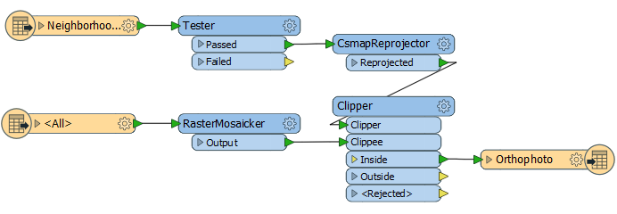
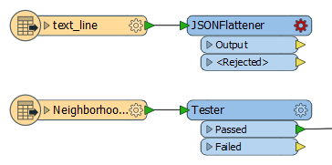
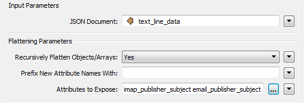
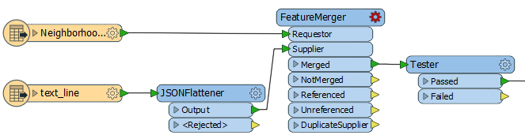
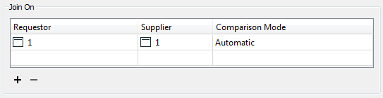
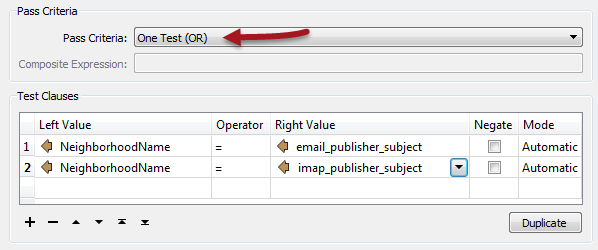
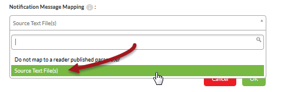

<!--Instructor Notes-->

<!--Exercise Section-->
<!--NB: In GitBook world we don't give a number to exercises-->

<table style="border-spacing: 0px;border-collapse: collapse;font-family:serif">
<tr>
<td width=25% style="vertical-align:middle;background-color:darkorange;border: 2px solid darkorange">
<i class="fa fa-cogs fa-lg fa-pull-left fa-fw" style="color:white;padding-right: 12px;vertical-align:text-top"></i>
Exercise 3
</td>
<td style="border: 2px solid darkorange;background-color:darkorange;color:white">

</td>
</tr>

<tr>
<td style="border: 1px solid darkorange; font-weight: bold">Data</td>
<td style="border: 1px solid darkorange">Orthophoto images (GeoTIFF)</td>
</tr>

<tr>
<td style="border: 1px solid darkorange; font-weight: bold">Overall Goal</td>
<td style="border: 1px solid darkorange">Provide email-driven access to orthophoto files</td>
</tr>

<tr>
<td style="border: 1px solid darkorange; font-weight: bold">Demonstrates</td>
<td style="border: 1px solid darkorange">Running a workspace in response to a notification</td>
</tr>

<tr>
<td style="border: 1px solid darkorange; font-weight: bold">Start Workspace</td>
<td style="border: 1px solid darkorange">C:\FMEData2016\Workspaces\ServerAuthoring\Notifications-Ex3-Begin.fmw</td>
</tr>

<tr>
<td style="border: 1px solid darkorange; font-weight: bold">End Workspace</td>
<td style="border: 1px solid darkorange">C:\FMEData2016\Workspaces\ServerAuthoring\Notifications-Ex3-Complete.fmw</td>
</tr>

</table>

---

As a technical analyst in the GIS department a recent project involved setting up a Data Download solution for users to serve orthophoto data to themselves. Having read up about notifications in FME Server, you think that it should be possible to set up a system that uses email-based automation.

So far you have set up a system for incoming email notifications to be registered by FME Server and proved that you can use that to trigger a workspace. Now you must actually edit the workspace to process the incoming email. 

One part of the Data Download project clipped raster features to the boundary of a neighborhood. It should be possible to set up the workspace to have extract the neighborhood name from the subject line of the incoming email. 

---

<!--Person X Says Section-->

<table style="border-spacing: 0px">
<tr>
<td style="vertical-align:middle;background-color:darkorange;border: 2px solid darkorange">
<i class="fa fa-quote-left fa-lg fa-pull-left fa-fw" style="color:white;padding-right: 12px;vertical-align:text-top"></i>
Miss Vector says...
</td>
</tr>

<tr>
<td style="border: 1px solid darkorange">

This exercise continues where exercise 2 left off. You must have completed exercise 2 to carry out this exercise.
</td>
</tr>
</table>

---

 **1) Open Workspace**
 Start FME Workbench and open the workspace: C:\FMEData2016\Workspaces\ServerAuthoring\Notifications-Ex3-Begin.fmw (you should open this workspace, even if you created one in exercise 2):

This workspace is a cut-down version of the one used for your Data Download project. Notice raster data is read and clipped to the boundary of a chosen neighborhood.

 **2) Add Reader**
 We now need to add a new Reader, which is what we'll use to obtain the content of the email message.

Select Readers > Add Reader from the menubar. When prompted set the parameters as follows: 

<table style="border: 0px">

<tr>
<td style="font-weight: bold">Reader Format</td>
<td style="">Text File</td>
</tr>

<tr>
<td style="font-weight: bold">Reader Dataset</td>
<td style="">C:\FMEData2016\readme.txt</td>
</tr>

<tr>
<td style="font-weight: bold">Reader Parameters</td>
<td style="">Read Whole File at Once: Yes</td>
</tr>

</table>

It doesn't really matter what text file we use as the source, it won't be used anyway. It will be replaced by the content of the incoming email. The Read Whole File at Once parameter is important. With it we'll receive the email content as a single chunk of text. Without it we'll receive the content as lots of lines of text, which would be much harder to parse.

 **3) Add JSONFlattener**
 Now add a JSONFlattener transformer to the workspace, after the Text File Reader:

Open the parameters dialog. In there select *text&#95;line&#95;data* as the source of the JSON content. Under Attributes to Expose manually enter *imap&#95;publisher&#95;subject* and *email&#95;publisher&#95;subject* - this will provide us with the email subject line whether we are using IMAP or SMTP.

There are other components of the incoming email we could expose, but these are all we need for now.

 **4) Add FeatureMerger**
 Now we need to filter the flow of neighborhood features to include only the neighborhood defined in our email attribute. There are various ways of doing this - maybe the ChangeDetector or Matcher would work - but here we'll use the FeatureMerger combined with the existing Tester.

So, add a FeatureMerger transformer. The Neighborhood features are the Requestor, the JSONFlattener output the Supplier. The best way is to tidy the canvas to look like this:

Open the FeatureMerger parameters dialog. Set the requestor and supplier join values to two identical constant values, like so:

This means that the JSON attributes will be copied onto ALL neighborhood features.

 **5) Edit Tester**
 Now open the Tester transformer's parameters dialog. You need to set up two test clauses: one to test if NeighborhoodName = email&#95;publisher&#95;subject and one to test if NeighborhoodName = imap&#95;publisher&#95;subject - the test should be an OR:

Now the feature will pass if it exists in the email subject line - regardless of whether we use the IMAP or SMTP email protocol.
  

 **6) Publish to FME Server**
 Publish the workspace to FME Server. You may (or may not) need to also upload the source raster and KML datasets (depending on whether your FME Server can access the files on your authoring system). Simply register the workspace with the Job Submitter service. 

 **7) Update Subscription**
 The subscription created in the previous exercise was for a different workspace. Therefore navigate to that subscription in the FME Server interface and change it to run the workspace published in the previous step. 

On choosing the workspace you should get the option to set a couple of more parameters, including where you want the data to be written to. Choose to write it to Resources &gt; Data &gt; Output (creating the Output folder if it doesn't already exist).

Also - vitally - you get to choose where to send the incoming message. Choose the published parameter for the text file Reader:

This is how the text file Reader knows where to read the incoming JSON email message from.

 **8) Test Workspace**
 Test the workspace by sending an email to the Publication email address. Be sure to make the subject line one of the neighborhoods in Vancouver:

- Downtown
- Fairview
- Kitsilano
- Mount Pleasant
- Strathcona
- West End

Check to ensure the workspace is triggered and run (in the Topic Monitoring and/or Jobs pages) and then look for the output dataset in Resources &gt; Data &gt; Output 

---

<!--Person X Says Section-->

<table style="border-spacing: 0px">
<tr>
<td style="vertical-align:middle;background-color:darkorange;border: 2px solid darkorange">
<i class="fa fa-quote-left fa-lg fa-pull-left fa-fw" style="color:white;padding-right: 12px;vertical-align:text-top"></i>
Ms Analyst says...
</td>
</tr>

<tr>
<td style="border: 1px solid darkorange">

If the output dataset is missing, check the FME log to see what might have gone wrong. You can return to the workspace and add Logger transformers at strategic places and try again, giving the log file a bit more information to help debug problems.

</td>
</tr>
</table>

---

<!--Exercise Congratulations Section--> 

<table style="border-spacing: 0px">
<tr>
<td style="vertical-align:middle;background-color:darkorange;border: 2px solid darkorange">
<i class="fa fa-thumbs-o-up fa-lg fa-pull-left fa-fw" style="color:white;padding-right: 12px;vertical-align:text-top"></i>
CONGRATULATIONS
</td>
</tr>

<tr>
<td style="border: 1px solid darkorange">

By completing this exercise you have learned how to:
 
<ul><li>Set up a workspace to read and process an incoming JSON message</li>
<li>Filter data in a workspace depending on the value of an incoming message</li>
<li>Update a workspace Subscription to specify where to write output</li>
<li>Update a workspace Subscription to specify where to receive input from</li></ul>

</td>
</tr>
</table>   
