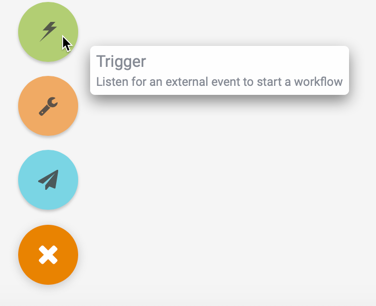
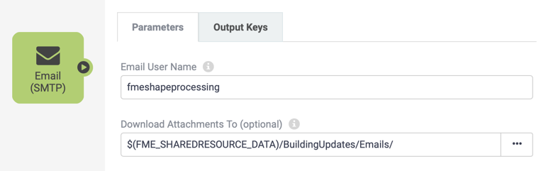
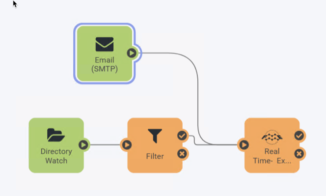
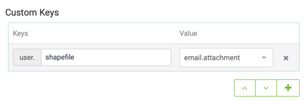

<!--Instructor Notes-->

<!--Exercise Section-->

<table style="border-spacing: 0px;border-collapse: collapse;font-family:serif">
<tr>
<td width=25% style="vertical-align:middle;background-color:darkorange;border: 2px solid darkorange">
<i class="fa fa-cogs fa-lg fa-pull-left fa-fw" style="color:white;padding-right: 12px;vertical-align:text-top"></i>
Exercise 4.3
</td>
<td style="border: 2px solid darkorange;background-color:darkorange;color:white">
Building Updates Automation
</td>
</tr>

<tr>
<td style="border: 1px solid darkorange; font-weight: bold">Data</td>
<td style="border: 1px solid darkorange">Building footprints (Esri Shapefile)</td>
</tr>

<tr>
<td style="border: 1px solid darkorange; font-weight: bold">Overall Goal</td>
<td style="border: 1px solid darkorange">Provide email-driven triggers for building updates</td>
</tr>

<tr>
<td style="border: 1px solid darkorange; font-weight: bold">Demonstrates</td>
<td style="border: 1px solid darkorange">Email Triggers</td>
</tr>

<tr>
<td style="border: 1px solid darkorange; font-weight: bold">Start Workspace</td>
<td style="border: 1px solid darkorange">N/A</td>
</tr>

<tr>
<td style="border: 1px solid darkorange; font-weight: bold">End Workspace</td>
<td style="border: 1px solid darkorange">N/A</td>
</tr>

</table>

---

As a technical analyst in the GIS department, you were involved in a recent assignment to set up a Directory Watch solution for users to automatically update the corporate database.

Having learned that not all users are able to access the internal network where FME Server is hosted, you think that it should be possible to also set up a system that uses email-based automation to handle the same updates.

---

 **1) Create Resource Folder**
The first step is to create another Resource folder where all the email attachments will be saved. Log into the FME Server web interface, navigate to Resources > Data > BuildingUpdates, and then create a new folder called Emails.

 **2) Update Automation**
 Next, Navigate to the Automations page, since we are triggering the same workspace we can add a second trigger into the existing Automation. Add a new Trigger by dragging and dropping a Trigger (green) node onto the canvas.

The new Trigger can be created to use either the Email (SMTP) protocol or the Email (IMAP) protocol.

SMTP is easier to set up, but FME Server must reside on a server with a proper DNS record (all FME Cloud and Training machines will have this). IMAP is necessary when FME Server resides on an internal network or you would like to monitor an email account sitting on an external server.

---

***SMTP Protocol***

To use the SMTP protocol select Email (SMTP) as the Trigger. This will reveal the Email User Name parameter. Enter a name for receiving email, for example: *fmeshapeprocessing*

For the Download Attachments To parameter browse to the Emails folder created in step 1.

Clicking Apply will create an email address *fmeshapeprocessing@&lt;hostname&gt;* - for example:

<table>
<tr><th>Host</th><th>Example Email Address</th></tr>
<tr><td>FME Cloud</td><td>fmeshapeprocessing@myfmeserver.fmecloud.com</td></tr>
<tr><td>Amazon AWS</td><td>fmeshapeprocessing@ec1-23-456-789-012.compute-1.amazonaws.com</td></tr>
</table>

---

***IMAP Protocol***

To use the IMAP protocol select Email (IMAP) as the Trigger. This will open up a number of other parameters. Enter them according to your email account.

In case it is of use, the server information for Gmail, Outlook, and Yahoo! are as follows:

<table style="border: 0px">

<tr>
<td style="font-weight: bold">IMAP Server Host</td>
<td style="">imap.gmail.com</td>
<td style="">imap-mail.outlook.com</td>
<td style="">imap.mail.yahoo.com</td>
</tr>

<tr>
<td style="font-weight: bold">Server Port</td>
<td style="">993</td>
<td style="">993</td>
<td style="">993</td>
</tr>

<tr>
<td style="font-weight: bold">Connection Security</td>
<td style="">SSL/TLS</td>
<td style="">SSL/TLS</td>
<td style="">SSL/TLS</td>
</tr>

<tr>
<td style="font-weight: bold">Verify SSL Certificates</td>
<td style="">Yes</td>
<td style="">Yes</td>
<td style="">Yes</td>
</tr>

</table>

You will also need to check the settings in your email account to make sure IMAP is turned on. Regardless of the email provider, you should set these parameters as follows:

<table style="border: 0px">

<tr>
<th style="font-weight: bold">Parameter</th>
<th style="">Value</th>
</tr>

<tr>
<td style="font-weight: bold">Poll Interval</td>
<td style="">30 Seconds</td>
</tr>

<tr>
<td style="font-weight: bold">Emails to Fetch</td>
<td style="">New Emails Only</td>
</tr>

<tr>
<td style="font-weight: bold">Download Attachments To</td>
<td style="">A Resource folder of your choice</td>
</tr>

</table>

You may select any Resource folder for attachments to be saved to; but (if you have already completed exercise 1-3) don't choose the BuildingUpdates folder, or else you'll cause the workspace to be triggered by both the Email and Directory Watch Trigger!

Add a connection from the Email trigger to the workspace action. The automation is not ready yet because the JSON message from the Email Trigger stores the JSON in a parameter named Email Attachment, however the Source dataset for the run workspace is set to pick up a value from the Directory Watch File Path attribute. Therefore in order to have both incoming triggers send the correct information to the workspace we need to create an attribute in each Trigger with a common name that can be used downstream in the workflow. These are known as Custom keys.

 **3) Create Custom key**
 We will need to create an Output Key on both Triggers. First select the Email trigger and click on the Output Keys tab. This will list all the standard output keys that come with that action, scroll to the bottom of the list and there is a second section called Custom Keys.

Set the Key name to shapefile and for the Value select email.attachment from the drop down list.

Repeat the process in the Directory Watch trigger but this time set the value to file path. Now return to the Workspace Action and change the Source Dataset from file.path to the user.shapefile attribute listed under Custom Keys.

<!--Person X Says Section-->

<table style="border-spacing: 0px">
<tr>
<td style="vertical-align:middle;background-color:darkorange;border: 2px solid darkorange">
<i class="fa fa-quote-left fa-lg fa-pull-left fa-fw" style="color:white;padding-right: 12px;vertical-align:text-top"></i>
Ms Analyst says...
</td>
</tr>

<tr>
<td style="border: 1px solid darkorange">

Custom keys can only be used in the Automation they are defined in, and can be set to an element of the JSON from the Trigger or Action message. To create values that can be used across all workspaces you can create Global Keys by selected the globe icon in the menu ribbon. These can only be set to plain text values, an example of their use might be a UNC path to an external location your organisation stores their data.

</td>
</tr>
</table>

 **4) Test Automation**
 Now let's test the Automation.

This time we can zip up the four .shp and associated file types to pass as an email attachment. Since the Email trigger is not being passed through the filter but directly hooked up to the Run Workspace action and we do not want to see it fail.  

Send an email *with an attachment* to the address created in the Email trigger. When the email is received by FME Server (SMTP), or FME Server fetches it (IMAP), the Automation will send a message to the Workspace Action. (Remember that an IMAP publication only checks for an email at the specified poll interval, so the result might not be immediate!)

---

<!--Exercise Congratulations Section-->

<table style="border-spacing: 0px">
<tr>
<td style="vertical-align:middle;background-color:darkorange;border: 2px solid darkorange">
<i class="fa fa-thumbs-o-up fa-lg fa-pull-left fa-fw" style="color:white;padding-right: 12px;vertical-align:text-top"></i>
CONGRATULATIONS
</td>
</tr>

<tr>
<td style="border: 1px solid darkorange">

By completing this exercise you have learned how to:
 
<ul><li>Create an Email Trigger</li>
<li>Create an automation with multiple input triggers to a single action</li>
<li>Create custom keys to configure an Action so it can handle triggers across different protocols</li></ul>

</td>
</tr>
</table>
